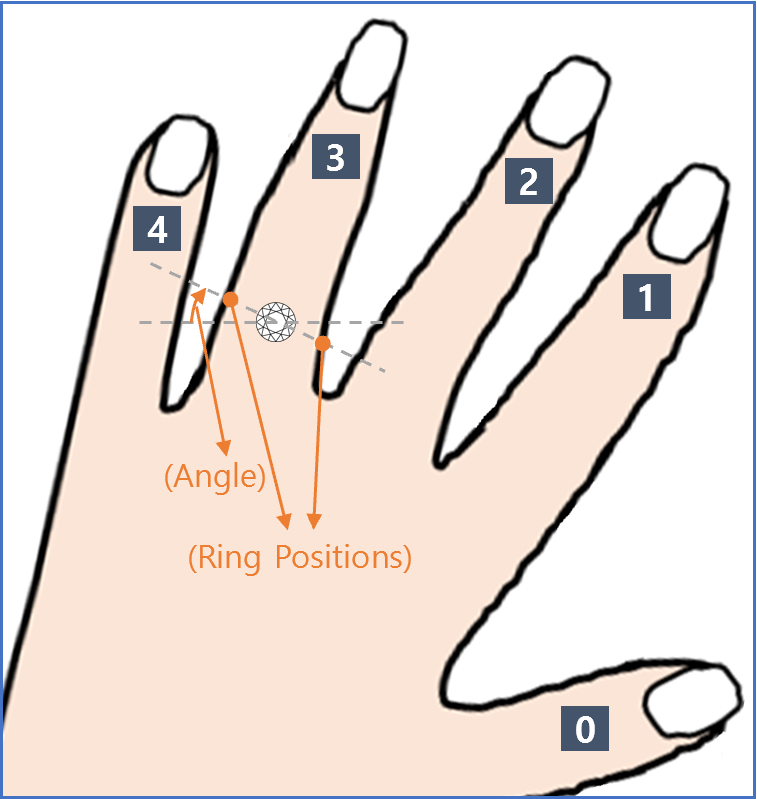
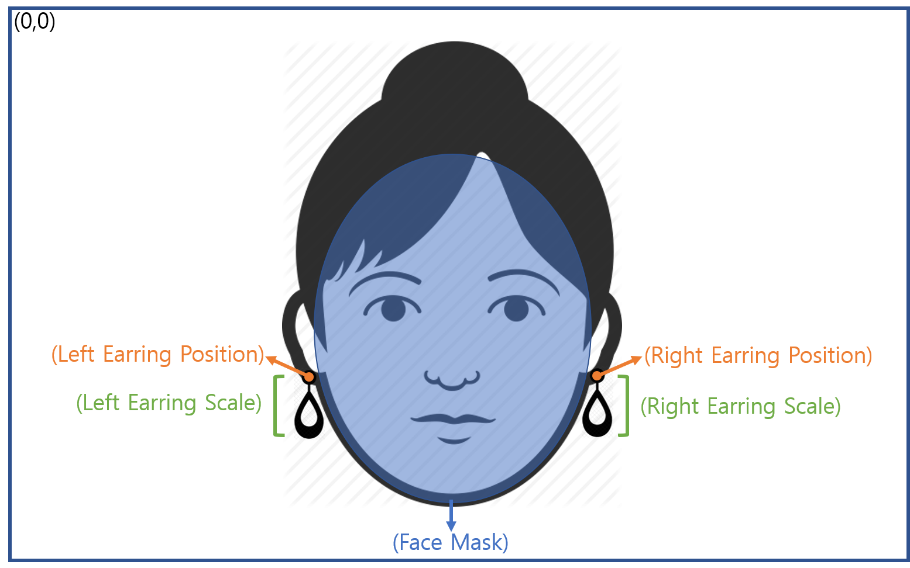
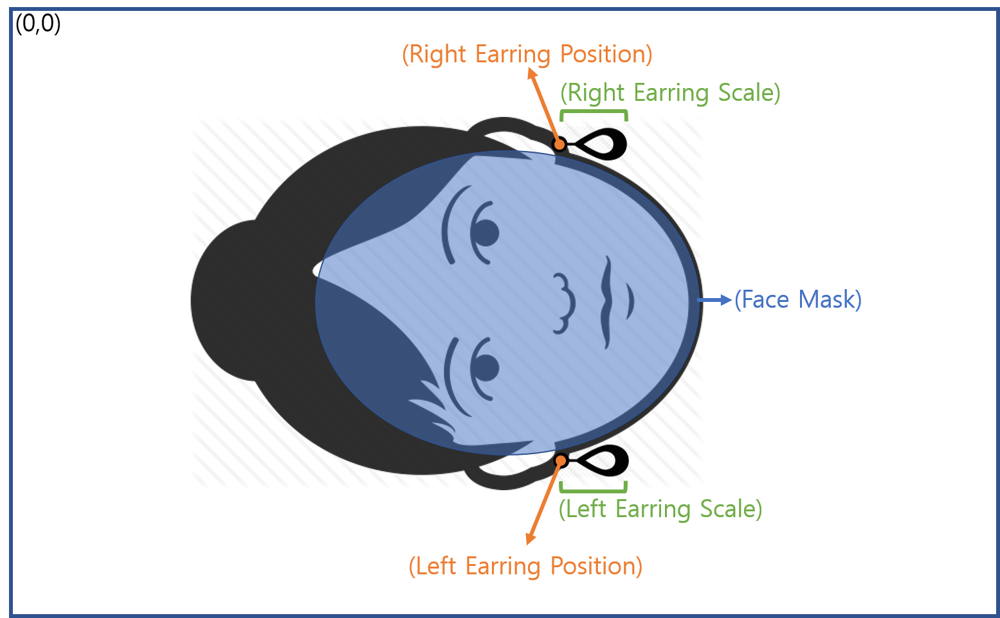

{: width="200"}

# AR1ing Tutorial

>AR1ing은 모바일 장치로 입력된 영상에서 얼굴 및 손의 특정 위치와 스케일 정보 등을 실시간으로 추정하는 컴퓨터 비전 기반의 API Library 입니다.  

.png){: width="200"}&nbsp;&nbsp;&nbsp;&nbsp;&nbsp;&nbsp;&nbsp;&nbsp;.png){: width="200"}

***

## 특징

### 손의 특정 위치 및 스케일 정보 추정

> 사용자의 손을 모바일 장치에서 실시간으로 검출하고 각 손가락과 손목의 위치 및  스케일 정보를 제공합니다. 이것을 이용해서 온라인상에서 사용자가 반지나 팔찌(밴드)를 가상으로 착용(Virtual Try-on)할 수 있는 서비스를 만들 수 있습니다.

- 스팩:
  - 양손 적용 가능
  - 화면 크기의 약 25% 이상 크기의 손에 대응
  - 1920x1080 25~30 FPS (Device tested: Galaxy Note 8)
  
- 결과물:
  - 다섯 손가락 첫 마디뼈의 중간 지점의 위치, 길이, 그리고 각도
  - 손목의 위치, 길이, 그리고 각도
  
  > 반지 
  
  {: width="450"}
    ```text
    반지 위치: 왼쪽 위치(x1, y1), 오른쪽 위치(x2, y2)
    반지 길이: 반지 위치 사이의 거리
    반지 각도: 수평선을 기준으로 반지의 중심점에서 시계 방향으로의 각도(degree)    
    ```  

    |손가락|인덱스|
    |:-:|:-:|
    |엄지손가락|0|
    |검지손가락|1|
    |가운데손가락|2|
    |약지손가락|3|
    |새끼손가락|4|
    
  > 팔찌 
  
  {: width="450"}
    ```text
    팔찌 위치: 왼쪽 위치(x1, y1), 오른쪽 위치(x2, y2)
    팔찌 길이: 팔찌 위치 사이의 거리
    팔찌 각도: 수평선을 기준으로 팔찌의 중심점에서 시계 방향으로의 각도(degree)
    ```  
  
### 귀 위치 및 스케일 정보 추정

> 사용자의 귀를 모바일 장치에서 실시간으로 검출하고 양쪽 귀의 위치 및 스케일 정보를 제공합니다. 이것을 이용해서 온라인상에서 사용자가 귀걸이를 가상으로 착용(Virtual Try-on)할 수 있는 서비스를 만들 수 있습니다.

- 스팩:

    |목차|스팩|비고|
    |:-:|:-:|:-:|
    |가능인원|1명||
    |동작범위|Yaw(-45º ~ 45º), Roll(-15º ~ 15º), Pitch(-5º ~ 20º)|범위 내|
    |속도|30~40 FPS (Frame Per Secound) |실험 장비(Galaxy Note 8), 해상도(1920 X 1080)|

- 결과물:
  - 양쪽 귀의 위치, 양쪽 귀 크기, 얼굴 마스크 정보
  
    > 입력 영상이 가로 방향일 경우

    {: width="450"}
    ```text
    귀 위치정보: x(이미지의 가로 방향 위치), y(이미지의 세로 방향 위치)
    귀 크기(스케일): 귀의 높이 / 영상의 높이
    얼굴 마스크 정보: 얼굴의 경계 라인 정보
    ```  

    > 입력 영상이 세로 방향일 경우

    {: width="450"}
    ```text
    귀 위치정보: x(이미지의 가로 방향 위치), y(이미지의 세로 방향 위치)
    귀 크기(스케일): 귀의 너비 / 영상의 너비
    얼굴 마스크 정보: 얼굴의 경계 라인 정보
    ```  

***

## 환경설정

- [Android 환경설정][android]

- [iOS 환경설정][ios]

***

## AR1ing API 사용방법 (c++ with OpenCV)

>C++를 이용한 ARing API 사용법을 소개한다. ARing API를 사용하기 위해서는 OpenCV 라이브러리가 필요하다.
ARing API의 전체 예제 코드는 [Android][andoid_sample]/[iOS][ios_sample] 링크를 참고한다.

1. ARing 객체를 생성한다.
    > 객체를 생성하는 과정에서 라이센스와 관련된 예외가 발생할 수 있다.  

    ```c++
    // Android
    try {
      std::shared_ptr<dp::aringnative::IARing> g_ptrARing =
        dp::android::DPFactoryForAndroid::CreateInstance<dp::aringnative::IARing>(
          env, activity);
    } catch (dp::exception::DPLicenseExpiredException ex) {
      __android_log_print(ANDROID_LOG_FATAL, "ARing", "%s", ex.what());
    } catch (dp::exception::DPLicenseException ex) {
      __android_log_print(ANDROID_LOG_FATAL, "ARing", "%s", ex.what());
    }
    ```
    ```c++
    // iOS
    try {
      std::shared_ptr<dp::aringnative::IARing> g_ptrARing =
        dp::ios::DPFactoryForiOS::CreateInstance<dp::aringnative::IARing>();
    } catch (dp::exception::DPLicenseExpiredException ex) {
      std::cout << ex.what() << std::endl;
    } catch (dp::exception::DPLicenseException ex) {
      std::cout << ex.what() << std::endl;
    }
    ```

2. ARing 객체를 초기화 한다.
    > ARing API를 초기화 하기 위해서 다바이스 실행 시 영상의 크기, 영상을 회전할 각도, 카메라 센서의 크기, 그리고 포커스 값을 입력한다. 카메라 센서의 크기와 포커스 값을 0으로 입력할 경우 ARing 내부에 정의된 기본값이 사용된다. 일반적으로 스마트폰을 세로로 사용할 경우 회전된 영상을 얻게 된다. 올바른 영상으로 바꾸기 위해 얼마나 회전을 해야하는지를 파라미터로 설정해야 한다.

    ```c++
    // (img.cols) 영상 가로 크기
    // (img.rows) 영상 세로 크기
    // (imageRotation) 영상을 회전할 각도
    // (sensorWidth) 카메라 센서의 가로 크기
    // (sensorHeight) 카메라 센서의 세로 크기
    // (focalLength) 카메라 포커스 값
    g_ptrARing->initialize(img.cols, img.rows, imageRotation, sensorWidth, sensorHeight, focalLength);
    ```


    |Exception|Exception message|Description|
    |-|-|-|
    |dp::exception::DPException|Already initialized|두번 이상 초기화를 했을 경우 발생한다.|
    |dp::exception::DPException|Initialization Failed|예상하지 못한 에러가 있을 경우 발생한다.|

### 귀걸이 적용시

3. ARing 객체의 DetectFace 함수를 호출한다.
   > 영상의 [타입][image_type]을 지정해야 한다. 영상의 사이즈는 320x240보다 커야한다. 이 함수의 [반환 값][result]에는 얼굴 검출 유무 및 귀의 위치 등이 포함되어 있다. 반환값에 포함된 위치의 좌표계는 입력 영상의 pixel 좌표계와 같다.

    ```c++
    // DPAR1ingFaceInput는 DetectFace를 실행하기 위한 인풋 파라메터가 설정되어 있다.
    // DPAR1ingFaceInput src: API 실행을 위한 영상
    // DPAR1ingFaceInput imageType: 영상 타입
    dp::aringnative::DPAR1ingFaceInput faceInput;
    faceInput.src = img;
    faceInput.imageType = imageType;
    dp::aringnative::DPAR1ingFaceOutput result = g_ptrARing->DetectFace(faceInput);
    ```

    |Exception|Exception message|Description|
    |-|-|-|
    |dp::exception::DPException|There is no image|입력 영상이 비어있을 경우 발생한다.|
    |dp::exception::DPException|No initialized|초기화를 하지 않은 경우 발생한다.|
    |dp::exception::DPException|Image size is different from the initial image size|초기화할 때 입력한 영상의 크기와 현재 입력 영상의 크기가 다른 경우 발생한다.|

4. 귀 위치 정보를 이용하여 귀걸이를 출력한다.
    >왼쪽, 오른쪽 귀걸이 2개를 출력한다. 이 때 귀걸이의 크기는 귀의 크기값을 이용해서 결정한다. 귀의 크기는 (귀의 높이 / 입력 영상의 높이) 값이다. 영상의 방향과 귀걸이의 방향이 일치하도록 해야한다.

    ```c++
    cv::Mat earingPic = cv::imread("earingPic.png"); //귀걸이 영상 입력
    if(result.detected)
    {
      drawEarring(matDST, earingPic, result, true); // LEFT
      drawEarring(matDST, earingPic, result, false); // RIGHT
    }
    ```

    ```c++
    void drawEarring(cv::Mat dst, cv::Mat earingPic, DPAR1ingFaceOutput result, bool isLeft)
    {
      float fEaring_scale_y = isLeft ? result.earringScaleYLeft : earringScaleYRight;
      cv::Mat matEarring;
      cv::resize(earingPic, matEarring, cv::Size(0, 0), fEaring_scale_y, fEaring_scale_y);
  
      if(matEarring.empty())
        return;
  
      cv::Point earingPt = isLeft ? result.leftEarringPos : result.rightEarringPos;
  
      cv::Rect earingRect(0, 0, matEarring.cols, matEarring.rows);
  
      earingRect = earingRect + earingPt;
      earingRect = earingRect - cv::Point(earingRect.width / 2, earingRect.width / 4);
  
      cv::Rect safeRect(0, 0, dst.cols, dst.rows);
      earingRect = earingRect & safeRect;
  
      if(matEarring.size().area()!=earingRect.area())
        return;

      // 얼굴을 일정 각도 이상 돌리면 mask를 적용하지 않는다.
      if (isLeft) {
        if (!(result.rotX < -15))
          matEarring.setTo(0, result.mask(earingRect));
      } else {
        if (!(result.rotX > 15))
          matEarring.setTo(0, result.mask(earingRect));
      }
  
      cv::Mat earingMask;
      cv::compare(matEarring, 0, earingMask, cv::CMP_GT);
  
      // dst의 타입(디바이스에서 영상을 출력할 때 사용하는 타입)으로 변경한다.
      cv::cvtColor(earingMask, earingMask, CV_BGR2RGBA);
      cv::cvtColor(matEarring, matEarring, CV_BGR2RGBA);
  
      cv::subtract(dst(earingRect), earingMask, dst(earingRect));
      cv::add(matEarring, dst(earingRect), dst(earingRect));
    }
  
    ```

5. 얼굴의 마스크 크기 및 귀 3차원 위치를 제어한다.
    >얼굴의 마스크 크기 및 귀 3차원 위치를 임의로 제어 할 수 있다. 얼굴 마스크 크기 조절범위는 [-5 ~ 5]이며 기본값은 [0]이다. (-)값은 마스크의 크기가 얼굴 안쪽 방향으로 작아지며, (+)값은 얼굴 바깥쪽 방향으로 커진다. 귀 3차원 위치의 범위도 [-5 ~ 5]이며 기본값은 [0]이다. (-)값은 얼굴의 안쪽 방향으로 3차원 위치가 이동하며, (+)값은 얼굴의 바깥쪽 방향으로 3차원 위치가 이동한다. 기능의 사용은 DetectFace 함수 호출 시 얼굴의 마스크 크기 및 귀 3차원 위치 제어 범위를 파라메터로 넣어 사용한다.

    ```c++
   // DetectFace함수 호출시 DPAR1ingFaceInput에 제어하고 싶은 파라메터에 값을 넣어 주면 된다.
   // 디폴트 설정되어 있기 때문에, 제어가 불 필요하다면 해당 변수에 데이터를 넣지 않아도 된다.
   // DPAR1ingFaceInput n3DPosOffset: 귀 3차원 위치 제어 값
   // DPAR1ingFaceInput nMaskOffset: 얼굴 마스크의 크기 값
   dp::aringnative::DPAR1ingFaceInput faceInput;
   faceInput.src = img;
   faceInput.imageType = imageType;
   faceInput.n3DPosOffset = 3;
   faceInput.nMaskOffset = 1;
   dp::aringnative::DPAR1ingFaceOutput result = g_ptrARing->DetectFace(faceInput);
    ```
### 반지 또는 팔찌(밴드) 적용시

3-1. AR1ing 객체의 DetectHand 함수를 호출한다.
   > 영상의 [타입][image_type]을 지정해야 한다. 영상의 사이즈는 320x240보다 커야한다. 이 함수의 [반환 값][result]에는 반지 위치, 길이, 각도가 포함되어 있다. 반환값에 포함된 위치의 좌표계는 입력 영상의 pixel 좌표계와 같다.

    ```c++
    // DPAR1ingHandInput는 DetectHand를 실행하기 위한 인풋 파라메터가 설정되어 있다.
    // DPAR1ingHandInput src: API 실행을 위한 영상
    // DPAR1ingHandInput imageType: 영상 타입
    // DPAR1ingHandInput m_fingers: 손가락 선택
    // DPAR1ingHandInput m_offset: 반지 위치 조절
    // DPAR1ingHandInput m_bRightHand: 왼손/오른손 선택
    dp::ar1ingnative::DPAR1ingHandInput input;
    input.matSrc = src;
    input.enumImageType = dp::ar1ingnative::DP_IMAGE_TYPE::RGBA_8888;
    input.vFingers = m_fingers;
    input.fOffset = m_offset;
    input.bRightHand = m_bRightHand;
    dp::ar1ingnative::DPAR1ingHandOutput result = m_ptrStyleAR->DetectHand(input);
    ```

    |Exception|Exception message|Description|
    |-|-|-|
    |dp::exception::DPException|There is no image|입력 영상이 비어있을 경우 발생한다.|
    |dp::exception::DPException|No initialized|초기화를 하지 않은 경우 발생한다.|
    |dp::exception::DPException|Image size is different from the initial image size|초기화할 때 입력한 영상의 크기와 현재 입력 영상의 크기가 다른 경우 발생한다.|

3-2. AR1ing 객체의 DetectWrist 함수를 호출한다.
   > 영상의 [타입][image_type]을 지정해야 한다. 영상의 사이즈는 320x240보다 커야한다. 이 함수의 [반환 값][result]에는 팔찌 위치, 길이, 각도가 포함되어 있다. 반환값에 포함된 위치의 좌표계는 입력 영상의 pixel 좌표계와 같다.

    ```c++
    // DPAR1ingWristInput DetectWrist를 실행하기 위한 인풋 파라메터가 설정되어 있다.
    // DPAR1ingWristInput src: API 실행을 위한 영상
    // DPAR1ingWristInput imageType: 영상 타입
    // DPAR1ingWristInput m_offset: 팔찌 위치 조절
    // DPAR1ingWristInput m_bRightHand: 왼손/오른손 선택
    dp::ar1ingnative::DPAR1ingWristInput input;
    input.matSrc = src;
    input.enumImageType = dp::ar1ingnative::DP_IMAGE_TYPE::RGBA_8888;
    input.fOffset = m_offset;
    input.bRightHand = m_bRightHand;
    dp::ar1ingnative::DPAR1ingWristOutput result = m_ptrStyleAR->DetectWrist(input);
    ```

    |Exception|Exception message|Description|
    |-|-|-|
    |dp::exception::DPException|There is no image|입력 영상이 비어있을 경우 발생한다.|
    |dp::exception::DPException|No initialized|초기화를 하지 않은 경우 발생한다.|
    |dp::exception::DPException|Image size is different from the initial image size|초기화할 때 입력한 영상의 크기와 현재 입력 영상의 크기가 다른 경우 발생한다.|


4. 손 위치 정보를 이용하여 반지 또는 팔찌를 출력한다.
    >선택한 손(왼손 또는 오른손)에 계산된 반지 또는 팔찌의 위치, 크기, 각도를 이용해서 반지 또는 팔찌를 출력한다.  

    ```c++
    // 반지 출력
    cv::Mat ringPic = cv::imread("ringPic.png"); //반지 이미지 입력
    if(resultHand.bDetected)
    {
        for (int i = 0; i < 5; i++) {
            if (!resultHand.vFinger[i]) // 지정한 손가락에만 반지 출력
                  continue;        
            std::vector<cv::Point2f> fingerPt;
            for (int j = 0; j < result.vFingerPts[i].size(); j++) {
                  fingerPt.push_back(result.vFingerPts[i][j]);
            }
            draw_ring_band(dst, fingerPt, 0.1f, ringPic);
        }
    }
     ```

     ```c++
    // 팔찌 출력
    cv::Mat braceletPic = cv::imread("braceletPic.png"); //팔찌 이미지 입력
    if(resultWrist.bDetected)
    {
        std::vector<cv::Point2f> vWristPt;
        for (int j = 0; j < resultWrist.vWristPt.size(); j++) {
            vWristPt.push_back(resultWrist.vWristPt[j]);
        }  
        draw_ring_band(dst, vWristPt, 0.05f, braceletPic);
    }
    ```

    ```c++
    // 반지 또는 팔찌 출력함수
   void draw_ring_band(cv::InputOutputArray _matDisplay, std::vector<cv::Point2f> pts,
                      float thickness, cv::Mat matBand)
   {
       cv::Mat matDisplay = _matDisplay.getMat();
       std::vector<cv::Point2f> vWristPt = pts;
       std::vector<cv::Point2f> imagePt;
       vWristPt.resize(3);
       imagePt.resize(3);
         // 반지 또는 밴드 두께 설정
       int nRingThickness = thickness * matBand.cols;
       imagePt[0] = cv::Point2f(nRingThickness, matBand.rows / 2);
       imagePt[1] = cv::Point2f(matBand.cols - nRingThickness, matBand.rows / 2);
       imagePt[2] = cv::Point2f(matBand.cols / 2, 0);
         // 반지 또는 밴드 가로 설정
       cv::Point2f wristCt = cv::Point2f(vWristPt[0] + vWristPt[1]) / 2.0;
       cv::Point2f diffPt = vWristPt[1] - vWristPt[0];
       float wristWidth = std::sqrt(diffPt.x * diffPt.x + diffPt.y * diffPt.y);
         cv::Point2d diffPt = pt2 - pt1;
       float l = std::sqrt(diffPt.x * diffPt.x + diffPt.y * diffPt.y);
       cv::Point2f smallDiff = diffPt / l;
       cv::Point2d ortho_vec = cv::Point2d(smallDiff.y, -smallDiff.x);
         // 반지 또는 밴드 세로 설정
       float wristHeight = wristWidth * (matBand.rows - nRingThickness * 2) / matBand.cols;
       vWristPt[2] = wristCt + cv::Point2f(ortho_vec) * wristHeight;
         // 반지 또는 밴드 박스 설정
       cv::Rect wristRect = cv::boundingRect(vWristPt);
         cv::Point cnt = (wristRect.tl() + wristRect.br()) / 2;
       cv::Point rad = cv::Point(wristRect.width, wristRect.height);
       wristRect = cv::Rect(cnt - rad, cnt + rad);
         // 반지 또는 밴드 이미지 와 디스플레이 이미지 바운더리 체크
       cv::Rect safeRect(0, 0, matDisplay.cols, matDisplay.rows);
       cv::Rect cropedRect = safeRect & wristRect;
       if (cropedRect.area() != wristRect.area()) {
          return;
       }
         // 반지 또는 밴드영역 최소화
       vWristPt[0] -= cv::Point2f(wristRect.tl());
       vWristPt[1] -= cv::Point2f(wristRect.tl());
       vWristPt[2] -= cv::Point2f(wristRect.tl());
         // 반지 또는 밴드 이미지 디스플레이 이미지에 그리기
       cv::Mat matBand_canvas;
       cv::Mat matWrist(vWristPt);
       cv::Mat matImage(imagePt);
       matWrist = matWrist.reshape(1, 3);
       matImage = matImage.reshape(1, 3);
         matWrist.convertTo(matWrist, CV_32F);
       matImage.convertTo(matImage, CV_32F);
         cv::Mat matAffine = cv::estimateRigidTransform(matImage, matWrist, false);
       if (matAffine.empty()) {
          return;
       }
       cv::warpAffine(matBand, matBand_canvas, matAffine, wristRect.size());
         // Extract useful area from the band image
       cv::Mat bandMask;
       cv::cvtColor(matBand_canvas, bandMask, cv::COLOR_BGR2GRAY);
       bandMask = bandMask > 30;
         cv::cvtColor(matBand_canvas, matBand_canvas, CV_BGR2RGBA);
       matBand_canvas.copyTo(matDisplay(wristRect), bandMask);
   }
  
    ```


***

## 연락처

>API 적용시 문제점을 발견하거나 궁금한 점이 있다면, 다음의 이메일(hoohyun.kim@deepixel.xyz)로 문의해 주세요.  

***

## 참조

- [Anroid Sample][andoid_sample]
- [iOS Sample][ios_sample]
- [ARing API][ARing_api]
- [OpenCV][opencv]
- [TBB][tbb]

[andoid_sample]: https://github.com/deepixel-dev1/deepixel-dev1.github.io/tree/master/ARing/tutorial/android/
[ios_sample]: https://github.com/deepixel-dev1/deepixel-dev1.github.io/tree/master/ARing/tutorial/ios
[opencv]: http://opencv.org/
[ARing_api]: /ARing/apis/
[result]: /ARing/apis/structdp_1_1aringnative_1_1_d_p_a_ring_result.html
[image_type]: /ARing/apis/namespacemembers_enum.html
[tbb]: https://www.threadingbuildingblocks.org/
[android]: android.md
[iOS]: ios.md
[license]: /License/README.md
