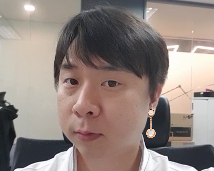
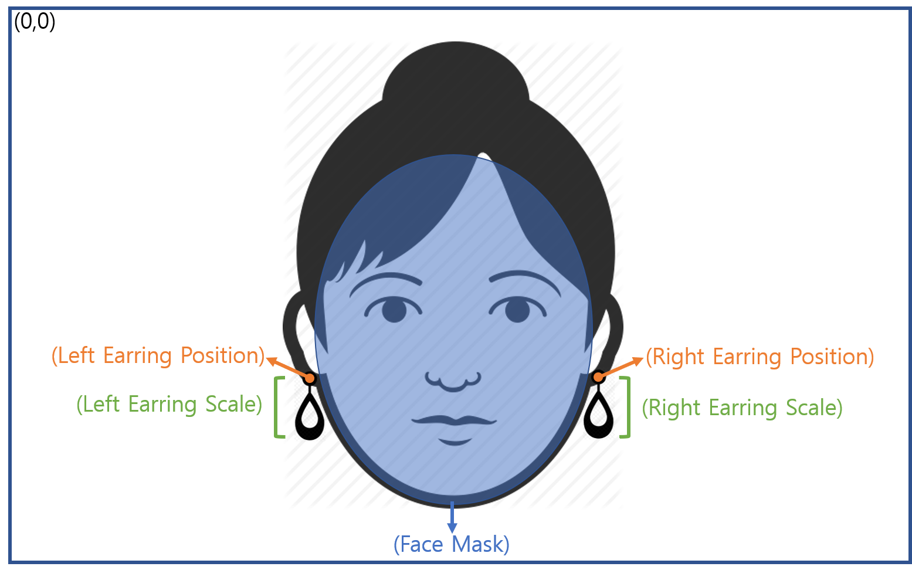
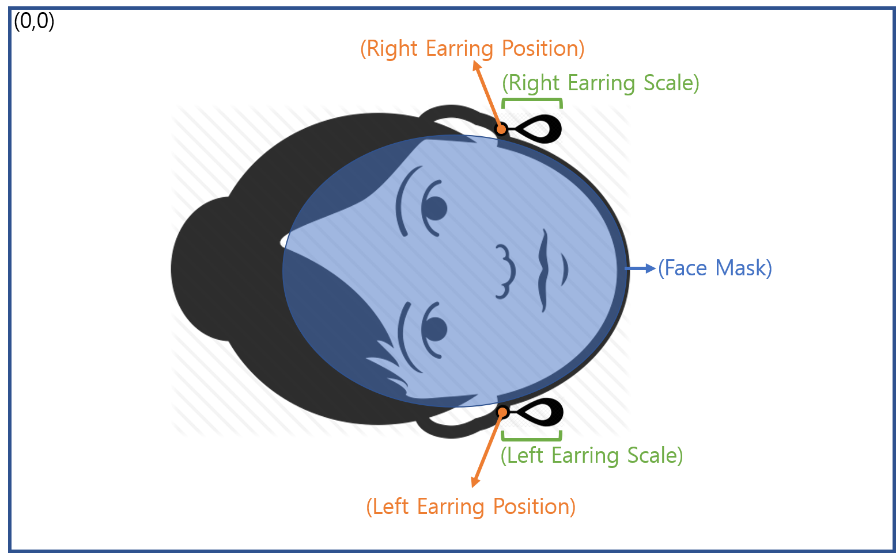

{: width="200"}

# ARing Tutorial

>ARing은 모바일 장치에서 실시간으로 얼굴 및 손의 특정 위치와 스케일 정보 등을 실시간으로 추정하는 컴퓨터 비전 기반 API Library 입니다.  

***

## 특징

### 귀 위치 및 스케일 정보 추정

> 사용자의 귀를 모바일 장치에서 실시간으로 검출하고 양쪽 귀의 위치 및 스케일 정보를 제공합니다. 이것을 이용해서 온라인상에서 사용자가 귀걸이를 가상으로 착용(Virtual Try-on)할 수 있는 서비스를 만들 수 있습니다.

{: width="400"}

- 스팩:
  - 1명만 적용 가능
  - Yaw 축으로 약 45º 이내
  - 1920x1080 30~40 FPS (Device tested: Galaxy Note 8)

- 결과물:  
  - 양쪽 귀의 위치, 양쪽 귀 크기, 얼굴 마스크 정보
  
    > 입력 영상이 가로 방향일 경우

    {: width="400"}
    ```text
    귀 위치정보: x(이미지의 가로 방향 위치), y(이미지의 세로 방향 위치)
    귀 크기(스케일): 귀의 높이 / 영상의 높이
    얼굴 마스크 정보: 얼굴의 경계 라인 정보
    ```  

    > 입력 영상이 세로 방향일 경우

    {: width="400"}
    ```text
    귀 위치정보: x(이미지의 가로 방향 위치), y(이미지의 세로 방향 위치)
    귀 크기(스케일): 귀의 너비 / 영상의 너비
    얼굴 마스크 정보: 얼굴의 경계 라인 정보
    ```  

***

## 환경설정

- [Android 환경설정][android]

- [iOS 환경설정][ios]

***

## ARing API 사용방법 (c++ with OpenCV)

>C++를 이용한 ARing API 사용법을 소개한다. ARing API를 사용하기 위해서는 OpenCV 라이브러리가 필요하다.
ARing API의 전체 예제 코드는 [Android][andoid_sample]/[iOS][ios_sample] 링크를 참고한다.

1. ARing 객체를 생성한다.
    > 객체를 생성하는 과정에서 [라이센스와 관련된 예외][license_exception]가 발생할 수 있다.  

    ```c++
    // Android
    std::shared_ptr<dp::aringnative::IARing> g_ptrARing =
      dp::android::DPFactoryForAndroid::CreateInstance<dp::aringnative::IARing>(
        env, activity);
    ```
    ```c++
    // iOS
    std::shared_ptr<dp::aringnative::IARing> g_ptrARing =
      dp::ios::DPFactoryForiOS::CreateInstance<dp::aringnative::IARing>();
    ```

2. ARing 객체를 초기화 한다.
    > ARing API를 초기화 하기 위해서 다바이스 실행 시 영상의 크기, 영상을 회전할 각도, 카메라 센서의 크기, 그리고 포커스 값을 입력한다. 카메라 센서의 크기와 포커스 값을 0으로 입력할 경우 ARing 내부에 정의된 기본값이 사용된다. 일반적으로 스마트폰을 세로로 사용할 경우 회전된 영상을 얻게 된다. 올바른 영상으로 바꾸기 위해 얼마나 회전을 해야하는지를 파라미터로 설정해야 한다.

    ```c++
    // (img.cols) 영상 가로 크기
    // (img.rows) 영상 세로 크기
    // (imageRotation) 영상을 회전할 각도
    // (sensorWidth) 카메라 센서의 가로 크기
    // (sensorHeight) 카메라 센서의 세로 크기
    // (focalLength) 카메라 포커스 값
    g_ptrARing->initialize(img.cols, img.rows, imageRotation, sensorWidth, sensorHeight, focalLength);
    ```

    |Exception|Exception message|Description|
    |-|-|-|
    |dp::exception::DPException|Already initialized|두번 이상 초기화를 했을 경우 발생한다.|
    |dp::exception::DPException|Initialization Failed|예상하지 못한 에러가 있을 경우 발생한다.|

3. ARing 객체의 DetectFace 함수를 호출한다.
   > 영상의 [타입][image_type]을 지정해야 한다. 영상의 사이즈는 320x240보다 커야한다. 이 함수의 [반환 값][ARing_api]에는 얼굴 검출 유무 및 귀의 위치 등이 포함되어 있다. 반환값에 포함된 위치의 좌표계는 입력 영상의 pixel 좌표계와 같다.

    ```c++
    dp::aringnative::DPAringResult result = g_ptrARing->DetectFace(img, imageType);
    ```

    |Exception|Exception message|Description|
    |-|-|-|
    |dp::exception::DPException|There is no image|입력 영상이 비어있을 경우 발생한다.|
    |dp::exception::DPException|No initialized|초기화를 하지 않은 경우 발생한다.|
    |dp::exception::DPException|Image size is different from the initial image size|초기화할 때 입력한 영상의 크기와 현재 입력 영상의 크기가 다른 경우 발생한다.|

4. 귀 위치 정보를 이용하여 귀걸이를 출력한다.
    >왼쪽, 오른쪽 귀걸이 2개를 출력한다. 이 때 귀걸이의 크기는 귀의 크기값을 이용해서 결정한다. 귀의 크기는 (귀의 높이 / 입력 영상의 높이) 값이다. 영상의 방향과 귀걸이의 방향이 일치하도록 해야한다.

    ```c++
    cv::Mat earingPic = cv::imread("earingPic.png"); //귀걸이 영상 입력
    if(result.detected)
    {
      drawEarring(matDST, earingPic, result, true); // LEFT
      drawEarring(matDST, earingPic, result, false); // RIGHT
    }
    ```

    ```c++
    void drawEarring(cv::Mat dst, cv::Mat earingPic, DPARingResult result, bool isLeft)
    {
      float fEaring_scale_y = isLeft ? result.earringScaleYLeft : earringScaleYRight;
      cv::Mat matEarring;
      cv::resize(earingPic, matEarring, cv::Size(0, 0), fEaring_scale_y, fEaring_scale_y);
  
      if(matEarring.empty())
        return;
  
      cv::Point earingPt = isLeft ? result.leftEarringPos : result.rightEarringPos;
  
      cv::Rect earingRect(0, 0, matEarring.cols, matEarring.rows);
  
      earingRect = earingRect + earingPt;
      earingRect = earingRect - cv::Point(earingRect.width / 2, earingRect.width / 4);
  
      cv::Rect safeRect(0, 0, dst.cols, dst.rows);
      earingRect = earingRect & safeRect;
  
      if(matEarring.size().area()!=earingRect.area())
        return;

      // 얼굴을 일정 각도 이상 돌리면 mask를 적용하지 않는다.
      if (isLeft) {
        if (!(result.rotX < -15))
          matEarring.setTo(0, result.mask(earingRect));
      } else {
        if (!(result.rotX > 15))
          matEarring.setTo(0, result.mask(earingRect));
      }
  
      cv::Mat earingMask;
      cv::compare(matEarring, 0, earingMask, cv::CMP_GT);
  
      // dst의 타입(디바이스에서 영상을 출력할 때 사용하는 타입)으로 변경한다.
      cv::cvtColor(earingMask, earingMask, CV_BGR2RGBA);
      cv::cvtColor(matEarring, matEarring, CV_BGR2RGBA);
  
      cv::subtract(dst(earingRect), earingMask, dst(earingRect));
      cv::add(matEarring, dst(earingRect), dst(earingRect));
    }
  
    ```

***

## 연락처

>API 적용시 문제점을 발견하거나 궁금한 점이 있다면, 다음의 이메일(hoohyun.kim@deepixel.xyz)로 문의해 주세요.  

***

## 참조

- [Anroid Sample][andoid_sample]
- [iOS Sample][ios_sample]
- [ARing API][ARing_api]
- [OpenCV][opencv]
- [TBB][tbb]
- [License][license]

[andoid_sample]: https://github.com/deepixel-dev1/deepixel-dev1.github.io/tree/master/ARing/tutorial/android/
[ios_sample]: https://github.com/deepixel-dev1/deepixel-dev1.github.io/tree/master/ARing/tutorial/ios
[opencv]: http://opencv.org/
[ARing_api]: /ARing/apis/
[image_type]: /ARing/apis/
[tbb]: https://www.threadingbuildingblocks.org/
[android]: android.md
[iOS]: ios.md
[license]: /License/README.md
[license_exception]: /License/README.md#Exceptions
