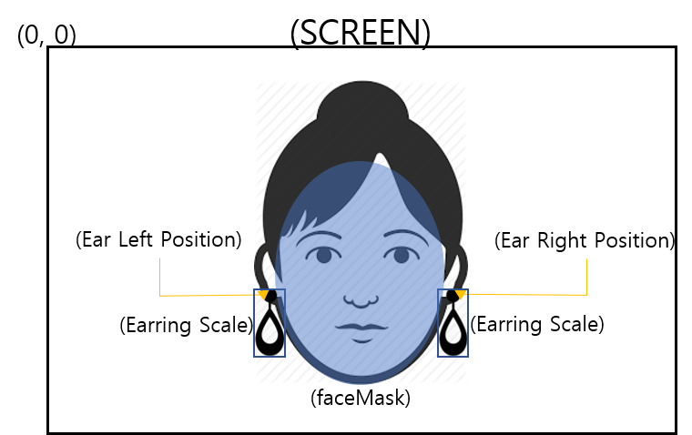

{: width="200"}

# ARing tutorial

>ARing은 얼굴의 귀 정보를 추정하여 어플리케이션 개발자가 응용할 수 있게 해주는 영상처리 기반 API 모듈 입니다.  

***

## 특징

### 1. 귀 위치 추정

> 귀 위치 추정은 사용 유저의 귀를 모바일 상에서 실시간으로 검출해 주는 api 모듈입니다. 

{: width="400"}

- 스팩:
  - 1명만 적용 가능
  - 30~40 FPS (Device: Galaxy Note 8)

- 결과물:  
  - 귀의 왼쪽, 오른쪽 위치정보, 귀 스케일, 얼굴 마스크 정보

    ```text
    귀 위치정보: x(이미지의 가로 방향 위치), y(이미지의 세로 방향 위치)
    귀 스케일: 귀걸이 이미지 스케일 변환 정보
    얼굴 마스크 정보: 얼굴의 바운더리 정보
    ```  

{: width="400"}

- [Android tutorial][android]

- [iOS tutorial][ios]
  
[android]: android.md
[iOS]: ios.md
