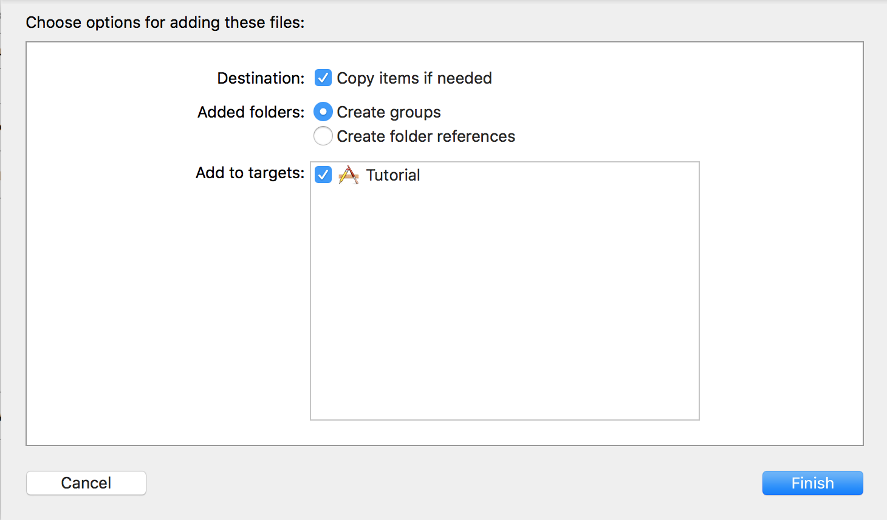
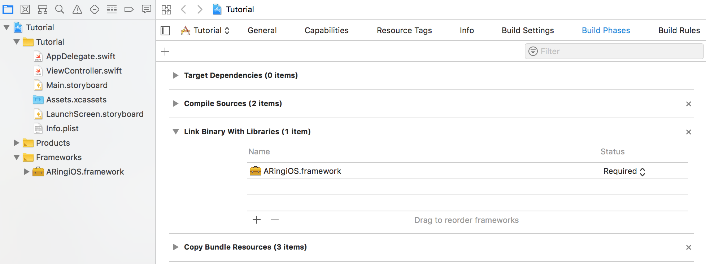
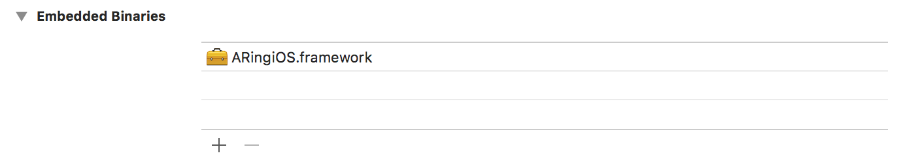
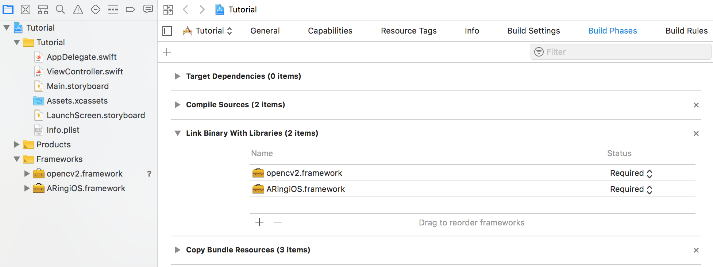
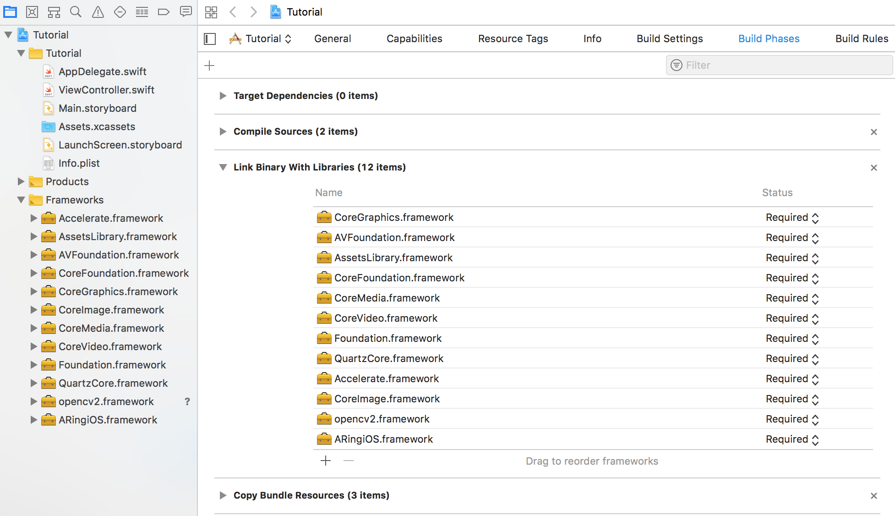
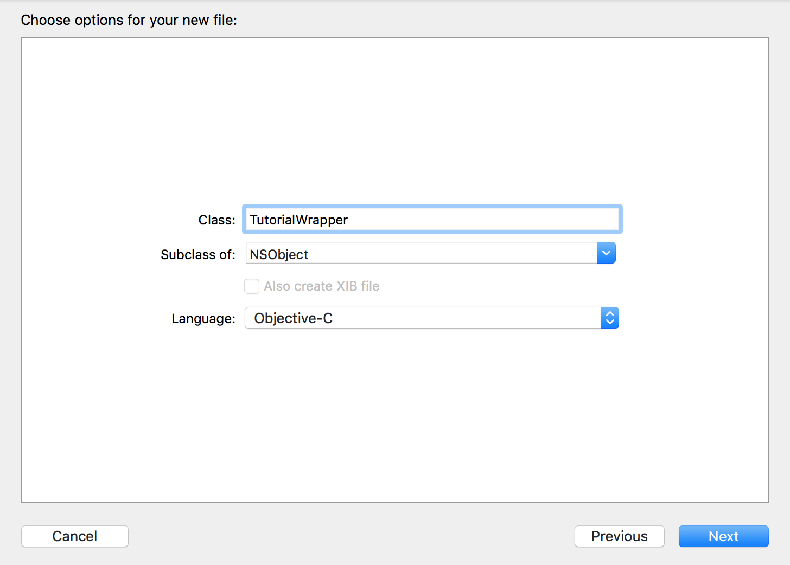
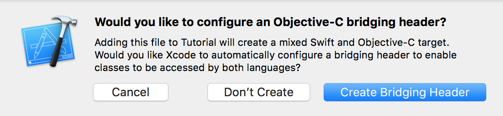
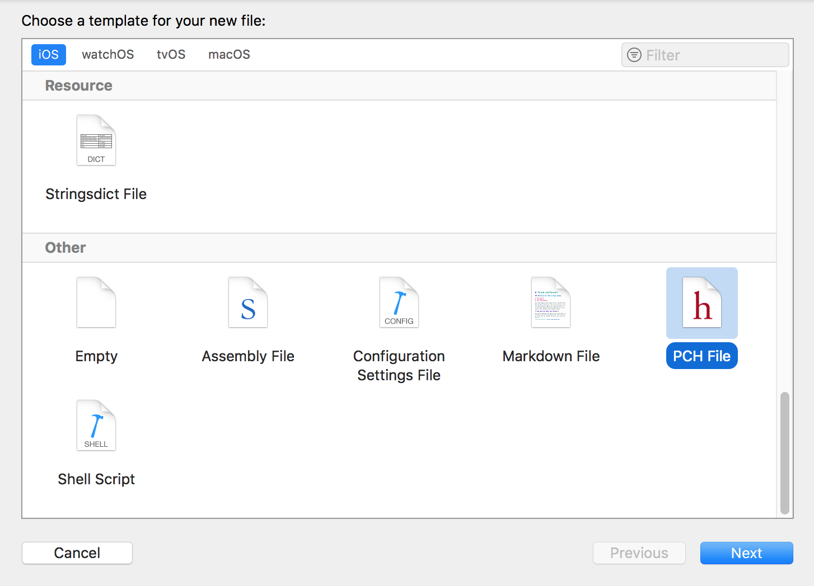
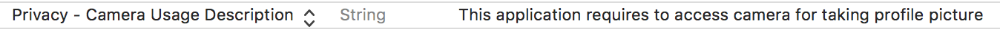

{: width="200"}

# ARing iOS 개발 설정

## Getting started

1. Xcode 프로젝트 생성한다.
2. 드래그&드롭으로 ARingiOS.framework를 프로젝트에 추가한다.
    > 아래와 같은 화면이 뜨면 파일이 프로젝트 폴더로 복사하도록 설정한다.
    > 

   
3. General -> Embedded binary 설정에 AringiOS.framework 를 추가한다.
   
4. OpenCV 3.4.3 버전 [다운로드][OpenCV]
5. 드래그&드롭으로 opencv2.framework를 프로젝트에 추가한다.
   > 아래와 같은 화면이 뜨면 파일이 프로젝트 폴더로 복사하도록 설정한다.
   > 

   
   - **Build Settings -> Framework Search Paths** 설정값에 해당하는 폴더에 ARingiOS와 OpenCV framework 파일이 있는지 확인한다.
6. OpenCV에 필요한 framework 추가한다.
   
7. Cocoa Touch Class 추가  
   File -> New -> File… -> Cococa Touch Class
   
   > 아래와 같은 창이 뜨면 Create Bridging Header 버튼을 클릭한다.
   > 
8. TutorialWrapper.m 파일명을 TutorialWrapper.mm 으로 변경한다.
9. Tutorial-Bridging-Header.h 파일에 아래 코드를 추가한다.
    ```c
    #import "TutorialWrapper.h"
    ```
10. PCH 파일 추가한다.
    
11. 추가한 PCH 파일을 아래와 같이 수정한다.
    ```c
    #ifndef PrefixHeader_pch
    #define PrefixHeader_pch

    // Include any system framework and library headers here that should be included in all compilation units.
    // You will also need to set the Prefix Header build setting of one or more of your targets to reference this file.
    #ifdef __cplusplus
    #include <opencv2/opencv.hpp>
    #endif

    #endif /* PrefixHeader_pch */
    ```
12. Build Settings -> Prefix Header 설정값으로 PCH 파일의 위치를 추가한다.

13. Info.plist 파일에 아래 내용을 추가한다.
    

## 문제 해결

프로그램 실행 후 아래와 같은 예외가 발생할 경우 bundle identifier 를 라이센스에 적용된 올바른 값으로 수정해야 한다.

```text
dp::exception::DPLicenseException: The application id(xyz.deepixel.Tutorial) is not allowed.
```

## 참조

- Tutorial 소스 코드 [다운로드][tutorial_source_code]

[OpenCV]: https://opencv.org/releases.html
[tutorial_source_code]: https://github.com/deepixel-dev1/deepixel-dev1.github.io/tree/master/ARing/tutorial/ios