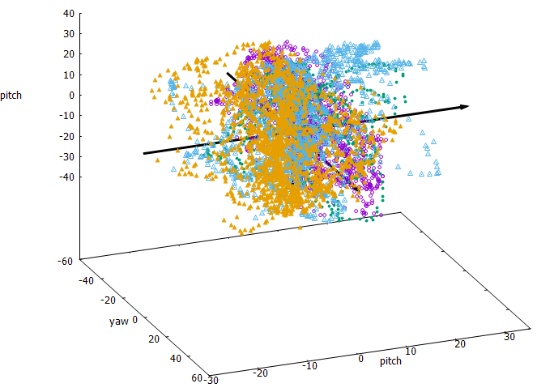
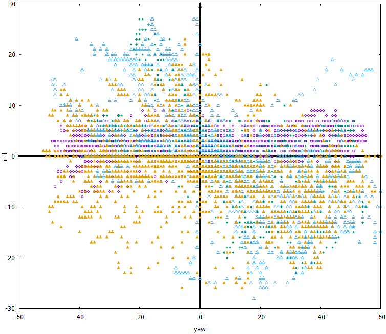
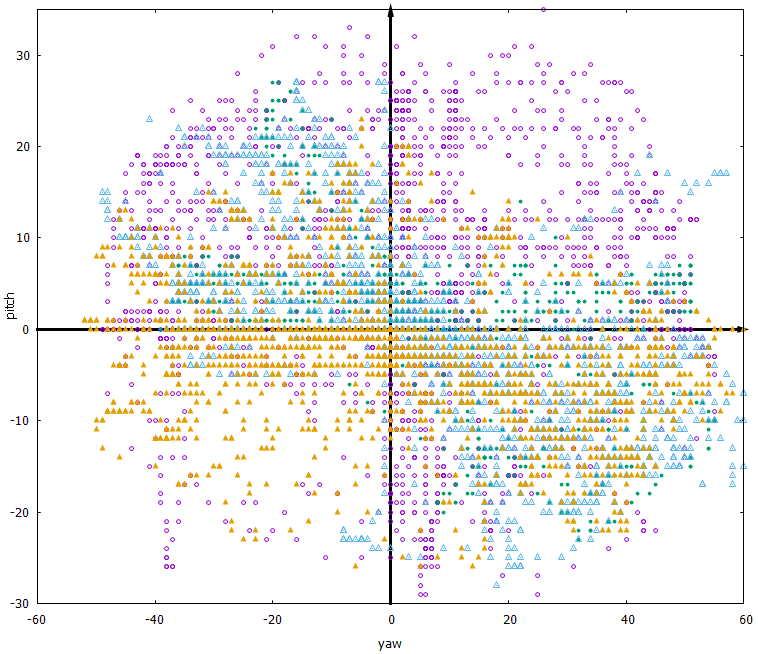
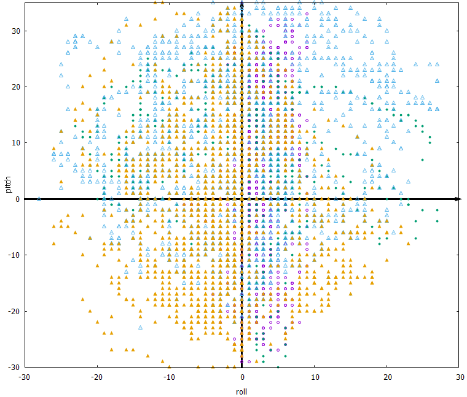

{: width="200"}

# SPEC

> 얼굴 방향 및 각도(yaw, roll, pitch)에 따른 스펙을 정의한다.

|  |
| :--: |
| *3D SPEC(YAW, ROLL, PITCH)* |

|  |
| :--: |
| *2D SPEC(YAW, ROLL)* |

|  |
| :--: |
| *2D SPEC(YAW, PITCH)* |

|  |
| :--: |
| *2D SPEC(ROLL, PITCH)* |