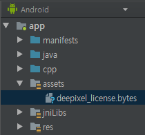

LICENSE TUTORIAL (For Android)
=========================

>A license file is required to use the SW library provided by Deepixel Inc.


## Requests a license

The following information is required to generate and manage the license file. Please send us the information by email.[deepixel@deepixel.xyz]

- Application ID  
>Application ID to which the license applies.  

- Your company
- E-mail
>E-mail address for updates and important information.  

## Applies a license

1. Copies a license file in assets folder and rename the license file to "deepixel_license.bytes".  


2. Makes sure the application id is the same as the one you provided when you requested the license. 

3. Passes the main activity object to the JNI function and create a MAKA object.

```java  
package maka.deepixel.xyz.makaandroidappexample;

import android.app.Activity;
import android.support.v7.app.AppCompatActivity;
import android.os.Bundle;

public class MainActivity extends AppCompatActivity {

    // Used to load the 'native-lib' library on application startup.
    static {
        System.loadLibrary("native-lib");
    }

    @Override
    protected void onCreate(Bundle savedInstanceState) {
        super.onCreate(savedInstanceState);
        setContentView(R.layout.activity_main);

        // Example of a call to a native method
        init(this, "deepixel_license.bytes");
    }

    /**
     * A native method that is implemented by the 'native-lib' native library,
     * which is packaged with this application.
     */
    public native void init(Activity activity, String licenseFilename);
}

```
```cpp
#include <jni.h>
#include <android/log.h>
#include <makanative/DPFactoryForAndroid.h>
#include <makanative/IMaka.h>
#include <makanative/DPException.h>

#define LOGF(tag, ...) __android_log_print(ANDROID_LOG_FATAL  , tag, __VA_ARGS__)

extern "C" {

std::shared_ptr<dp::makanative::IMaka> g_ptrMaka;

JNIEXPORT void JNICALL
Java_maka_deepixel_xyz_makaandroidappexample_MainActivity_init(JNIEnv *env, jobject,
                                                               jobject activity,
                                                               jstring licenseFilename) {
    try {
        jboolean isCopy;
        std::string licenseFilenameStr = env->GetStringUTFChars(licenseFilename, &isCopy);
        g_ptrMaka = dp::android::DPFactoryForAndroid::CreateInstance<dp::makanative::IMaka>
                (env, activity, licenseFilenameStr);
     } catch (dp::exception::DPLicenseExpiredException ex) {
        LOGF("MAKA", "%s", ex.what());
    }
}

}
```

## License exceptions

- dp::exception::DPLicenseException
>This exception is occurred when the license file does not exists or is corruted.

- dp::exception::DPLicenseExpiredException
>This exception is occurred when it is expired.
