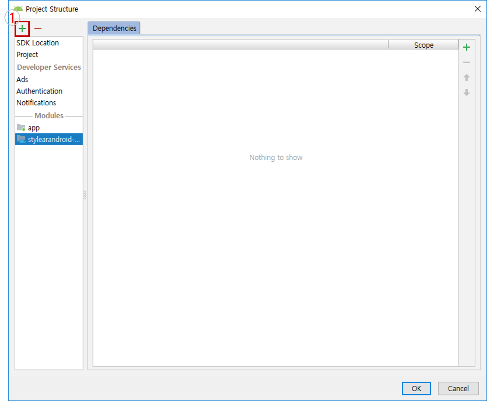
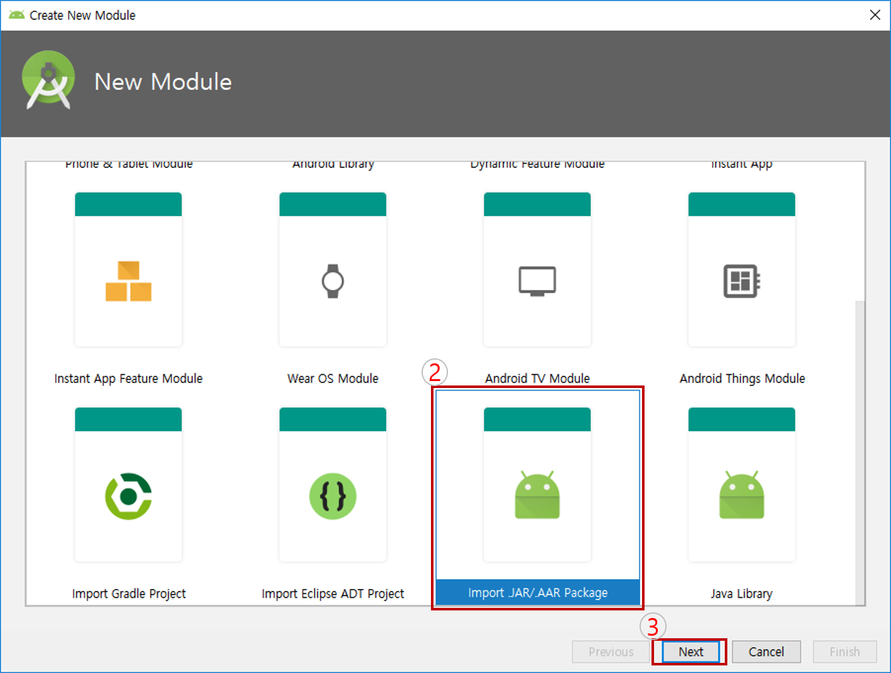
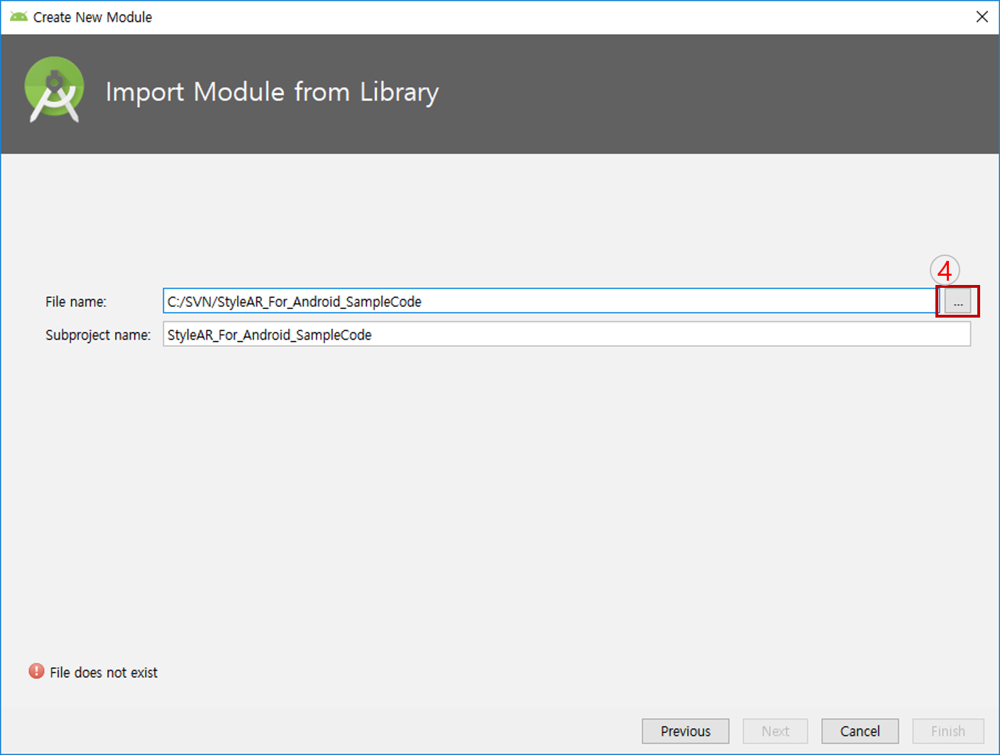
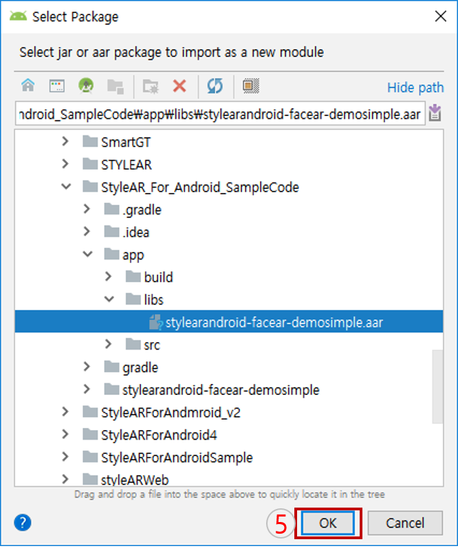

[{: width="200"}](https://www.deepixel.xyz/)

# StyleAR Android 환경설정

Android 플랫폼에서 StyleAR API를 적용하기 위한 라이브러리 등록 및 프로젝트 권한 설정에 대한 방법을 자세히 설명합니다.

## Android 프로젝트에서 StyleAR API 라이브러리 추가

> 본 예제는 StyleARAndroid.aar이 아닌 stylearandroid-facear-demosimple.aar로 설정되어 있습니다. 또한 Android Studio 버전은 3.2.1 입니다.

1. File->ProjectStructure를 클릭합니다.
2. 라이센스 발급된 라이브러리파일(StyleARAndroid.aar)을 임포트 합니다.
   1. Project Sturcture 다이얼로그의 +
      버튼을 클릭합니다.
      
   1. import AAR/JAR Package를 선택하고, next 를 클릭합니다.
      
   1. 라이브러리 파일 이름을 변경하기 위해 ... 버튼을 클릭합니다.
      
   1. 저장된 StyleARAndroid.aar파일경로를 지정하고, OK 를 클릭합니다.
      
3. 프로젝트 Gradle에 설정을 추가합니다.

   ```java
    android{
        // JAVA 버전
        compileOption{
            sourceCompatibility 1.8
            sourceCompatibility 1.8
        }
    }

    dependencies{
        implementation 'net.sourceforge.streamsupport:android-retrofuture:1.7.0'
        implementation 'com.android.support:appcompat-v7:28.0.0'
        implementation 'com.android.support.constraint:constraint-layout:1.1.3'
        // 어플리케이션에 StyleARAndroid aar(라이브러리) 추가
        implementation project(':StyleARAndroid')
    }
   ```

4. 어플리케이션 ID 설정

   > 적용할 프로젝트의 **어플리케이션 ID**는 **반드시 라이센스 발급 시 기입했던** '**적용 어플리케이션 ID**'를 사용해야 합니다.

   ```java
    android{
        defaultConfig {
            // 어플리케이션 ID = 라이센스 발급때 기입한 ID로 설정
            // 예시 라이센스 발급 ID(xyz.deepixel)
            applicationId "xyz.deepixel"
        }
    }
   ```

## Android 프로젝트에 권한설정 추가

> **StyleAR API**를 개발 프로젝트의 어플리케이션에 적용하기 위해서는 **파일 입출력** 및 **카메라 사용**에 대한 **어플리케이션 사용자의 권한**이 **승인** 되어야 합니다.

- **사용권한 설정**  
   사용권한을 요청할 수 있게 manifests에 아래의 코드를 입력합니다.

  ```xml
  <!--For Android-->
  <!--manifests file-->
  <uses-permission android:name="android.permission.WRITE_EXTERNAL_STORAGE" />
  <uses-permission android:name="android.permission.CAMERA" />
  ```

- **권한수락 코드(변경가능)**  
   설정된 권한이 모바일사용자에게 나타날 수 있도록 다이얼로그를 만들며, 선택에 따라 실제 권한이 적용 될 수 있도록 합니다. 해당 코드는 예시이며, **개발자가 다른 방식으로 기능구현**해도 무방합니다.

  ```java
  /*For Android*/
  private val REQUEST_CAMERA_PERMISSION = 1
  private val REQUEST_WRITE_EXTERNAL_STORAGE_PERMISSION = 2
  private val FRAGMENT_DIALOG = "dialog"
  // camera 권한 설정
  private boolean requestCameraPermission() {
      if (ContextCompat.checkSelfPermission(getActivity(), Manifest.permission.CAMERA)
              == PackageManager.PERMISSION_GRANTED)
          return false;
      else if (shouldShowRequestPermissionRationale(Manifest.permission.CAMERA)) {
          ConfirmationDialogFragment.newInstance(R.string.camera_permission_confirmation,
                  new String[]{Manifest.permission.CAMERA},
                  REQUEST_CAMERA_PERMISSION,
                  R.string.camera_permission_not_granted)
                  .show(getFragmentManager(), FRAGMENT_DIALOG);
      } else {
          requestPermissions(new String[]{Manifest.permission.CAMERA}, REQUEST_CAMERA_PERMISSION);
      }
      return true;
  }
  // 파일입출력 권한 설정
  private boolean requestReadExternalStoragePermission() {
      if (ContextCompat.checkSelfPermission(getActivity(), Manifest.permission.WRITE_EXTERNAL_STORAGE)
              == PackageManager.PERMISSION_GRANTED)
          return false;
      else if (shouldShowRequestPermissionRationale(Manifest.permission.WRITE_EXTERNAL_STORAGE)) {
          ConfirmationDialogFragment.newInstance(R.string.write_external_storage_permission_confirmation,
                  new String[]{Manifest.permission.WRITE_EXTERNAL_STORAGE},
                  REQUEST_WRITE_EXTERNAL_STORAGE_PERMISSION,
                  R.string.write_external_storage_permission_not_granted)
                  .show(getFragmentManager(), FRAGMENT_DIALOG);
      } else {
          requestPermissions(new String[]{Manifest.permission.WRITE_EXTERNAL_STORAGE},
                             REQUEST_WRITE_EXTERNAL_STORAGE_PERMISSION);
      }
      return true;
  }
  // 에러 다이얼로그 생성
  public static class ErrorDialog extends DialogFragment {

      private static final String ARG_MESSAGE = "message";

      public static ErrorDialog newInstance(String message) {
          ErrorDialog dialog = new ErrorDialog();
          Bundle args = new Bundle();
          args.putString(ARG_MESSAGE, message);
          dialog.setArguments(args);
          return dialog;
      }

      @NonNull
      @Override
      public Dialog onCreateDialog(Bundle savedInstanceState) {
          final Activity activity = getActivity();
          return new AlertDialog.Builder(activity)
                  .setMessage(getArguments().getString(ARG_MESSAGE))
                  .setPositiveButton(android.R.string.ok, (dialogInterface, i) -> activity.finish())
                  .create();
      }

  }
  // 확인 다이얼로그 생성
  public static class ConfirmationDialogFragment extends DialogFragment {

      private static final String ARG_MESSAGE = "message";
      private static final String ARG_PERMISSIONS = "permissions";
      private static final String ARG_REQUEST_CODE = "request_code";
      private static final String ARG_NOT_GRANTED_MESSAGE = "not_granted_message";

      public static ConfirmationDialogFragment newInstance(@StringRes int message,
                                                           String[] permissions,
                                                           int requestCode,
                                                           @StringRes int notGrantedMessage) {
          ConfirmationDialogFragment fragment = new ConfirmationDialogFragment();
          Bundle args = new Bundle();
          args.putInt(ARG_MESSAGE, message);
          args.putStringArray(ARG_PERMISSIONS, permissions);
          args.putInt(ARG_REQUEST_CODE, requestCode);
          args.putInt(ARG_NOT_GRANTED_MESSAGE, notGrantedMessage);
          fragment.setArguments(args);
          return fragment;
      }

      @NonNull
      @Override
      public Dialog onCreateDialog(Bundle savedInstanceState) {
          final Bundle args = getArguments();
          return new android.support.v7.app.AlertDialog.Builder(getActivity())
                  .setMessage(args.getInt(ARG_MESSAGE))
                  .setPositiveButton(android.R.string.ok,
                          (dialog, which) -> {
                              String[] permissions = args.getStringArray(ARG_PERMISSIONS);
                              if (permissions == null) {
                                  throw new IllegalArgumentException();
                              }
                              ActivityCompat.requestPermissions(getActivity(),
                                      permissions, args.getInt(ARG_REQUEST_CODE));
                          })
                  .setNegativeButton(android.R.string.cancel,
                          (dialog, which) ->
                                  ErrorDialog.newInstance(getString(args.getInt(ARG_NOT_GRANTED_MESSAGE)))
                                          .show(getChildFragmentManager(), FRAGMENT_DIALOG)).create();
      }

  }
  ```

---
