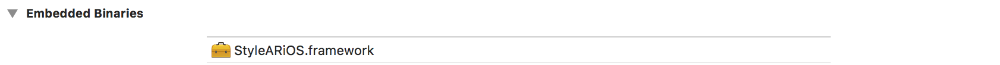
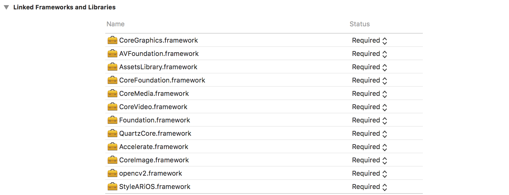
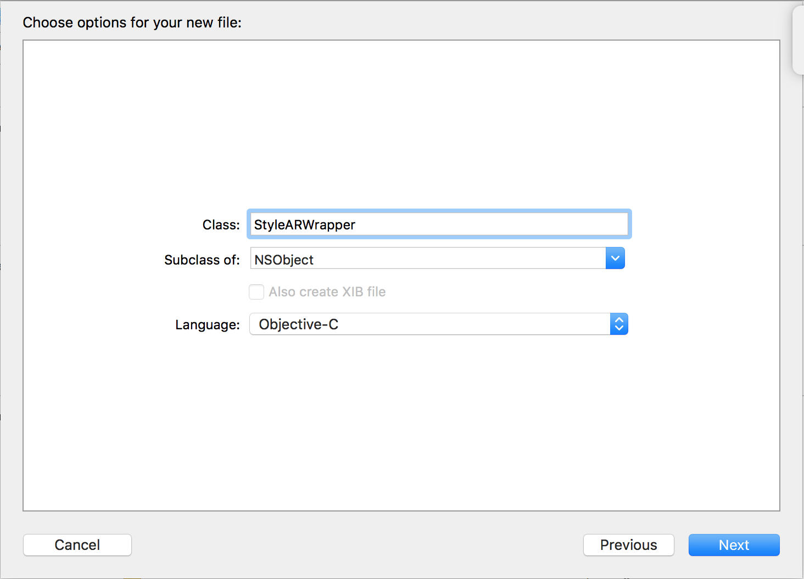
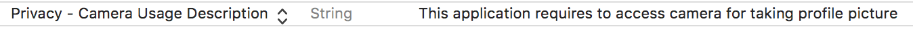
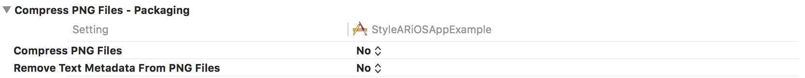

{: width="200"}

# StyleAR iOS 환경설정

## Xcode 환경설정

1. Xcode 프로젝트 생성한다.
2. General -> Embedded binaries 설정에 StyleARiOS.framework 를 추가한다.
   
3. OpenCV 3.4.3 버전 [다운로드][opencv]
4. Generral -> Linked frameworks and binaries 에 opencv2.framework와 OpenCV에 필요한 frameworks를 추가한다.
   
   - **Build Settings -> Framework Search Paths** 설정값에 해당하는 폴더에 StyleARiOS와 OpenCV framework 파일이 있는지 확인한다.
5. Cocoa Touch Class 추가  
   File -> New -> File… -> Cococa Touch Class
   
   > 아래와 같은 창이 뜨면 Create Bridging Header 버튼을 클릭한다.
   > 
6. StyleARWrapper.m 파일명을 StyleARWrapper.mm 으로 변경한다.
7. StyleARiOSAppExample-Bridging-Header.h 파일에 아래 코드를 추가한다.

   ```objective-c
   #import "StyleARWrapper.h"
   ```

8. PCH 파일 추가한다.
   
9. 추가한 PCH 파일을 아래와 같이 수정한다.

   ```c
   #ifndef PrefixHeader_pch
   #define PrefixHeader_pch

   // Include any system framework and library headers here that should be included in all compilation units.
   // You will also need to set the Prefix Header build setting of one or more of your targets to reference this file.
   #ifdef __cplusplus
   #include <opencv2/opencv.hpp>
   #endif

   #endif /* PrefixHeader_pch */
   ```

10. Build Settings -> Prefix Header 설정값으로 PCH 파일의 위치를 추가한다.

11. Info.plist 파일에 카메라 권한을 얻기 위한 설정을 추가한다.
    

---

## 문제 해결

- 프로그램 실행 후 아래와 같은 예외가 발생할 경우 bundle identifier 를 라이센스에 적용된 올바른 값으로 수정해야 한다.

  ```text
  dp::exception::DPLicenseException: The application id(xyz.deepixel.Tutorial) is not allowed.
  ```

- PNG 파일을 사용할 때 아래와 같은 에러가 발생할 경우 프로젝트 설정을 변경하여 해결할 수 있다.

  ```text
  libpng error: CgBI: unhandled critical chunk
  ```

  

---

## 참조

- Tutorial 소스 코드 [다운로드][tutorial_source_code]

[opencv]: https://opencv.org/releases.html
[tutorial_source_code]: https://github.com/deepixel-dev1/deepixel-dev1.github.io/tree/master/StyleAR/tutorial/ios
