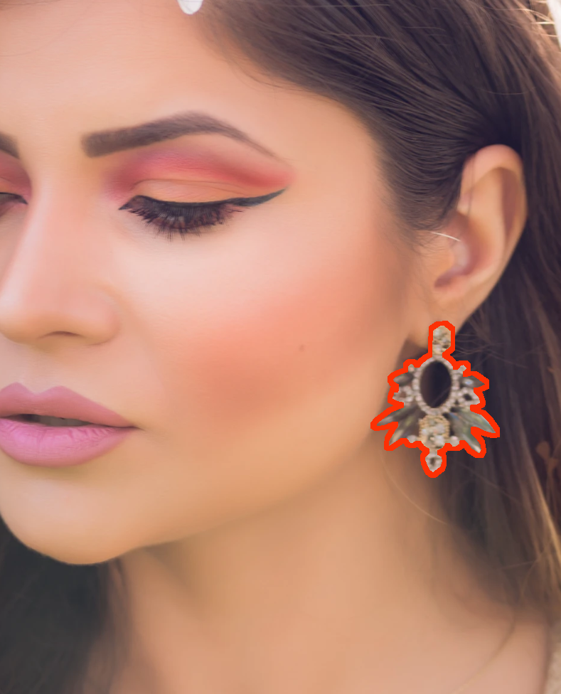
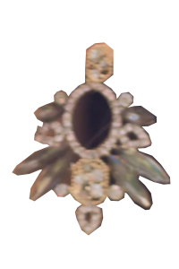

{: width="200"}

---

## 자주 묻는 질문들

Q: **귀걸이 이미지의 파일 크기는 제한이 있나요?** 
A: 현재 700kb 이하로 제한하고 있습니다.

Q: **어떤 이미지 파일로 업로드 가능한가요?** 
A: 현재 PNG 파일만 가능합니다.

Q: **가상 착용이 더욱 실제 착용한것 처럼 보이려면 어떻게 해야하나요?** 
A: 제품을 착용한 모델의 고화질 사진에서 귀걸이외 모든 배경을 없앤  사진이 가장 실제 같은 가상착용 결과를 보여줍니다.

- Tips
  - 바탕이 투명한 RGBA 사진 (32bit)
  - 모델의 턱 각도가 좌우 45도 이내

예제)

