- [1. 제품관리](#1-%ec%a0%9c%ed%92%88%ea%b4%80%eb%a6%ac)
  - [1.1. 구매하기](#11-%ea%b5%ac%eb%a7%a4%ed%95%98%ea%b8%b0)
  - [1.2. 상품등록](#12-%ec%83%81%ed%92%88%eb%93%b1%eb%a1%9d)
  - [1.3. 가상착용 태그 설정](#13-%ea%b0%80%ec%83%81%ec%b0%a9%ec%9a%a9-%ed%83%9c%ea%b7%b8-%ec%84%a4%ec%a0%95)
- [2. UI관리](#2-ui%ea%b4%80%eb%a6%ac)
  - [2.1. 모델관리](#21-%eb%aa%a8%eb%8d%b8%ea%b4%80%eb%a6%ac)
  - [2.2. 플로팅관리](#22-%ed%94%8c%eb%a1%9c%ed%8c%85%ea%b4%80%eb%a6%ac)
    - [2.2.1. 크기 및 위치 변경](#221-%ed%81%ac%ea%b8%b0-%eb%b0%8f-%ec%9c%84%ec%b9%98-%eb%b3%80%ea%b2%bd)
    - [2.2.2. 플로팅 비활성화](#222-%ed%94%8c%eb%a1%9c%ed%8c%85-%eb%b9%84%ed%99%9c%ec%84%b1%ed%99%94)
- [3. 통계](#3-%ed%86%b5%ea%b3%84)
  - [3.1. 최근호출내역](#31-%ec%b5%9c%ea%b7%bc%ed%98%b8%ec%b6%9c%eb%82%b4%ec%97%ad)
  - [3.2. 월간호출내역](#32-%ec%9b%94%ea%b0%84%ed%98%b8%ec%b6%9c%eb%82%b4%ec%97%ad)
  - [3.3. 제품호출내역](#33-%ec%a0%9c%ed%92%88%ed%98%b8%ec%b6%9c%eb%82%b4%ec%97%ad)
- [4. 프로모션](#4-%ed%94%84%eb%a1%9c%eb%aa%a8%ec%85%98)
  - [4.1. 쿠폰등록](#41-%ec%bf%a0%ed%8f%b0%eb%93%b1%eb%a1%9d)
- [5. StyleAR 쿠폰발급 및 등록](#5-stylear-%ec%bf%a0%ed%8f%b0%eb%b0%9c%ea%b8%89-%eb%b0%8f-%eb%93%b1%eb%a1%9d)
  - [5.1. 쇼핑몰 쿠폰발급](#51-%ec%87%bc%ed%95%91%eb%aa%b0-%ec%bf%a0%ed%8f%b0%eb%b0%9c%ea%b8%89)
    - [5.1.1. 카페24 쿠폰발급](#511-%ec%b9%b4%ed%8e%9824-%ec%bf%a0%ed%8f%b0%eb%b0%9c%ea%b8%89)
    - [5.1.2. 메이크샵 쿠폰발급](#512-%eb%a9%94%ec%9d%b4%ed%81%ac%ec%83%b5-%ec%bf%a0%ed%8f%b0%eb%b0%9c%ea%b8%89)
- [6. 고객 상담 및 문의](#6-%ea%b3%a0%ea%b0%9d-%ec%83%81%eb%8b%b4-%eb%b0%8f-%eb%ac%b8%ec%9d%98)

---
# 1. 제품관리

가상착용 상품 사진, 상품명, 상품코드 등의 상품 정보 및 등록 상태를 확인할 수 있습니다.

## 1.1. 구매하기

화면 왼쪽 상단의 '구매하기'를 통해 가상착용 가능 상품을 증가시킬 수 있습니다. 가상착용 상품은 쇼핑몰 데이터 분석을 통해 StyleAR 인공지능이 최적의 상품을 선정하여 등록합니다.

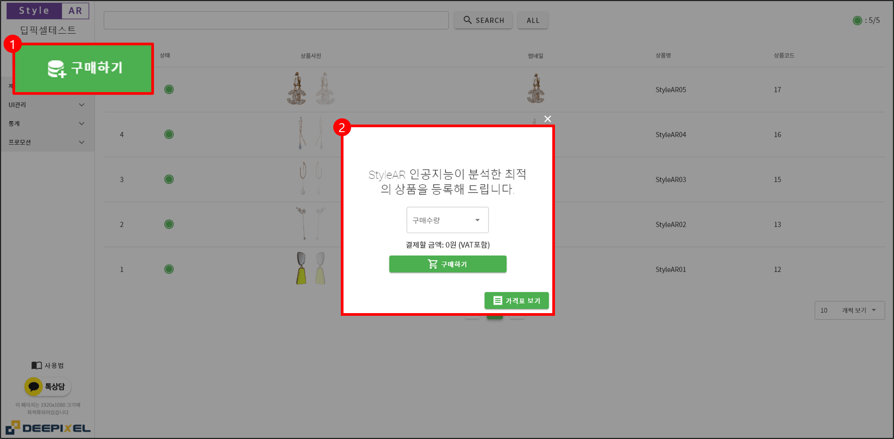

## 1.2. 상품등록

상품의 등록 진행 상태는 제품관리>귀걸이 페이지에서 확인 가능합니다. 등록이 완료되면, 완료 안내 이메일을 전송해 드리며, StyleAR은 즉시 활성화되어 작동하게 됩니다.

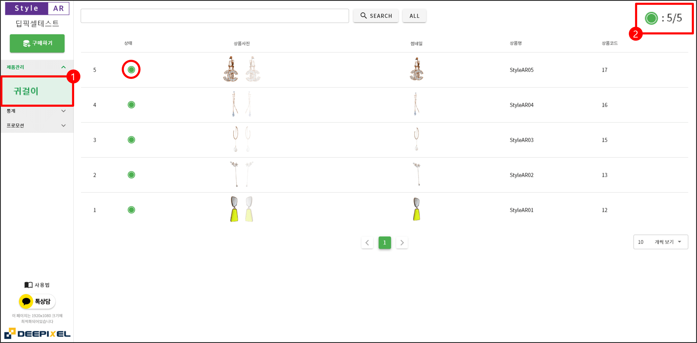

전체 진행도는 오른쪽 상단 표시등을 통해 확인할 수 있으며, 상태 표시등은 등록 대기 상태는 노랑색, 등록 완료 상태는 녹색으로 표시됩니다.

## 1.3. 가상착용 태그 설정

고객이 쇼핑몰에서 가상착용 상품을 쉽게 찾을 수 있도록 '가상착용' 태그를 삽입해 주십시오.

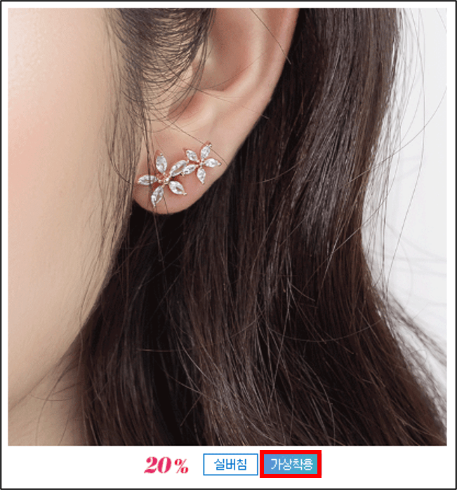

# 2. UI관리

## 2.1. 모델관리

StyleAR은 고객에게 가상착용을 위한 적절한 예시를 제공함과 동시에 고객 사진을 대신하여 가상착용이 가능한 모델을 제공하고 있습니다.

UI관리>모델관리 페이지에서 모델을 변경할 수 있습니다. 모델 사진을 업로드하고 저장을 누르면 StyleAR의 모델로 변경됩니다. 모델 변경 후 반영 시간은 10분가량 소요됩니다. 초기화 시, StyleAR의 기본 모델로 변경됩니다.

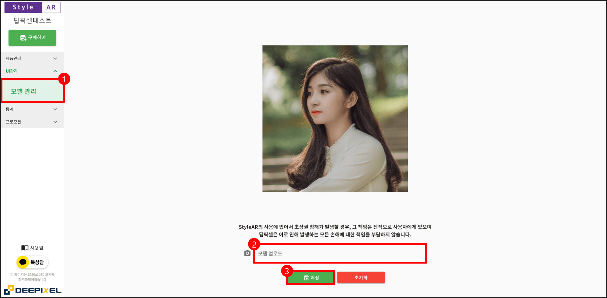

모델 사진 선택 시, 원활한 가상착용을 위해 최소한 한쪽 귀와 두 눈이 보이는 사진을 권장합니다. 단, StyleAR의 사용에 있어서 초상권 침해가 발생할 경우, 그 책임은 전적으로 사용자가에게 있으며, 딥픽셀은 이로 인해 발생하는 모든 손해에 대한 책임을 지지 않습니다.

## 2.2. 플로팅관리

StyleAR의 웹/모바일 상의 크기 및 위치를 변경할 수 있습니다. UI관리>플로팅관리 페이지에서 변경 후 반영 시간은 10분가량 소요됩니다.

### 2.2.1. 크기 및 위치 변경

기본 크기와 위치는 최적의 크기와 위치로 디폴트 세팅이 적용되어 있기 때문에 변경 없이 사용해도 무관합니다. 쇼핑몰 화면을 보면서 StyleAR 크기 및 위치 변경이 가능하도록 업데이트할 예정입니다.

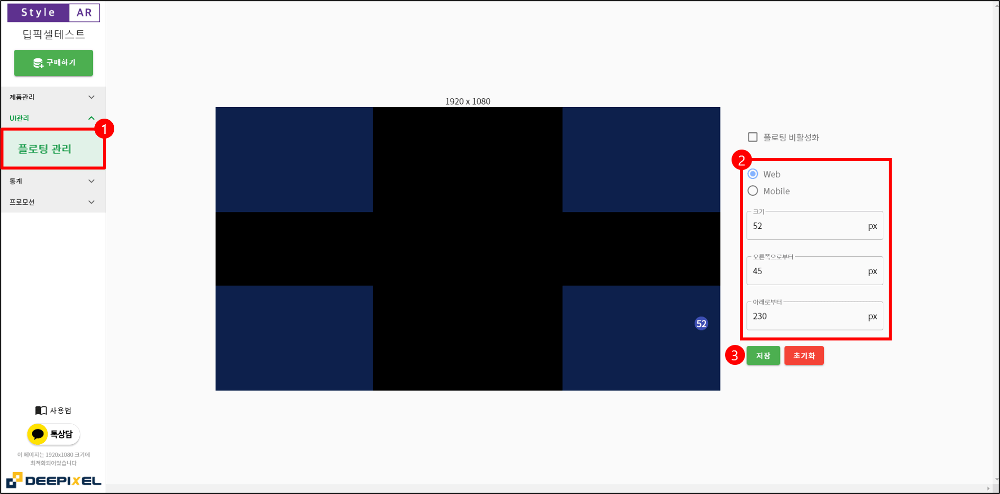

### 2.2.2. 플로팅 비활성화

플로팅 비활성화 기능은 일시적으로 StyleAR이 쇼핑몰 화면에서 사라지게 할 수 있는 기능입니다.

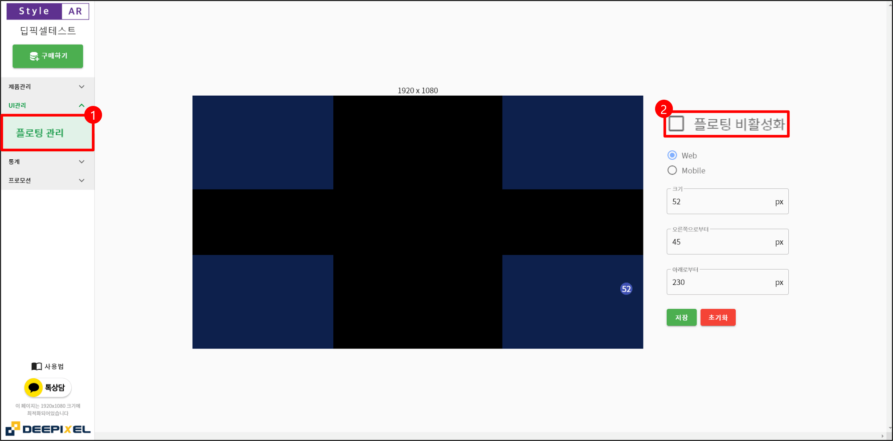

# 3. 통계

StyleAR 사용에 대한 분석 자료를 기본 제공하고 있습니다. 전체 호출수 및 시간별/상품별 호출수 등의 고객 사용 데이터를 실시간으로 제공하고 있습니다. 더욱 직관적이고 유용한 통계 데이터를 제공할 수 있도록 업데이트할 예정입니다.

## 3.1. 최근호출내역

기간별로 StyleAR 가상착용 사용 횟수를 확인할 수 있습니다.

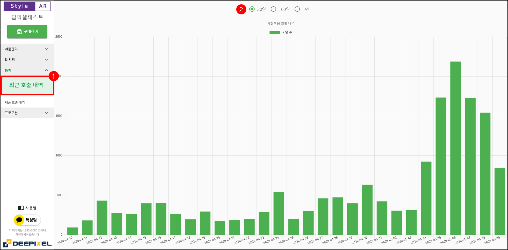

## 3.2. 월간호출내역

월간별로 StyleAR 가상착용 사용 횟수를 확인할 수 있습니다.

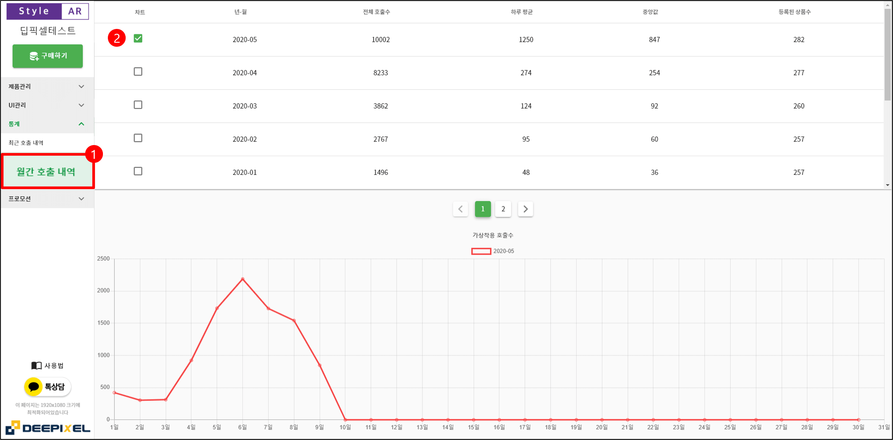

## 3.3. 제품호출내역

상품별로 StyleAR 가상착용 사용 횟수를 확인할 수 있습니다.

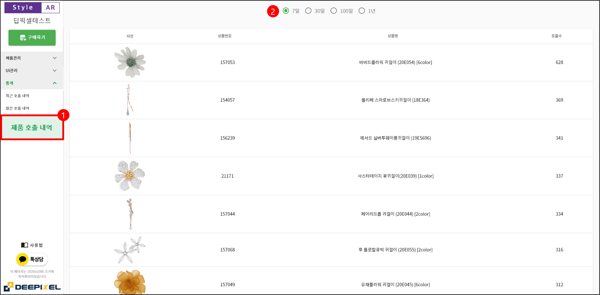

# 4. 프로모션

StyleAR을 통해 가상착용을 체험하는 고객에게 쿠폰을 제공할 수 있습니다. StyleAR을 위한 전용 쿠폰이 쇼핑몰에서 사전 발급되어야 하며, 아래 절차에 따라 등록되어야 합니다. 쇼핑몰 쿠폰발급에 관한 절차는 5장을 참조해 주십시오.

## 4.1. 쿠폰등록

쇼핑몰에서 발급한 쿠폰번호를 프로모션>쿠폰관리 페이지에서 '쿠폰추가'를 통해 등록 후, StyleAR 상단에 쿠폰을 노출시킬 수 있습니다.

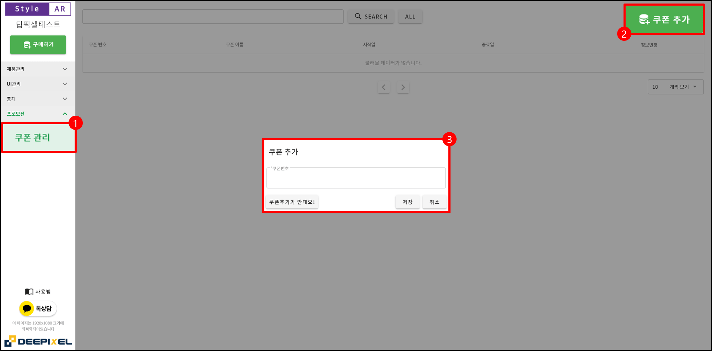

발급된 쿠폰은 StyleAR 가상착용 시, StyleAR에 아래 사진과 같이 자동 노출됩니다. 쿠폰을 클릭하면 쿠폰이 고객에게 저장됩니다.  

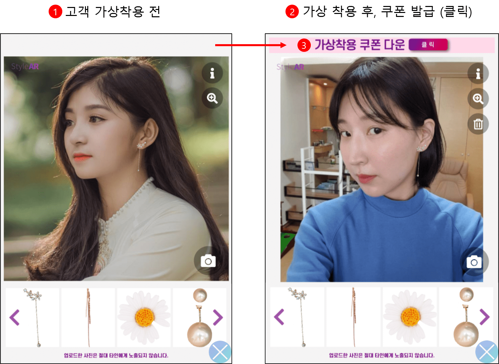

# 5. StyleAR 쿠폰발급 및 등록

StyleAR에 쿠폰을 노출시키기 위해서는 쇼핑몰에서 StyleAR 전용 쿠폰을 발급합니다.

## 5.1. 쇼핑몰 쿠폰발급

StyleAR의 쿠폰 기능은 현재 아래의 쇼핑몰을 지원하고 있으며, 빠른 시일내로 다양한 쇼핑몰의 지원할 예정입니다.

1. 카페24
2. 메이크샵

### 5.1.1. 카페24 쿠폰발급

카페24 쿠폰발급은 프로모션>쿠폰관리>쿠폰만들기 페이지에서 발급정보를 입력하여 StyleAR 전용 쿠폰을 발급합니다.  

카페24 StyleAR 전용쿠폰 발급 시 필수 설정 사항  
1. 발급구분: 고객 다운로드발급 및 회원대상
2. 동일인 재발급 여부: 불가능
3. 발급시점: 즉시발급
4. 노출설정: 노출안함

프로모션>쿠폰관리>쿠폰발급/조회 페이지에서 발급쿠폰 목록에서 StyleAR 매니저에 등록할 쿠폰번호를 확인합니다.  

### 5.1.2. 메이크샵 쿠폰발급

메이크샵 쿠폰발급은 회원관리>왕대박 쿠폰 발행 서비스>새로운 쿠폰만들기 페이지에서 발급정보를 입력하여 StyleAR 전용 쿠폰을 발급합니다.  

메이크샵 StyleAR 전용쿠폰 발급 시 필수 설정 사항  
1. 쿠폰 발급 조건: 쿠폰 클릭시 발급
2. 쿠폰 자동 노출: 하지 않습니다.
3. 동일인 재발급: 불가능

회원관리>왕대박 쿠폰 발행 서비스>발급한 쿠폰 내역관리 페이지에서 발급한 쿠폰 내역에서 StyleAR 매니저에 등록할 쿠폰번호를 확인합니다.

# 6. 고객 상담 및 문의

궁금하신 사항이 있으시면 카카오채널톡 상담을 통해 언제든지 문의하실 수 있습니다. 또는 support@deepixel.xyz로 문의 가능합니다.

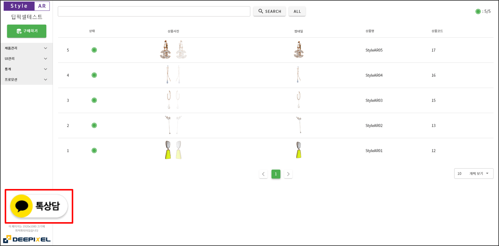