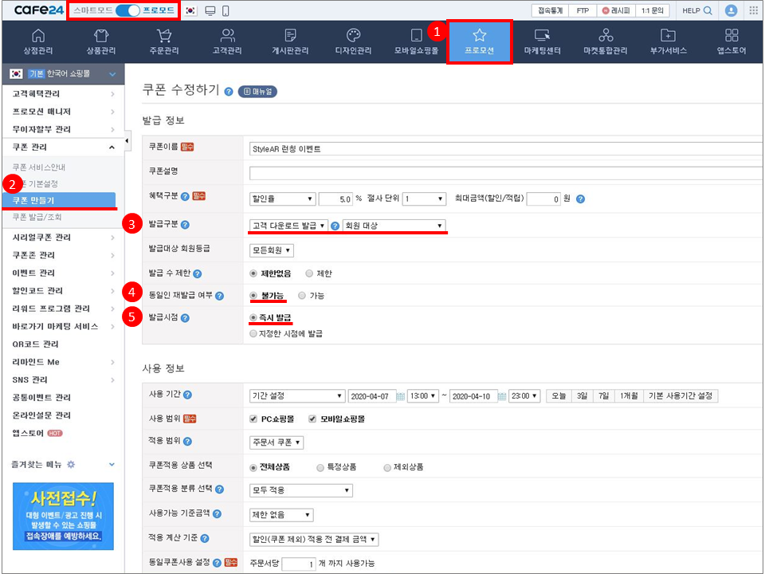
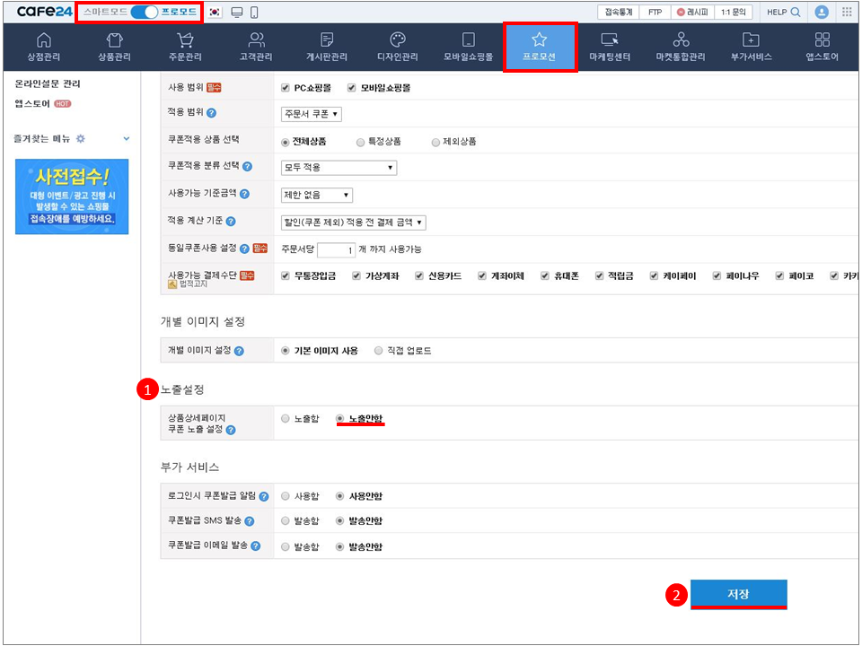
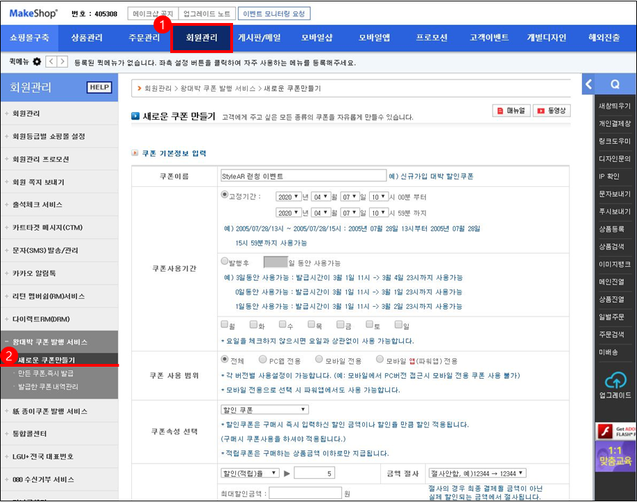
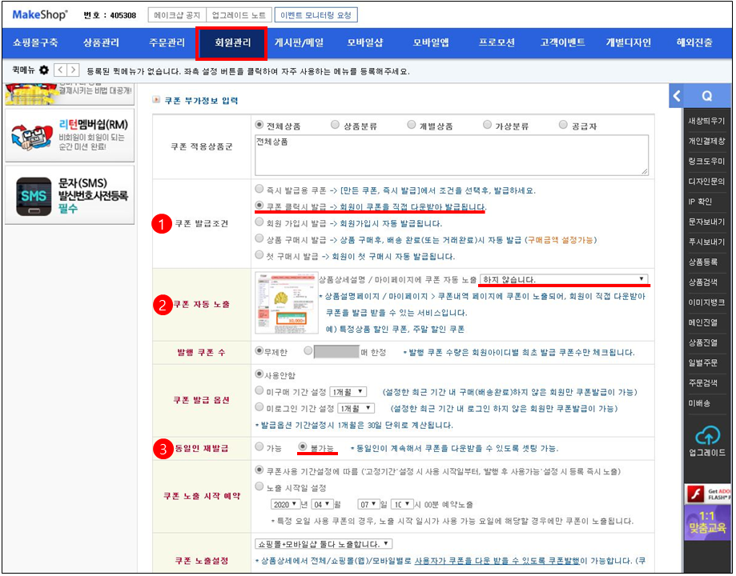
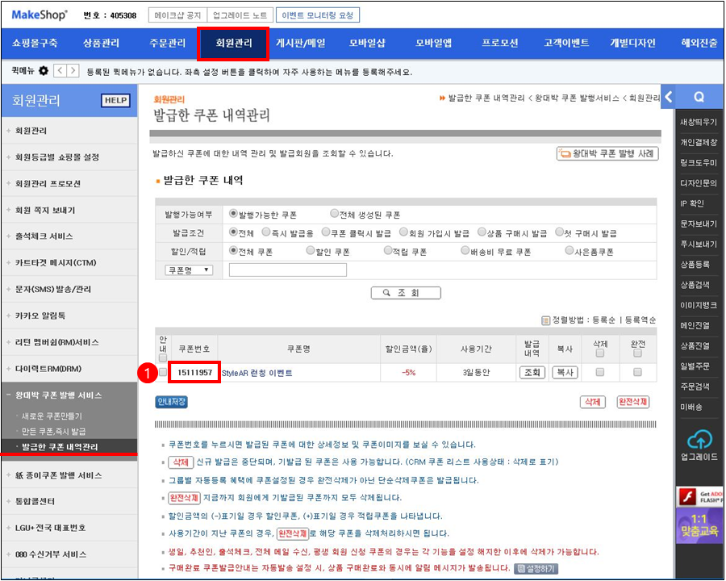

{: width="200"}

---

# StyleAR 쿠폰 발급 및 등록

StyleAR 플로팅을 통해 가상착용을 체험하는 고객에게 쿠폰을 제공할 수 있습니다. 쇼핑몰(호스팅 업체)을 통해 발급한 쿠폰을 StyleAR 매니저에 등록하여 StyleAR 플로팅에 노출시켜, 다운로드 형식으로 고객에게 쿠폰을 전달합니다. 본 기능을 사용하기 위해서는 StyleAR 매니저의 프로모션>쿠폰관리에서 쿠폰추가를 통해 쿠폰번호를 등록하여야 합니다.

## 쇼핑몰 쿠폰발급

StyleAR 플로팅 쿠폰은 아래의 쇼핑몰을 지원하고 있으며, 빠른 시일내로 다양한 쇼핑몰의 지원할 예정입니다.  

1. 카페24
2. 메이크샵 

### 1. 카페24 쿠폰발급

카페24 쿠폰발급은 프로모션>쿠폰관리>쿠폰만들기 페이지에서 발급정보를 입력하여 StyleAR 전용 쿠폰을 발급합니다.  

  

카페24 StyleAR 전용쿠폰 발급 시 필수 설정 사항  
1. 발급구분: 고객 다운로드발급 및 회원대상
2. 동일인 재발급 여부: 불가능
3. 발급시점: 즉시발급
4. 노출설정: 노출안함

  

프로모션>쿠폰관리>쿠폰발급/조회 페이지에서 발급쿠폰 목록에서 StyleAR 매니저에 등록할 쿠폰번호를 확인합니다.  

### 2. 메이크샵 쿠폰발급

메이크샵 쿠폰발급은 회원관리>왕대박 쿠폰 발행 서비스>새로운 쿠폰만들기 페이지에서 발급정보를 입력하여 StyleAR 전용 쿠폰을 발급합니다.  

메이크샵 StyleAR 전용쿠론 발급 시 필수 설정 사항  
1. 쿠폰 발급 조건: 쿠폰 클릭시 발급
2. 쿠폰 자동 노출: 하지 않습니다.
3. 동일인 재발금: 불가능

  

회원관리>왕대박 쿠폰 발행 서비스>발급한 쿠폰 내역관리 페이지에서 발급한 쿠폰 내역에서 StyleAR 매니저에 등록할 쿠폰번호를 확인합니다. 

## 매니저 쿠폰등록

쇼핑몰에서 발급한 쿠폰의 번호를 매니저>프로모션>쿠폰관리 페이지에서 쿠폰추가를 통해 StyleAR 플로팅 상단에 쿠폰을 노출시킬 수 있습니다.   
  

쇼핑몰 쿠폰발급 시, 쿠폰 미노출 및 다운로드 또는 클릭시 발생 세팅으로 인해 StyleAR 가상착용 사용시, StyleAR 플로팅 상단에 쿠폰이 아래 사진과 같이 노출됩니다. 쿠폰을 클릭하면 자동으로 쿠폰이 저장됩니다.  
  

