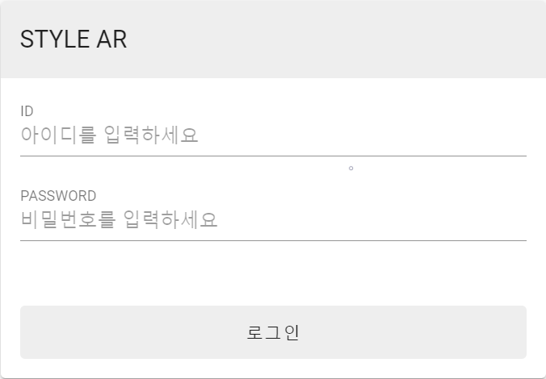
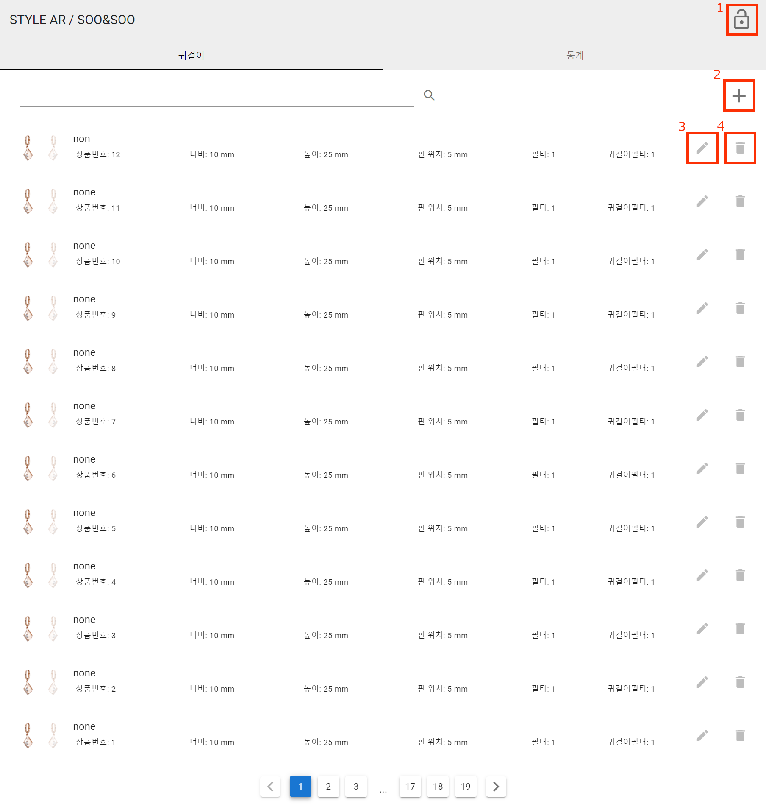
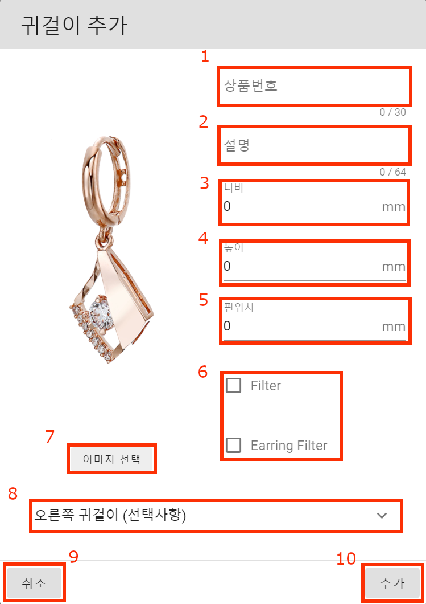
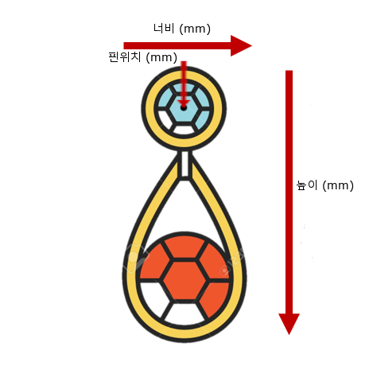
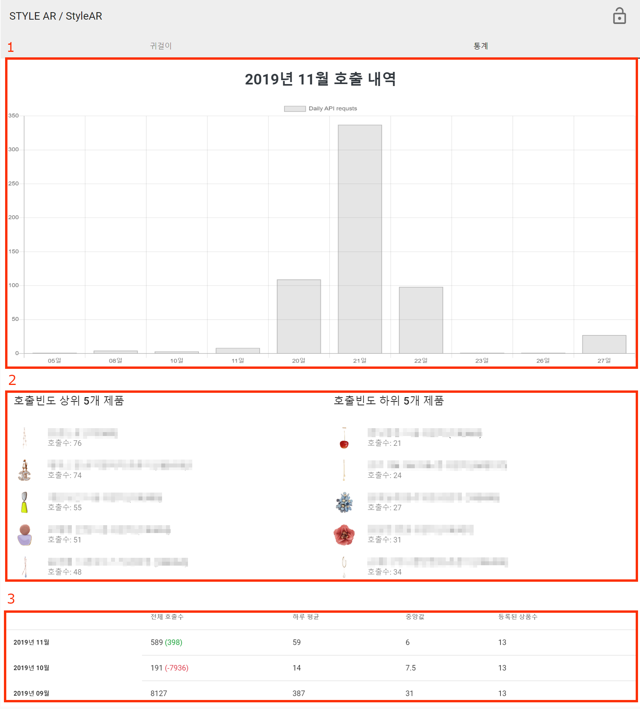

{: width="200"}

---

# StyleAREarring 관리자 페이지

웹 플랫폼에서 StyleAR 플로팅 버튼을 쇼핑몰에서 사용하기 위한 고객사 전용 어플리케이션 툴입니다. 가상착용이 가능한 Earring을 등록, 수정 및 삭제가 가능하며 지난 API 사용량을 볼수 있는 통계 페이지를 제공합니다.

# 로그인 및 회원가입

현재 관리자 페이지는 이메일을 통한 회원가입만을 허용하고 있습니다.  
관리자: [support@deepixel.xyz](support@deepixel.xyz)

# 귀걸이 페이지

### 1. 로그아웃

세션 시간: 현재 7시간

### 2. 귀걸이 추가 버튼

귀걸이 추가 버튼을 누르시면 귀걸이 이미지와 귀걸이에 대한 정보를 입력 하실수 있습니다.
양쪽 귀걸이의 모양과 정보가 상이할 경우 오른쪽 귀걸이에 대한 정보를 추가적으로 입력하시면 됩니다. (상품 번호 와 이름 제외)

1. 상품번호 (고객사 제품 ID)
2. 설명 (제품이름)
3. 귀걸이 너비 (mm)
4. 귀걸이 높이 (mm)
5. 핀위치 (mm)
6. 원본 이미지 및 귀걸이 이미지 필터 적용 여부
7. 귀걸이 이미지 추가
8. 오른쪽 귀걸이 정보 입력 (선택사항)
9. 취소 버튼 (창닫기)
10. 추가 버튼 (적용)

#### 귀걸이 치수

### 3. 귀걸이 편집 버튼

해당 귀걸이의 정보를 수정하려면 편집 버튼을 눌러 수정하실수 있습니다.

### 4. 귀걸이 삭제 버튼

해당 귀걸이를 삭제하고 싶으시다면 삭제 버튼을 눌러 사제하실수 있습니다.

# 통계 페이지

1. 지난 달 일별 API 호출 수
2. 호출 빈도 상위 5개 & 하위 5개 제품
3. 지난 API 호출 통계 기록