- [1. 상품 추가](#1-%ec%83%81%ed%92%88-%ec%b6%94%ea%b0%80)
  - [1.1. 상품 추가 요청](#11-%ec%83%81%ed%92%88-%ec%b6%94%ea%b0%80-%ec%9a%94%ec%b2%ad)
  - [1.2. 상품 정보 입력](#12-%ec%83%81%ed%92%88-%ec%a0%95%eb%b3%b4-%ec%9e%85%eb%a0%a5)
  - [1.3. 바로구매URL 설정](#13-%eb%b0%94%eb%a1%9c%ea%b5%ac%eb%a7%a4url-%ec%84%a4%ec%a0%95)
- [2. 상품 등록](#2-%ec%83%81%ed%92%88-%eb%93%b1%eb%a1%9d)
  - [2.1. 상품 등록 완료](#21-%ec%83%81%ed%92%88-%eb%93%b1%eb%a1%9d-%ec%99%84%eb%a3%8c)
  - [2.2. 가상착용 태그 설정](#22-%ea%b0%80%ec%83%81%ec%b0%a9%ec%9a%a9-%ed%83%9c%ea%b7%b8-%ec%84%a4%ec%a0%95)
- [3. UI 관리](#3-ui-%ea%b4%80%eb%a6%ac)
  - [3.1. 모델 관리](#31-%eb%aa%a8%eb%8d%b8-%ea%b4%80%eb%a6%ac)
  - [3.2. 플로팅 관리](#32-%ed%94%8c%eb%a1%9c%ed%8c%85-%ea%b4%80%eb%a6%ac)
- [4. 통계](#4-%ed%86%b5%ea%b3%84)
- [5. StyleAR 쿠폰 발급 및 등록](#5-stylear-%ec%bf%a0%ed%8f%b0-%eb%b0%9c%ea%b8%89-%eb%b0%8f-%eb%93%b1%eb%a1%9d)
  - [5.1. 쇼핑몰 쿠폰발급](#51-%ec%87%bc%ed%95%91%eb%aa%b0-%ec%bf%a0%ed%8f%b0%eb%b0%9c%ea%b8%89)
    - [5.1.1. 카페24 쿠폰발급](#511-%ec%b9%b4%ed%8e%9824-%ec%bf%a0%ed%8f%b0%eb%b0%9c%ea%b8%89)
    - [5.1.2. 메이크샵 쿠폰발급](#512-%eb%a9%94%ec%9d%b4%ed%81%ac%ec%83%b5-%ec%bf%a0%ed%8f%b0%eb%b0%9c%ea%b8%89)
  - [5.2. 매니저 쿠폰등록](#52-%eb%a7%a4%eb%8b%88%ec%a0%80-%ec%bf%a0%ed%8f%b0%eb%93%b1%eb%a1%9d)

---
# 1. 상품 추가
가상착용 가능한 상품의 수를 구매하여 가상착용 가능 상품을 추가할 수 있습니다. 

## 1.1. 상품 추가 요청
상품 추가를 원하시는 경우, '상품추가요청'을 통해 추가할 상품 수량을 선택하여 구매를 진행합니다.

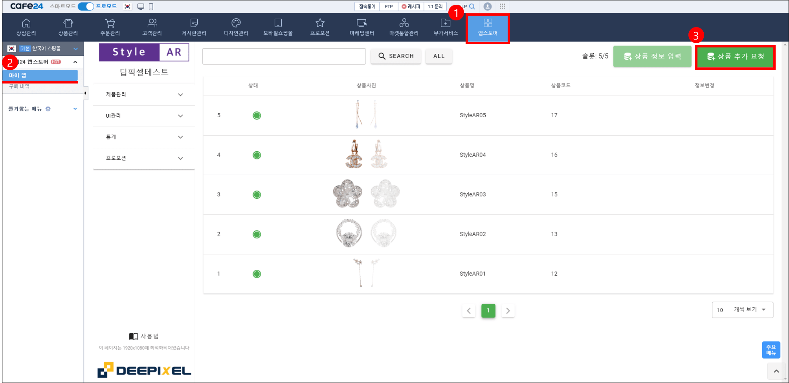  

## 1.2. 상품 정보 입력
결재가 완료 후, '상품정보입력'을 통해 추가를 원하는 상품 정보를 입력합니다. 상품 정보 입력의 편의를 위해 상품 판매 데이터 분석을 통해 최적의 가상착용 상품을 선택할 수 있도록 자동 선택 옵션을 추가할 예정입니다. 

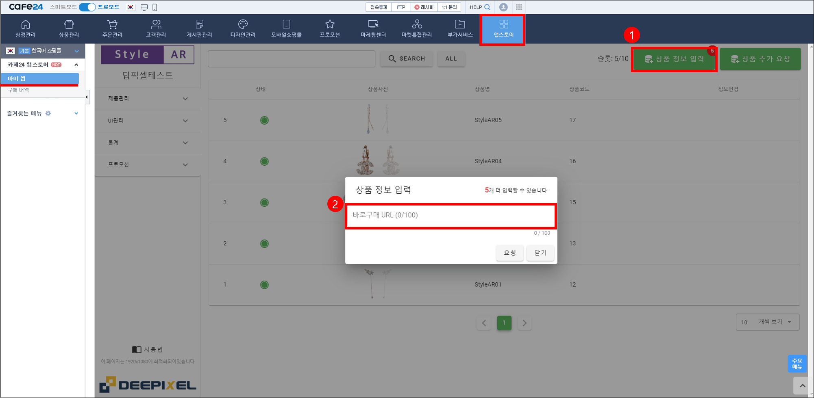  

## 1.3. 바로구매URL 설정
가상착용 상품을 등록하기 위한 정보는 바로구매URL을 복사해서 붙여 넣으면, URL내의 상품 정보를 찾아내어 추가할 상품을 자동으로 찾아냅니다. 바로구매URL 복사는 카페24>상품관리>상품목록>설정>바로구매URL>주소복사를 이용하시면 됩니다.

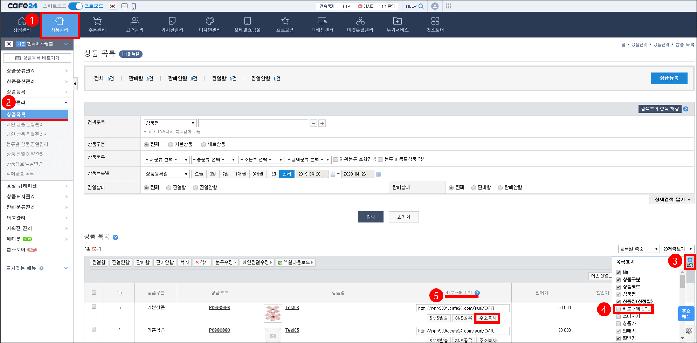  

# 2. 상품 등록

## 2.1. 상품 등록 완료
상품 등록 진행 상태는 매니저>제품관리>귀걸이 페이지에서 빨간색, 노랑색, 녹색으로 표시하고 있습니다. 상품 추가 요청 시, 상태는 빨간색으로 표시되며, 수정과 삭제가 가능합니다. 상품 등록 작업이 진행 시, 상태는 노랑색으로 표시되며, 수정과 삭제가 불가능합니다. 상품 등록이 완료 시, 녹색으로 표시되며, 이메일 또는 유선으로 상품 등록 완료를 공지해 드리며, 완료 즉시 가상착용이 가능합니다.

## 2.2. 가상착용 태그 설정
고객 편의를 위해 가상착용 상품임을 아래 사진처럼 태그 형태로 공지해 주십시오.

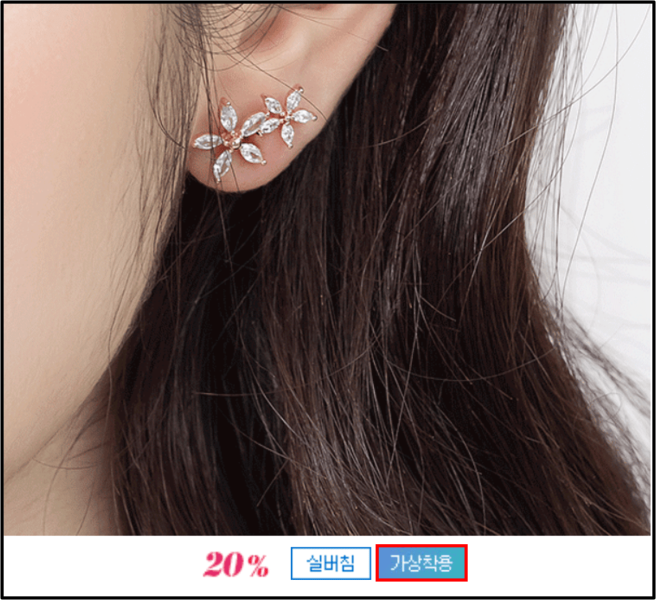  

# 3. UI 관리

## 3.1. 모델 관리
StyleAR 플로팅의 모델은 UI 관리>모델 관리 페이지에서 기본 모델을 대신하여 쇼핑몰 모델로 변경할 수 있습니다. 모델 사진을 업로드하고 저장을 누르면 StyleAR 플로팅의 모델로 적용됩니다. 업로드 모델 삭제 시, 기본 모델로 변경됩니다. 모델 변경 후 반영 시간은 10분가량 소요됩니다.

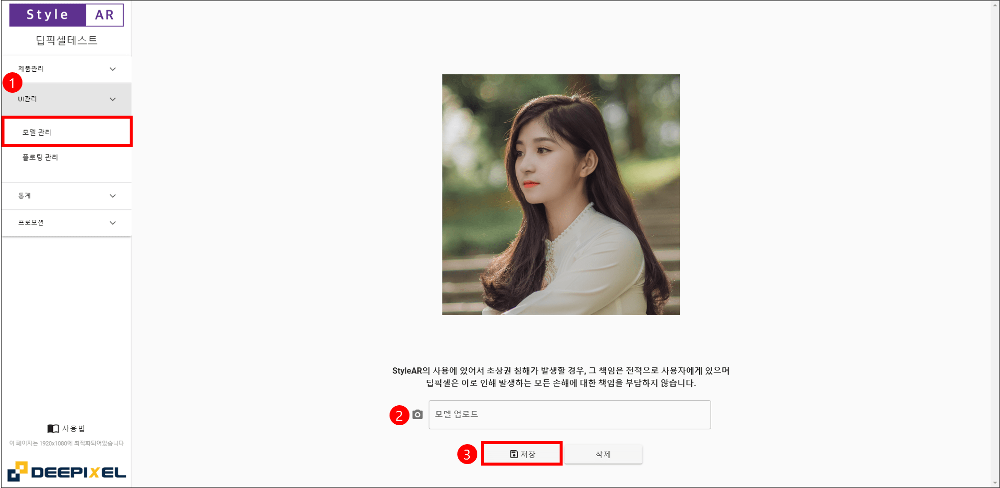  

가상착용을 위해 모델의 한쪽 귀와 두 눈이 보이는 사진을 사용하시길 권장합니다. 단, StyleAR의 사용에 있어서 초상권 침해가 발생할 경우, 그 책임은 전적으로 사용자가에게 있으며, 딥픽셀은 이로 인해 발생하는 모든 손해에 대한 책임을 부담하지 않습니다.

## 3.2. 플로팅 관리
StyleAR 플로팅의 웹/모바일 상의 위치 및 크기를 변경할 수 있습니다. UI 관리>플로팅 관리 페이지에서 변경 후 반영 시간은 10분가량 소요됩니다.

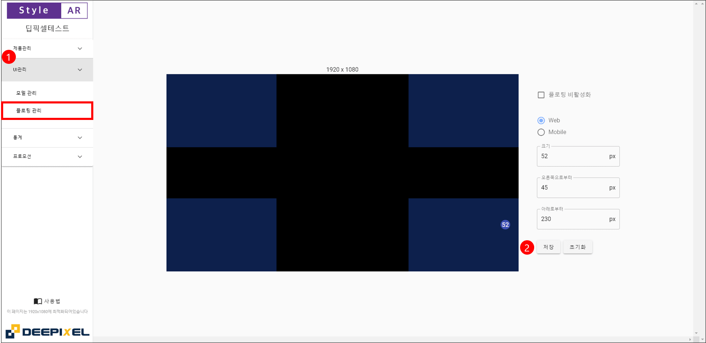  

# 4. 통계
StyleAR 매니저에서는 통계 페이지를 통해 StyleAR 사용에 대한 분석 자료를 제공하고 있습니다. 전체 호출수 및 시간별/상품별 호출수 등의 고객 사용 데이터를 실시간으로 제공하고 있습니다. 앞으로 더욱 직관적이고 유용한 통계 데이터를 제공하기 위해 노력하겠습니다.

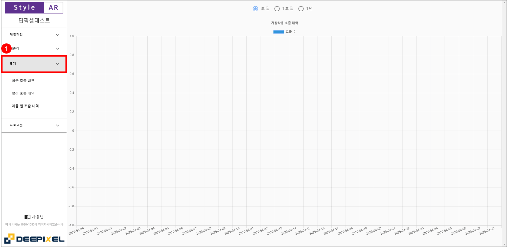  

# 5. StyleAR 쿠폰 발급 및 등록

StyleAR 플로팅을 통해 가상착용을 체험하는 고객에게 쿠폰을 제공할 수 있습니다. 쇼핑몰(호스팅 업체)을 통해 발급한 쿠폰을 StyleAR 매니저에 등록하여 StyleAR 플로팅에 노출시켜, 다운로드 형식으로 고객에게 쿠폰을 전달합니다. 본 기능을 사용하기 위해서는 StyleAR 매니저의 프로모션>쿠폰관리에서 쿠폰추가를 통해 쿠폰번호를 등록하여야 합니다.

## 5.1. 쇼핑몰 쿠폰발급

StyleAR 플로팅 쿠폰은 아래의 쇼핑몰을 지원하고 있으며, 빠른 시일내로 다양한 쇼핑몰의 지원할 예정입니다.  

1. 카페24
2. 메이크샵 

### 5.1.1. 카페24 쿠폰발급

카페24 쿠폰발급은 프로모션>쿠폰관리>쿠폰만들기 페이지에서 발급정보를 입력하여 StyleAR 전용 쿠폰을 발급합니다.  

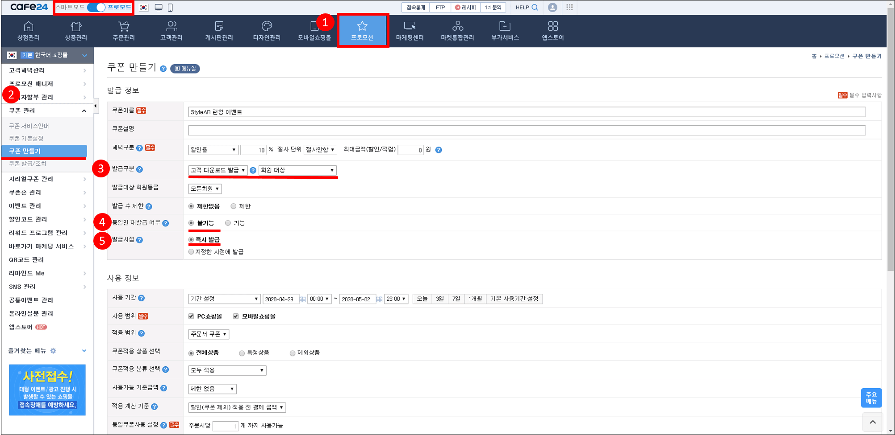  

카페24 StyleAR 전용쿠폰 발급 시 필수 설정 사항  
1. 발급구분: 고객 다운로드발급 및 회원대상
2. 동일인 재발급 여부: 불가능
3. 발급시점: 즉시발급
4. 노출설정: 노출안함

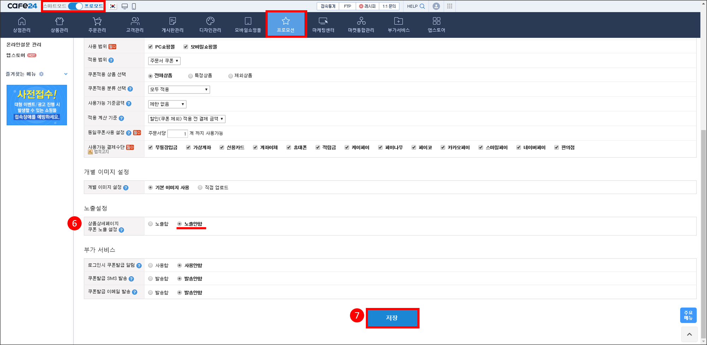  

프로모션>쿠폰관리>쿠폰발급/조회 페이지에서 발급쿠폰 목록에서 StyleAR 매니저에 등록할 쿠폰번호를 확인합니다.  

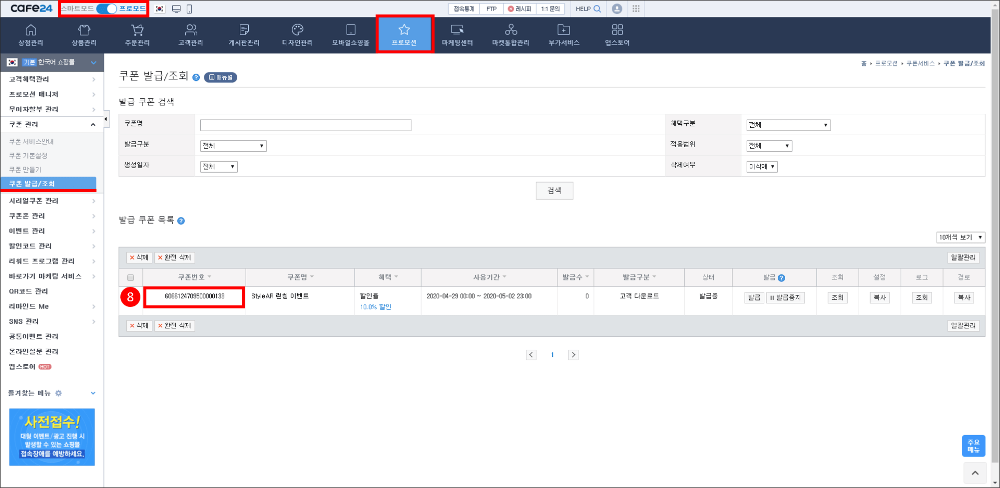

### 5.1.2. 메이크샵 쿠폰발급

메이크샵 쿠폰발급은 회원관리>왕대박 쿠폰 발행 서비스>새로운 쿠폰만들기 페이지에서 발급정보를 입력하여 StyleAR 전용 쿠폰을 발급합니다.  

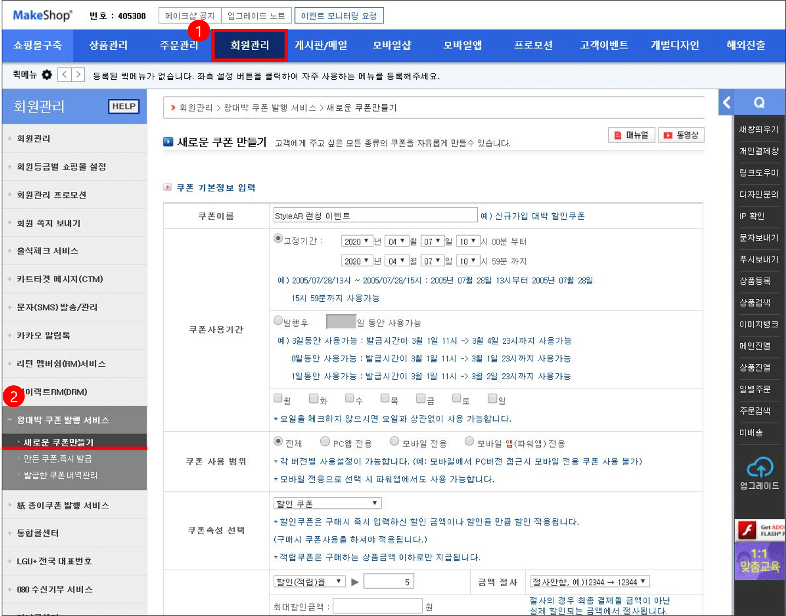

메이크샵 StyleAR 전용쿠폰 발급 시 필수 설정 사항  
1. 쿠폰 발급 조건: 쿠폰 클릭시 발급
2. 쿠폰 자동 노출: 하지 않습니다.
3. 동일인 재발금: 불가능

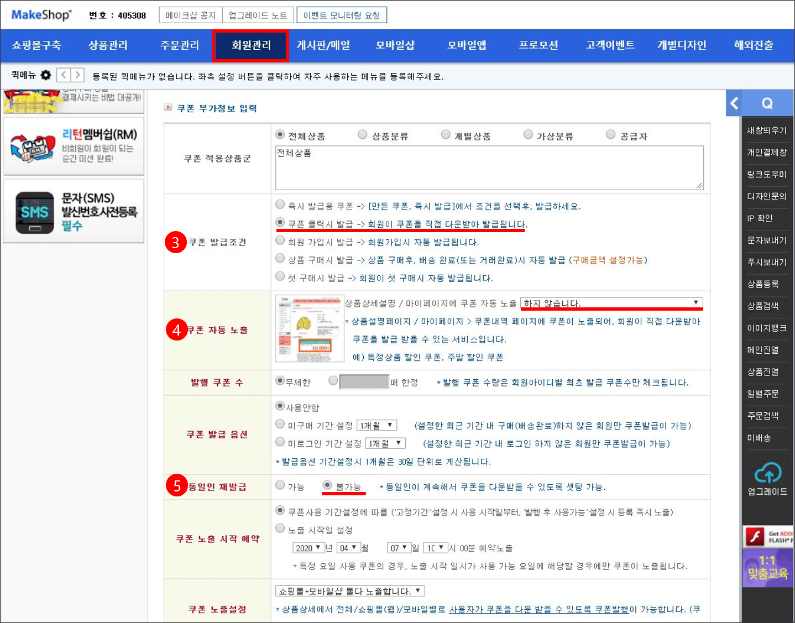  

회원관리>왕대박 쿠폰 발행 서비스>발급한 쿠폰 내역관리 페이지에서 발급한 쿠폰 내역에서 StyleAR 매니저에 등록할 쿠폰번호를 확인합니다. 

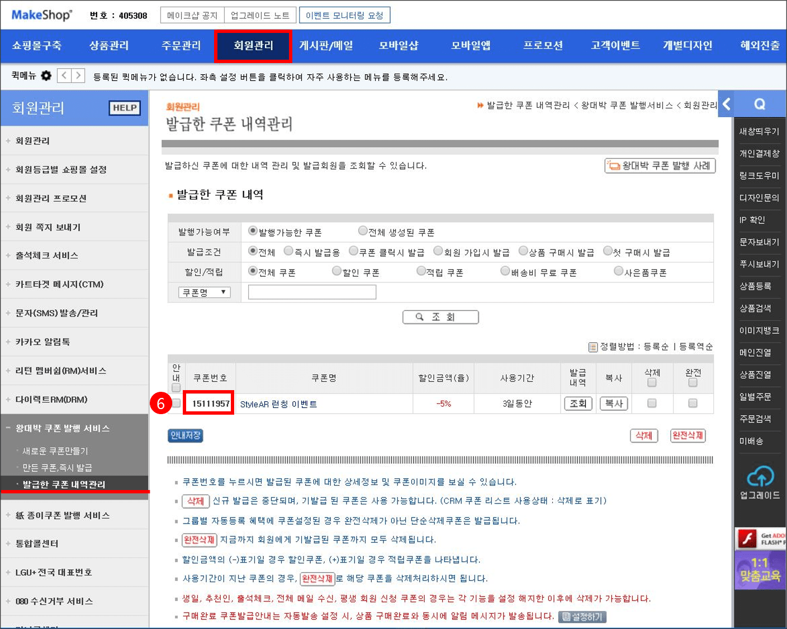

## 5.2. 매니저 쿠폰등록

쇼핑몰에서 발급한 쿠폰의 번호를 매니저>프로모션>쿠폰관리 페이지에서 쿠폰추가를 통해 StyleAR 플로팅 상단에 쿠폰을 노출시킬 수 있습니다.   

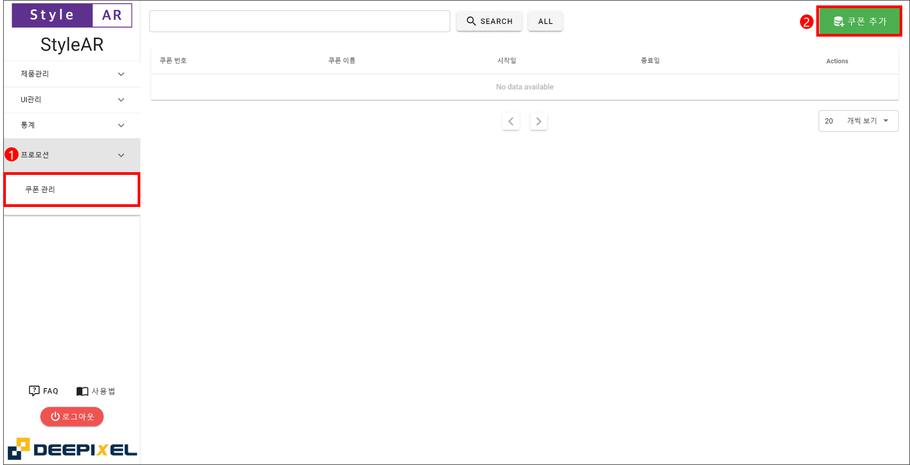  

쿠폰추가>쿠폰번호를 입력하여 StyleAR 쿠폰 기능을 활성화합니다.
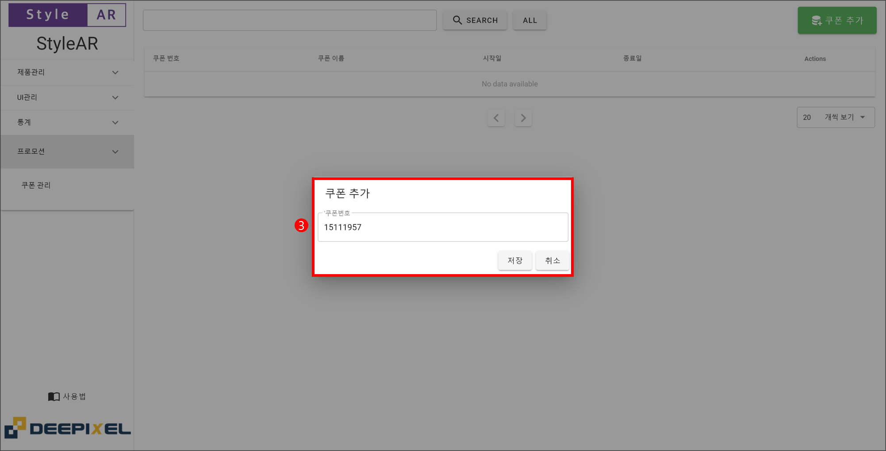  

발급된 쿠폰은 StyleAR 가상착용 시, StyleAR 플로팅 상단에 아래 사진과 같이 자동 노출됩니다. 쿠폰을 클릭하면 쿠폰이 저장됩니다.  

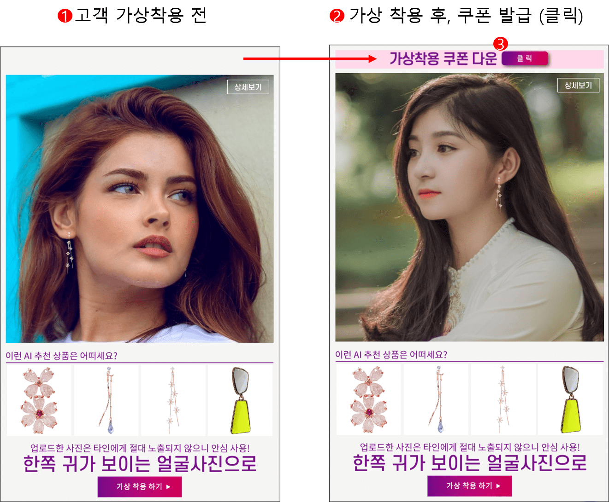  
