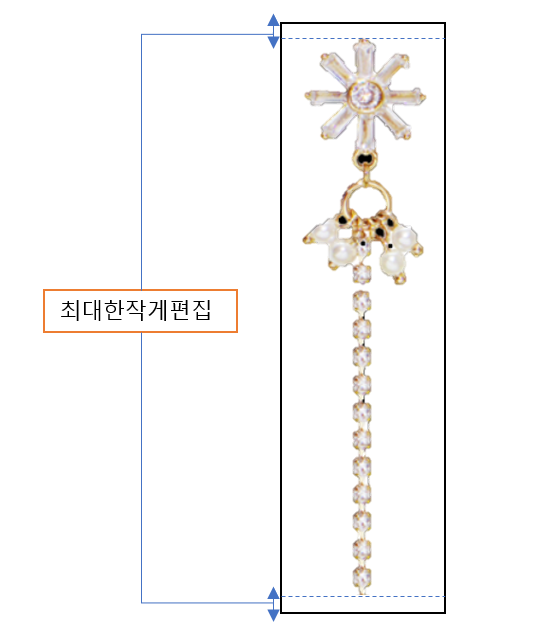
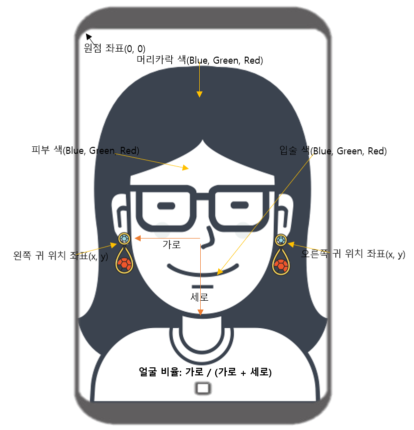
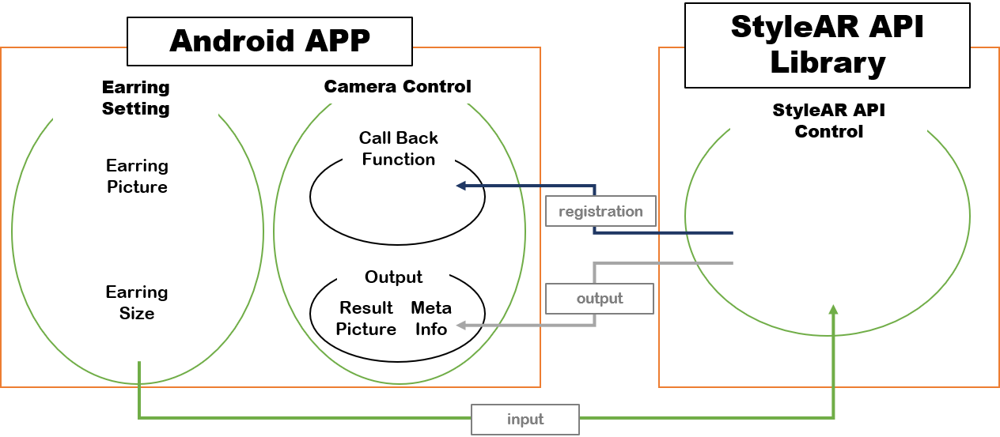

{: width="200"}

# StyleAR Tutorial

>StyleAR은 모바일 장치로 부터 입력된 영상에서 얼굴특정 위치 검출, 3D 피팅, 영상분석등을 통해 귀걸이 착용영상과 메타정보를 실시간으로 출력하는 컴퓨터 비전 기반의 API Library 입니다.  

.png){: width="200"}

***

## 특징

### 귀걸이 착용

> 영상내의 사용자의 귀를 모바일 장치에서 실시간으로 검출하여 양쪽 귀에 귀걸이가 착용된 영상을 제공합니다. 이것을 이용해서 온라인상에서 사용자가 귀걸이를 가상으로 착용(Virtual Try-on)할 수 있는 서비스를 만들 수 있습니다.

- 스팩:

    |목차|스팩|비고|
    |:-:|:-:|:-:|
    |가능인원|1명||
    |속도| 20 ~ 30FPS (Frame Per Secound) |실험 장비(Galaxy Note 8), 해상도(1920 X 1080)|

- 입력물:

    |목차|내용|비고|
    |:-:|:-:|:-:|
    |얼굴영상|{: width="200"}|얼굴이 사진의 40%이상 차지|
    |귀걸이 사진|{: width="300"}|영상편집 시 귀걸이 위와 아래의 공백을 최대한 작게 <br />영상은 귀걸이를 제외한 배경은 투명처리(png 포멧)|
    |귀걸이 크기|귀걸이 실측 가로크기 <br />귀걸이 실측 세로크기|단위(mm)|

- 결과물:

    |결과물|내용|비고|
    |:-:|:-:|:-:|
    |귀걸이 착용 영상|{: width="200"}|귀걸이 실측크기에 맞게 배치|
    |메타정보|{: width="500"}| 색상정보 범위(0 ~ 255) <br /> 얼굴비율 범위 (0 ~ 1) |

***

## StyleAR API 사용방법

>StyleAR API를 모바일 앱에서 사용하는 방법을 설명합니다.

- 라이센스 발급
  > StyleAR API를 사용하기 위해서는 반드시 라이센스를 발급받아야 합니다.

|목차|내용|
|:-:|:-:|
|발급|<honami82@deepixel.xyz>로 문의 바랍니다.|
|주의사항|API 사용 기간, 메타정보 사용 유무를 고려하여 주시기 바랍니다.|

- 환경설정
  - Android
    - StyleAR API Library 파일 넣기
    > Library 폴더에 라이센스 발급 시 배포된 라이브러리 파일(StyleARAndroid.aar)을 넣는다.
    - Gradle 설정추가

        ```Gradle
        android{
          compileOption{
          sourceCompatibility 1.8
          sourceCompatibility 1.8
          }
        }

        dependencies{
            implementation 'net.sourceforge.streamsupport:android-retrofuture:1.7.0'
            implementation 'com.android.support:appcompat-v7:28.0.0'
            implementation 'com.android.support.constraint:constraint-layout:1.1.3'
        }
        ```

  - IOS

- Android StyleAR API 사용법
  > [Android Code][android_sample]는 Android 예제인 [Camera2BasicFragment][camera2basicfragment_sample]를 기반으로 구현하였습니다.

  {: width="400"}

  - StyleAR API 객체생성
    > StyleAR의 API는 DPStyleARFactory를 사용하여 객체를 생성합니다. 객체를 생성하는 과정에서 라이센스와 관련된 메시지가 출력 될 수 있습니다.

    ```java
    public void onActivityCreated(Bundle savedInstanceState) {
        super.onActivityCreated(savedInstanceState);
        if (mStyleARAndroid == null) {
            try {
                 // StyleAR API 생성
                mStyleARAndroid = DPStyleARFactory.getInstance(this.getActivity());
                mStyleARAndroid.initialize();
            // license 메시지 출력
            } catch (DPLicenseExpiredException e) {
                ErrorDialog.newInstance(e.getMessage()).show(getChildFragmentManager(), FRAGMENT_DIALOG);
            } catch (DPLicenseException e) {
                ErrorDialog.newInstance(e.getMessage()).show(getChildFragmentManager(), FRAGMENT_DIALOG);
            } catch (DPException e) {
                ErrorDialog.newInstance(e.getMessage()).show(getChildFragmentManager(), FRAGMENT_DIALOG);
            }
        }
    }
    ```

  - StyleAR API 초기화 및 구동
    > StyleAR 초기화는 카메라 디바이스의 콜백 함수를 아래 예제와 같이 등록해야 합니다. 콜백함수 안에서 모바일 카메라 파라메터 정보(카메라 영상 크기 및 회전)를 StyleAR API에 등록해야 하며, start 함수를 통해 실제 StyleAR이 모바일에서 구동하게 됩니다.

    ```java
    /// Camera2BasicFragment.java
    import xyz.deepixel.stylear.DPCameraParam;
    import xyz.deepixel.stylear.DPEarringAnchorPosition;
    import xyz.deepixel.stylear.DPEarringParam;
    import xyz.deepixel.stylear.DPException;
    import xyz.deepixel.stylear.DPFaceMetaData;
    import xyz.deepixel.stylear.DPLicenseException;
    import xyz.deepixel.stylear.DPLicenseExpiredException;
    import xyz.deepixel.stylear.DPStyleARFactory;
    import xyz.deepixel.stylear.DPStyleAR;

    public class Camera2BasicFragment extends Fragment
        implements View.OnClickListener, ActivityCompat.OnRequestPermissionsResultCallback {

        private final CameraDevice.StateCallback mStateCallback = new CameraDevice.StateCallback() {
            // This method is called when the camera is opened.  We start camera preview here.
            mCameraOpenCloseLock.release();
            mCameraDevice = cameraDevice;
            createCameraPreviewSession();

            // Initialize style ar.
            // DPCameraParam 선언
            DPCameraParam cameraParam = new DPCameraParam();
            // SensorOrientation 설정
            cameraParam.setSensorOrientation(mSensorOrientation);
            // focallength 설정
            cameraParam.setFocalLength(m_focalLength);
            // surface 설정
            mStyleARAndroid.setTargetSurface(mSurface);
            // StyleAR API에 카메라 파라메터(DPCameraParam) 설정
            mStyleARAndroid.setCameraParam(cameraParam);
            // StyleAR 시작
            mStyleARAndroid.start();
        }
    }

    ```

    - StyleAR API 귀걸이 변경
    > 귀걸이를 변경할 시에는 File 클래스에 귀걸이 사진이 저장되어 있는 경로를 입력하고, 귀걸이 정보(실제 귀걸이 가로, 세로 크기, 귀걸이 핀 위치(TOP or CENTER)) 및 귀걸이 사진이 지정된 File 클래스를 StyleAR API의 setEarringParams함수에 입력합니다.

    {: width="250"}

    ```java
    // StyleAR API 귀걸이 정보 클래스 선언
    DPEarringParam earringParam = new DPEarringParam();
    // 귀걸이 사진 파일 위치
    earringParam.setAbsolutePath(mEarringFile.getAbsolutePath());
    // 실제 귀걸이 가로 크기(mm)
    earringParam.setWidth(13.0f);
    // 실제 귀걸이 세로 크기(mm)
    earringParam.setHeight(85.0f);
    // 귀걸이 핀 위치(TOP or CENTER)
    earringParam.setAnchorPosition(DPEarringAnchorPosition.TOP);
    // StyleAR API에 귀걸이 정보 클래스 및 귀걸이 파일 이름 입력
    mStyleARAndroid.setEarringParam(earringParam);"wing1.png");
    ```

    - StyleAR API 결과 출력
    > StyleAR API는 귀걸이가 착용된 영상데이터와 메타데이터를 결과로 출력합니다. 귀걸이 착용 얼굴영상 데이터는 ImageReader에 등록하여 카메라 아웃풋을 설정할 때 출력할 수 있으며, 메타데이터는 원하는 시점에 출력할 수 있습니다.

    ```java
    // 귀걸이 영상데이터 출력
    private void setUpCameraOutputs(int width, int height) {
        Activity activity = getActivity();
        CameraManager manager = (CameraManager) activity.getSystemService(Context.CAMERA_SERVICE);
        try {
            for (String cameraId : manager.getCameraIdList()) {
                CameraCharacteristics characteristics
                        = manager.getCameraCharacteristics(cameraId);

                // 정면 카메라로 설정
                Integer facing = characteristics.get(CameraCharacteristics.LENS_FACING);
                if (facing != null && facing != CameraCharacteristics.LENS_FACING_FRONT) {
                    continue;
                }

                StreamConfigurationMap map = characteristics.get(
                        CameraCharacteristics.SCALER_STREAM_CONFIGURATION_MAP);
                if (map == null) {
                    continue;
                }

                Size largest = Collections.max(
                        Arrays.asList(map.getOutputSizes(ImageFormat.YUV_420_888)),
                        new CompareSizesByArea());

                int displayRotation = activity.getWindowManager().getDefaultDisplay().getRotation();
                mSensorOrientation = characteristics.get(CameraCharacteristics.SENSOR_ORIENTATION);
                boolean swappedDimensions = false;
                switch (displayRotation) {
                    case Surface.ROTATION_0:
                    case Surface.ROTATION_180:
                        if (mSensorOrientation == 90 || mSensorOrientation == 270) {
                            swappedDimensions = true;
                        }
                        break;
                    case Surface.ROTATION_90:
                    case Surface.ROTATION_270:
                        if (mSensorOrientation == 0 || mSensorOrientation == 180) {
                            swappedDimensions = true;
                        }
                        break;
                    default:
                        Log.e(TAG, "Display rotation is invalid: " + displayRotation);
                }

                Point displaySize = new Point();
                activity.getWindowManager().getDefaultDisplay().getSize(displaySize);
                int rotatedPreviewWidth = width;
                int rotatedPreviewHeight = height;
                int maxPreviewWidth = displaySize.x;
                int maxPreviewHeight = displaySize.y;

                if (swappedDimensions) {
                    rotatedPreviewWidth = height;
                    rotatedPreviewHeight = width;
                    maxPreviewWidth = displaySize.y;
                    maxPreviewHeight = displaySize.x;
                }

                if (maxPreviewWidth > MAX_PREVIEW_WIDTH) {
                    maxPreviewWidth = MAX_PREVIEW_WIDTH;
                }

                if (maxPreviewHeight > MAX_PREVIEW_HEIGHT) {
                    maxPreviewHeight = MAX_PREVIEW_HEIGHT;
                }

                mPreviewSize = chooseOptimalSize(map.getOutputSizes(SurfaceTexture.class),
                        rotatedPreviewWidth, rotatedPreviewHeight, maxPreviewWidth,
                        maxPreviewHeight, largest);

                // ImageReader 설정
                mImageReader = ImageReader.newInstance(mPreviewSize.getWidth(), mPreviewSize.getHeight(),
                        ImageFormat.YUV_420_888, /*maxImages*/5);
                // StyleAR API 결과영상 등록
                mImageReader.setOnImageAvailableListener(
                        mStyleARAndroid.getOnImageAvailableListener(), mBackgroundHandler);

                int orientation = getResources().getConfiguration().orientation;
                if (orientation == Configuration.ORIENTATION_LANDSCAPE) {
                    mTextureView.setAspectRatio(
                            mPreviewSize.getWidth(), mPreviewSize.getHeight());
                } else {
                    mTextureView.setAspectRatio(
                            mPreviewSize.getHeight(), mPreviewSize.getWidth());
                }

                Boolean available = characteristics.get(CameraCharacteristics.FLASH_INFO_AVAILABLE);
                mFlashSupported = available == null ? false : available;

                mCameraId = cameraId;
                return;
            }
        } catch (CameraAccessException e) {
            e.printStackTrace();
        } catch (NullPointerException e) {
            ErrorDialog.newInstance(getString(R.string.camera_error))
                    .show(getChildFragmentManager(), FRAGMENT_DIALOG);
        }
    }
    // 메타데이터 출력(예시는 클릭 시 출력으로 함)
    // 에디트 텍스트
    private EditText mEditTextMetaData;
    mEditTextMetaData = view.findViewById(R.id.matadata);
    public boolean onTouch(View view, MotionEvent motionEvent) {
        if (motionEvent.getAction() == MotionEvent.ACTION_UP) {
            // 메타데이터 출력 저장
            DPFaceMetaData faceMetaData = mStyleARAndroid.getFaceMetaData();
            StringBuilder msg = new StringBuilder();
            // 얼굴 비율 평균 출력
            msg.append("FRM : ").append(faceMetaData.getFaceRatioMean()).append('\n');
            // 얼굴 비율 편차 출력
            msg.append("FRS : ").append(faceMetaData.getFaceRatioStd()).append('\n');
            // 머리카락 색깔 평균 출력
            msg.append("HCM : ").append(String.format("#%06X", 0xFFFFFF & faceMetaData.getHairColorMean())).append('\n');
            // 머러카락 색깔 편차 출력
            msg.append("HCS : ").append(String.format("#%06X", 0xFFFFFF & faceMetaData.getHairColorStd())).append('\n');
            // 입술 색깔 평균 출력
            msg.append("LCM : ").append(String.format("#%06X", 0xFFFFFF & faceMetaData.getLipColorMean())).append('\n');
            // 입술 색깔 편차 출력
            msg.append("LCS : ").append(String.format("#%06X", 0xFFFFFF & faceMetaData.getLipColorStd())).append('\n');
            // 피부색 색깔 평균 출력
            msg.append("SCM : ").append(String.format("#%06X", 0xFFFFFF & faceMetaData.getSkinColorMean())).append('\n');
            // 피부색 색깔 편차 출력
            msg.append("SCS : ").append(String.format("#%06X", 0xFFFFFF & faceMetaData.getSkinColorStd())).append('\n');
            //에디트 텍스트에 출력
            mEditTextMetaData.setText(msg.toString());
            mEditTextMetaData.setVisibility(View.VISIBLE);
        }
    }
    ```

    - StyleAR API 기능해제
    > StyleAR API 기능해제는 stop함수를 원하시는 시점에 호출합니다.

    ```java
    mStyleARAndroid.stop();
    ```

- IOS StyleAR API 사용법


## 연락처

>API 적용시 문제점을 발견하거나 궁금한 점이 있다면, 다음의 이메일(hoohyun.kim@deepixel.xyz)로 문의해 주세요.  

***

## 참조

- [Android Sample code][android_sample]
- [camera2basicfragment][camera2basicfragment_sample]

[android_sample]: https://github.com/deepixel-dev1/deepixel-dev1.github.io/tree/master/StyleAR/tutorial/android/StyleARForAndroidSample
[license]: /License/README.md
[camera2basicfragment_sample]: https://github.com/googlesamples/android-Camera2Basic/blob/master/Application/src/main/java/com/example/android/camera2basic/Camera2BasicFragment.java