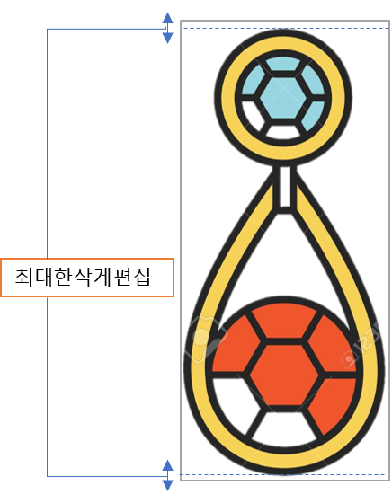
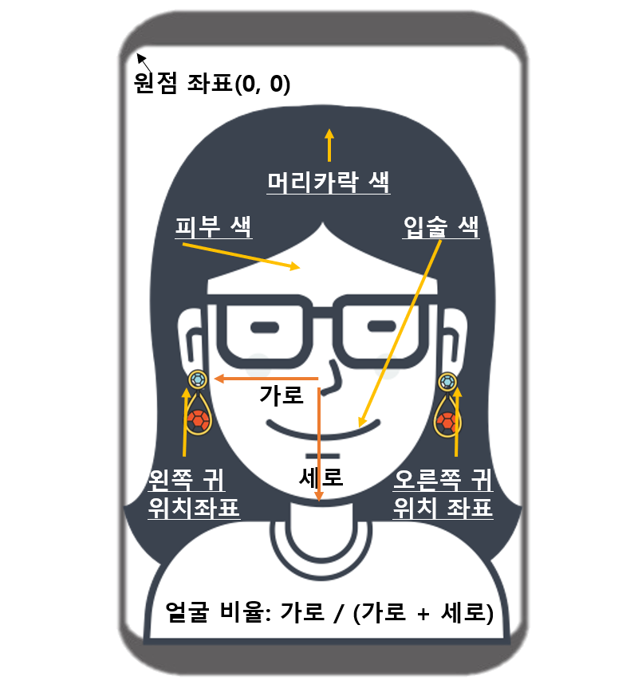
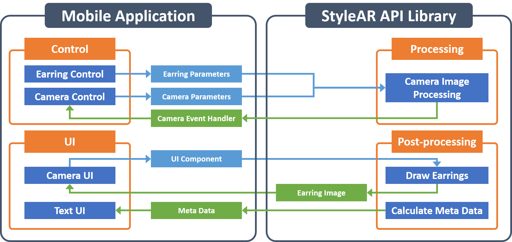
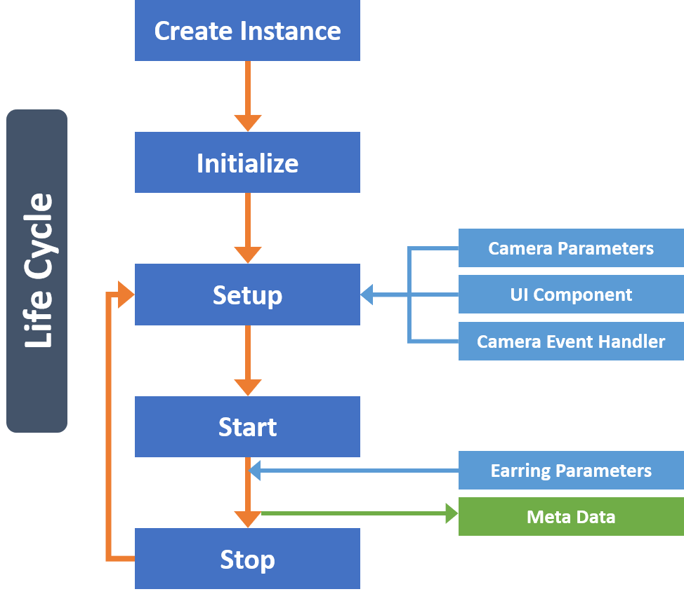

{: width="200"}

# StyleAR API Tutorial

>StyleAR API는 모바일의 카메라 영상에서 얼굴의 특정 위치 검출, 3D 피팅, 영상분석 등을 통해 귀걸이 착용 영상과 메타정보를 실시간으로 출력하는 컴퓨터 비전 기반의 API Library입니다.  

.png){: width="200"}

***

## 특징

### 귀걸이 착용

> 모바일의 카메라 영상에서 사용자의 귀를 실시간으로 검출하여 양쪽 귀에 귀걸이가 착용된 영상을 제공합니다. 이것을 이용해서 사용자가 귀걸이를 가상으로 착용(Virtual Try-on)할 수 있는 서비스를 만들 수 있습니다.

- 스팩:

    |목차|스팩|비고|
    |:-:|:-:|:-:|
    |가능인원|1명||
    |속도| 20 ~ 40FPS (Frame Per Secound) |실험 장비(Galaxy Note 8), 해상도(1440 X 1080)|

- 입력 및 출력:

    |목차|입력|비고||목차|출력|비고|
    |:-:|:-:|:-:|:-:|:-:|:-:|:-:|:-:|
    |얼굴영상|{: width="700"}|얼굴이 사진의 40%이상 차지 해야 함||결과영상|{: width="700"}|귀걸이가 실측크기에 맞게 배치되고, 영상 자체는 필터처리가 되어 입력영상보다 화사하게 보여줌|
    |귀걸이 사진|{: width="500"}|● 영상편집 시 귀걸이 위와 아래의 공백을 최대한 작게<br />● 영상은 귀걸이를 제외한 배경은 투명처리(png 포멧)||메타데이터|{: width="700"}|● 얼굴비율[가로: 코에서 턱, 세로: 코에서 귀]: 가로 /(가로 + 세로) {범위:0 ~ 1}<br />● 피부, 입술, 머리카락 색상: RGB순서로 색상정보가 출력 {범위:0 ~ 255}<br />● 귀 위치: 스크린의 원점을 기준으로 x, y 좌표|
    |귀걸이 크기|귀걸이 실측 가로와 세로 크기|단위(mm)|||||

***

## StyleAR API

- StyleAR API의 구조

  {: width="800"}

- StyleAR API의 life cycle

  {: width="500"}

## StyleAR API 사용방법

>StyleAR API를 모바일 앱에서 사용하는 방법을 설명합니다.

- 라이센스 발급
  > StyleAR API를 사용하기 위해서는 반드시 라이센스를 발급받아야 합니다.

|목차|내용|
|:-:|:-:|
|발급|<support@deepixel.xyz>로 문의 바랍니다.|
|주의사항|API 사용 기간과 메타정보 사용 유무를 고려하여 주시기 바랍니다.|

- 환경설정
  - Android
    - [Android 환경 설정][android_tutorial]

  - iOS
    - [iOS 환경 설정][ios_tutorial]

- StyleAR API 사용법
  - StyleAR view 연결
    > StyleAR API는 자체적으로 카메라를 제어하고 출력하는 view controller를 가지고 있습니다. StyleAR API를 사용을 할 시 해당 controller를 layout의 view에 연결하여 다른 설정 필요없이 쉽게 사용할 수 있습니다.

    ```java
    // For Android
    // StyleAR View Controller 선언
    private DPStyleARView m_stylearView
    // StyleAR View Controller를 layout의 view에 연결  
    m_stylearView = view.findViewById(R.id.stylear_view); //연결
    ```

    ```swift
    // For iOS
    ```

    - StyleAR API 귀걸이 변경
    > 귀걸이를 변경하기 위해서는 귀걸이 사진의 절대 경로와 귀걸이의 정보(실제 귀걸이의 가로 크기(mm), 세로 크기(mm) 그리고 핀 위치[TOP or CENTER])가 필요합니다.

    {: width="250"}

    ```java
    // For Android
    // StyleAR API 귀걸이 정보 클래스 선언
    DPEarringParam earringParam = new DPEarringParam();
    // 귀걸이 사진 파일 위치
    earringParam.setAbsolutePath(mEarringFile.getAbsolutePath());
    // 실제 귀걸이 가로 크기(mm)
    earringParam.setWidth(13.0f);
    // 실제 귀걸이 세로 크기(mm)
    earringParam.setHeight(85.0f);
    // 귀걸이 핀 위치(TOP or CENTER)
    earringParam.setAnchorPosition(DPEarringAnchorPosition.TOP);
    // StyleAR API에 귀걸이 정보 클래스 및 귀걸이 파일 이름 입력
    m_stylearView.setEarringParam(earringParam);
    ```

    ```swift
    // For iOS
    // 귀걸이 정보를 설정한다.
    NSString *earringPath = GetEarringImgPath();
    DPEarringParam *earringParam = [[DPEarringParam alloc] init];
    earringParam.absolutePath = earringPath;
    earringParam.width = 13.0f;
    earringParam.height = 85.0f;
    earringParam.anchorPosition = TOP;
    [_styleAR setEarringParam:earringParam];
    ```

    - StyleAR API 구동
    > StyleAR API동작을 시작합니다. StyleAR API에 설정된 UI 컴포넌트에 결과 영상을 출력합니다. StyleAR API을 구동하기 전에 카메라 관련 정보와 UI 컴포넌트를 설정해야 하고, 카메라 영상을 프로세싱하기 위한 이벤트 핸들러를 등록해야 합니다.

    ```java
    // For Android
    m_stylearView.start();
    ```

    ```swift
    // For iOS
    [_styleAR start];
    ```

    - StyleAR API 정지
    > StyleAR API 동작을 정지합니다. StyleAR API에 설정되 UI 컴포넌트에 결과 영상을 출력하는 것을 멈춥니다. 카메라 관련 정보, UI 컴포넌트 또는 이벤트 핸들러를 다시 등록하는 것을 StyleAR API동작을 정지한 후에 가능합니다.

    ```java
    // For Android
    m_stylearView.stop();
    ```

    ```swift
    // For iOS
    [_styleAR stop];
    ```

    - StyleAR API메타 정보 획득
    > StyleAR API이 동작하는 동안 카메라 입력 영상에서 다양한 메타 정보를 획득 할 수 있습니다.

    ```java
    // For Android
    DPFaceMetaData faceMetaData = m_stylearView.getFaceMetaData();
    StringBuilder msg = new StringBuilder();
    // 얼굴 비율 평균 출력
    msg.append("FRM : ").append(faceMetaData.getFaceRatioMean()).append('\n');
    // 얼굴 비율 편차 출력
    msg.append("FRS : ").append(faceMetaData.getFaceRatioStd()).append('\n');
    // 머리카락 색깔 평균 출력
    msg.append("HCM : ").append(String.format("#%06X", 0xFFFFFF & faceMetaData.getHairColorMean())).append('\n');
    // 머러카락 색깔 편차 출력
    msg.append("HCS : ").append(String.format("#%06X", 0xFFFFFF & faceMetaData.getHairColorStd())).append('\n');
    // 입술 색깔 평균 출력
    msg.append("LCM : ").append(String.format("#%06X", 0xFFFFFF & faceMetaData.getLipColorMean())).append('\n');
    // 입술 색깔 편차 출력
    msg.append("LCS : ").append(String.format("#%06X", 0xFFFFFF & faceMetaData.getLipColorStd())).append('\n');
    // 피부색 색깔 평균 출력
    msg.append("SCM : ").append(String.format("#%06X", 0xFFFFFF & faceMetaData.getSkinColorMean())).append('\n');
    // 피부색 색깔 편차 출력
    msg.append("SCS : ").append(String.format("#%06X", 0xFFFFFF & faceMetaData.getSkinColorStd())).append('\n');
    ```

    ```swift
    // For iOS
    DPFaceMetaData *faceMetaData = [styleAR getFaceMetaData];
    NSMutableString *str = [[NSMutableString alloc] init];
    [str appendFormat:@"FRM = %f\n", faceMetaData.faceRatioMean];
    [str appendFormat:@"FRS = %f\n", faceMetaData.faceRatioStd];
    [str appendFormat:@"HCM = #%06X\n", 0xFFFFFF & faceMetaData.hairColorMean];
    [str appendFormat:@"HCS = #%06X\n", 0xFFFFFF & faceMetaData.hairColorStd];
    [str appendFormat:@"LCM = #%06X\n", 0xFFFFFF & faceMetaData.lipColorMean];
    [str appendFormat:@"LCS = #%06X\n", 0xFFFFFF & faceMetaData.lipColorStd];
    [str appendFormat:@"SCM = #%06X\n", 0xFFFFFF & faceMetaData.skinColorMean];
    [str appendFormat:@"SCS = #%06X", 0xFFFFFF & faceMetaData.skinColorStd];
    ```

## 연락처

> StyleAR API 적용시 문제점을 발견하거나 궁금한 점이 있다면, 이메일(support@deepixel.xyz)로 문의해 주세요.  

***

## 참조

- [Android Sample code][android_sample]
- [camera2basicfragment][camera2basicfragment_sample]
- [Android 환경 설정][android_tutorial]
- [iOS Sample code][ios_sample]
- [iOS 환경 설정][ios_tutorial]
- [StyleAR API For Android][stylear_api_for_android]
- [StyleAR API For iOS][stylear_api_for_ios]

[android_sample]: https://github.com/deepixel-dev1/deepixel-dev1.github.io/tree/master/StyleAR/tutorial/android/StyleARForAndroidSample
[license]: /License/README.md
[camera2basicfragment_sample]: https://github.com/googlesamples/android-Camera2Basic/blob/master/Application/src/main/java/com/example/android/camera2basic/Camera2BasicFragment.java
[ios_sample]: https://github.com/deepixel-dev1/deepixel-dev1.github.io/tree/master/StyleAR/tutorial/ios/StyleARiOSAppExample
[android_tutorial]: /StyleAR/tutorial/android
[ios_tutorial]: /StyleAR/tutorial/ios
[stylear_api_for_android]: /StyleAR/apis/android
[stylear_api_for_ios]: /StyleAR/apis/ios
