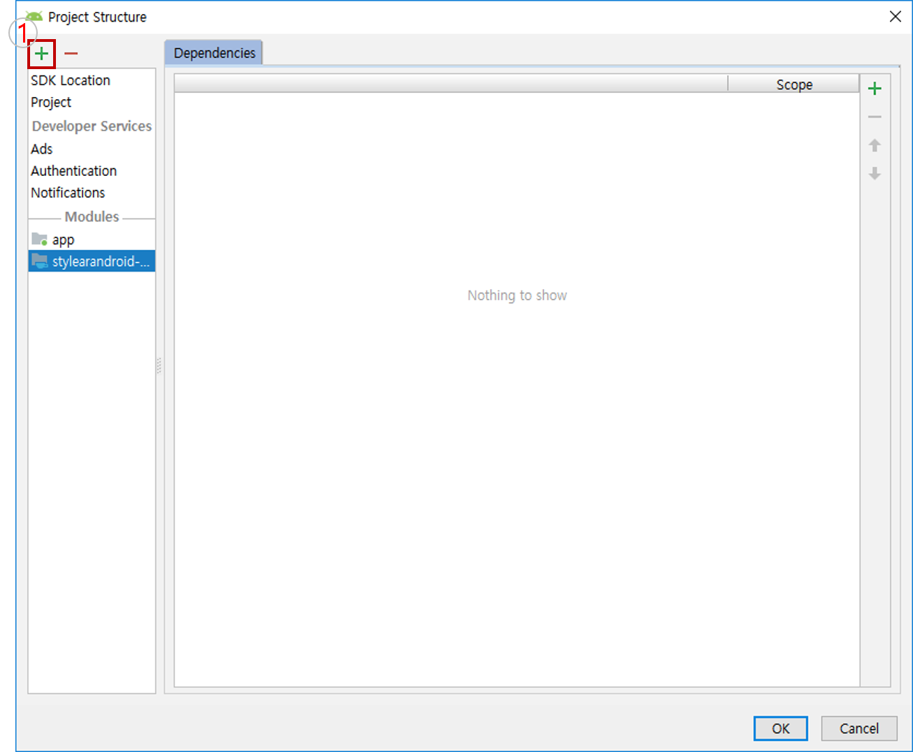
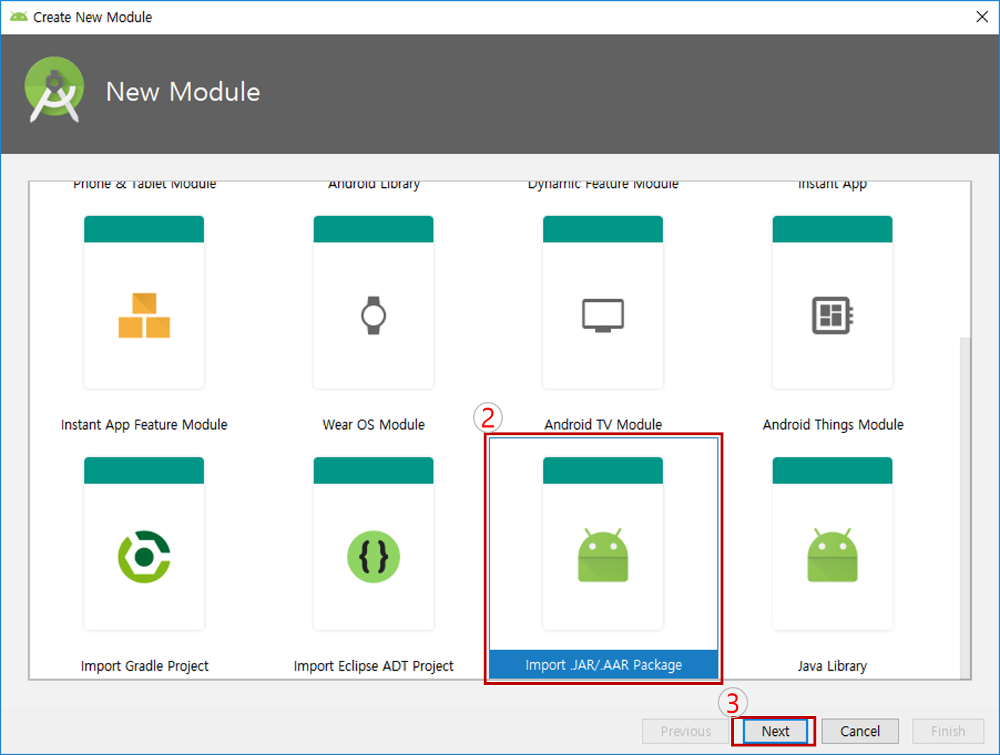
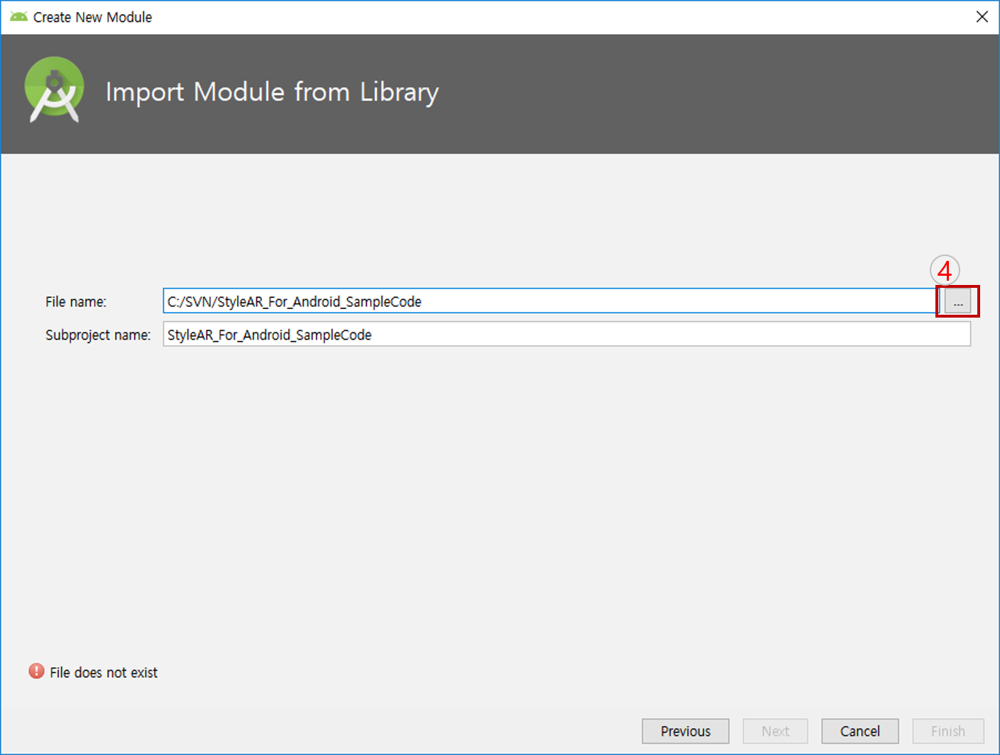
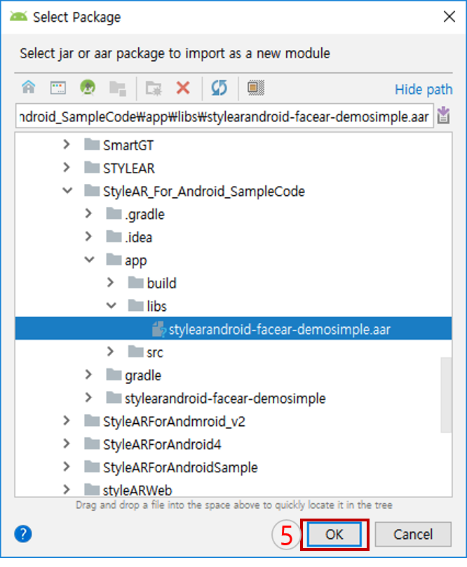

[{: width="200"}](https://deepixel.azurewebsites.net/)

# StyleAR Android 환경설정

Android 플랫폼에서 StyleAR API를 적용하기 위한 라이브러리 등록 및 프로젝트 권한 설정에 대한 방법을 자세히 설명합니다.

## Android 프로젝트에서 StyleAR API 라이브러리 추가

> 본 예제는 StyleARAndroid.aar이 아닌 stylearandroid-facear-demosimple.aar로 설정되어 있습니다. 또한 Android Studio 버전은 3.2.1 입니다.

1. File->ProjectStructure를 클릭합니다.
2. 라이센스 발급된 라이브러리파일(StyleARAndroid.aar)을 임포트 합니다.
    1. Project Sturcture 다이얼로그의 +
    버튼을 클릭합니다.
   
    1. import AAR/JAR Package를 선택하고, next 를 클릭합니다. 
   
    1. 라이브러리 파일 이름을 변경하기 위해 ... 버튼을 클릭합니다.
   
    1. 저장된 StyleARAndroid.aar파일경로를 지정하고, OK 를 클릭합니다.
   
3. 프로젝트 Gradle에 설정을 추가합니다.

    ```java
        android{
          // JAVA 버전
          compileOption{
          sourceCompatibility 1.8
          sourceCompatibility 1.8
          }
        }

        dependencies{
            implementation 'net.sourceforge.streamsupport:android-retrofuture:1.7.0'
            implementation 'com.android.support:appcompat-v7:28.0.0'
            implementation 'com.android.support.constraint:constraint-layout:1.1.3'
            // 어플리케이션에 StyleARAndroid aar(라이브러리) 추가
            implementation project(':StyleARAndroid')
        }
    ```

4. 어플리케이션 ID 설정
    > 적용할 프로젝트의 **어플리케이션 ID**는 **반드시 라이센스 발급 시 기입했던** '**적용 어플리케이션 ID**'를 사용해야 합니다.

    ```java
        android{
            defaultConfig {
            // 어플리케이션 ID = 라이센스 발급때 기입한 ID로 설정
            // 예시 라이센스 발급 ID(xyz.deepixel)
            applicationId "xyz.deepixel"
            }
        }
    ```

## Android 프로젝트에 권한설정 추가

> **StyleAR API**를 개발 프로젝트의 어플리케이션에 적용하기 위해서는 **파일 입출력** 및 **카메라 사용**에 대한 **어플리케이션 사용자의 권한**이 **승인** 되어야 합니다.

- **사용권한 설정**  
    사용권한을 요청할 수 있게 manifests에 아래의 코드를 입력합니다.

    ```xml
    <!--For Android-->
    <!--manifests file-->
    <uses-permission android:name="android.permission.WRITE_EXTERNAL_STORAGE" />
    <uses-permission android:name="android.permission.CAMERA" />
    ```

- **권한수락 코드(변경가능)**  
    설정된 권한이 모바일사용자에게 나타날 수 있도록 다이얼로그를 만들며, 선택에 따라 실제 권한이 적용 될 수 있도록 합니다. 해당 코드는 예시이며, **개발자가 다른 방식으로 기능구현**해도 무방합니다.

    ```java
    /*For Android*/
    private val REQUEST_CAMERA_PERMISSION = 1
    private val REQUEST_WRITE_EXTERNAL_STORAGE_PERMISSION = 2
    private val FRAGMENT_DIALOG = "dialog"
    // camera 권한 설정
    private boolean requestCameraPermission() {
        if (ContextCompat.checkSelfPermission(getActivity(), Manifest.permission.CAMERA)
                == PackageManager.PERMISSION_GRANTED)
            return false;
        else if (shouldShowRequestPermissionRationale(Manifest.permission.CAMERA)) {
            ConfirmationDialogFragment.newInstance(R.string.camera_permission_confirmation,
                    new String[]{Manifest.permission.CAMERA},
                    REQUEST_CAMERA_PERMISSION,
                    R.string.camera_permission_not_granted)
                    .show(getFragmentManager(), FRAGMENT_DIALOG);
        } else {
            requestPermissions(new String[]{Manifest.permission.CAMERA}, REQUEST_CAMERA_PERMISSION);
        }
        return true;
    }
    // 파일입출력 권한 설정
    private boolean requestReadExternalStoragePermission() {
        if (ContextCompat.checkSelfPermission(getActivity(), Manifest.permission.WRITE_EXTERNAL_STORAGE)
                == PackageManager.PERMISSION_GRANTED)
            return false;
        else if (shouldShowRequestPermissionRationale(Manifest.permission.WRITE_EXTERNAL_STORAGE)) {
            ConfirmationDialogFragment.newInstance(R.string.write_external_storage_permission_confirmation,
                    new String[]{Manifest.permission.WRITE_EXTERNAL_STORAGE},
                    REQUEST_WRITE_EXTERNAL_STORAGE_PERMISSION,
                    R.string.write_external_storage_permission_not_granted)
                    .show(getFragmentManager(), FRAGMENT_DIALOG);
        } else {
            requestPermissions(new String[]{Manifest.permission.WRITE_EXTERNAL_STORAGE}, REQUEST_WRITE_EXTERNAL_STORAGE_PERMISSION);
        }
        return true;
    }
    // 에러 다이얼로그 생성
    public static class ErrorDialog extends DialogFragment {

        private static final String ARG_MESSAGE = "message";

        public static ErrorDialog newInstance(String message) {
            ErrorDialog dialog = new ErrorDialog();
            Bundle args = new Bundle();
            args.putString(ARG_MESSAGE, message);
            dialog.setArguments(args);
            return dialog;
        }

        @NonNull
        @Override
        public Dialog onCreateDialog(Bundle savedInstanceState) {
            final Activity activity = getActivity();
            return new AlertDialog.Builder(activity)
                    .setMessage(getArguments().getString(ARG_MESSAGE))
                    .setPositiveButton(android.R.string.ok, (dialogInterface, i) -> activity.finish())
                    .create();
        }

    }
    // 확인 다이얼로그 생성
    public static class ConfirmationDialogFragment extends DialogFragment {

        private static final String ARG_MESSAGE = "message";
        private static final String ARG_PERMISSIONS = "permissions";
        private static final String ARG_REQUEST_CODE = "request_code";
        private static final String ARG_NOT_GRANTED_MESSAGE = "not_granted_message";

        public static ConfirmationDialogFragment newInstance(@StringRes int message,
                                                             String[] permissions, int requestCode, @StringRes int notGrantedMessage) {
            ConfirmationDialogFragment fragment = new ConfirmationDialogFragment();
            Bundle args = new Bundle();
            args.putInt(ARG_MESSAGE, message);
            args.putStringArray(ARG_PERMISSIONS, permissions);
            args.putInt(ARG_REQUEST_CODE, requestCode);
            args.putInt(ARG_NOT_GRANTED_MESSAGE, notGrantedMessage);
            fragment.setArguments(args);
            return fragment;
        }

        @NonNull
        @Override
        public Dialog onCreateDialog(Bundle savedInstanceState) {
            final Bundle args = getArguments();
            return new android.support.v7.app.AlertDialog.Builder(getActivity())
                    .setMessage(args.getInt(ARG_MESSAGE))
                    .setPositiveButton(android.R.string.ok,
                            (dialog, which) -> {
                                String[] permissions = args.getStringArray(ARG_PERMISSIONS);
                                if (permissions == null) {
                                    throw new IllegalArgumentException();
                                }
                                ActivityCompat.requestPermissions(getActivity(),
                                        permissions, args.getInt(ARG_REQUEST_CODE));
                            })
                    .setNegativeButton(android.R.string.cancel,
                            (dialog, which) ->
                                    ErrorDialog.newInstance(getString(args.getInt(ARG_NOT_GRANTED_MESSAGE)))
                                            .show(getChildFragmentManager(), FRAGMENT_DIALOG)).create();
        }

    }
    ```

***
