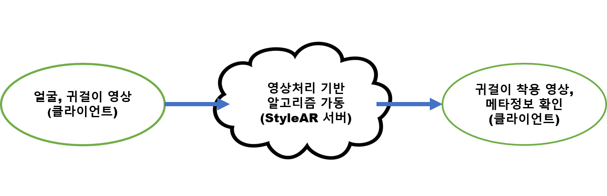
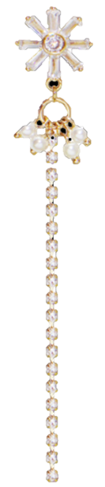
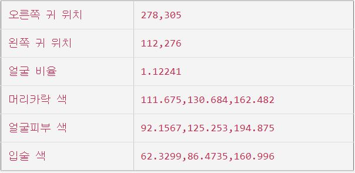
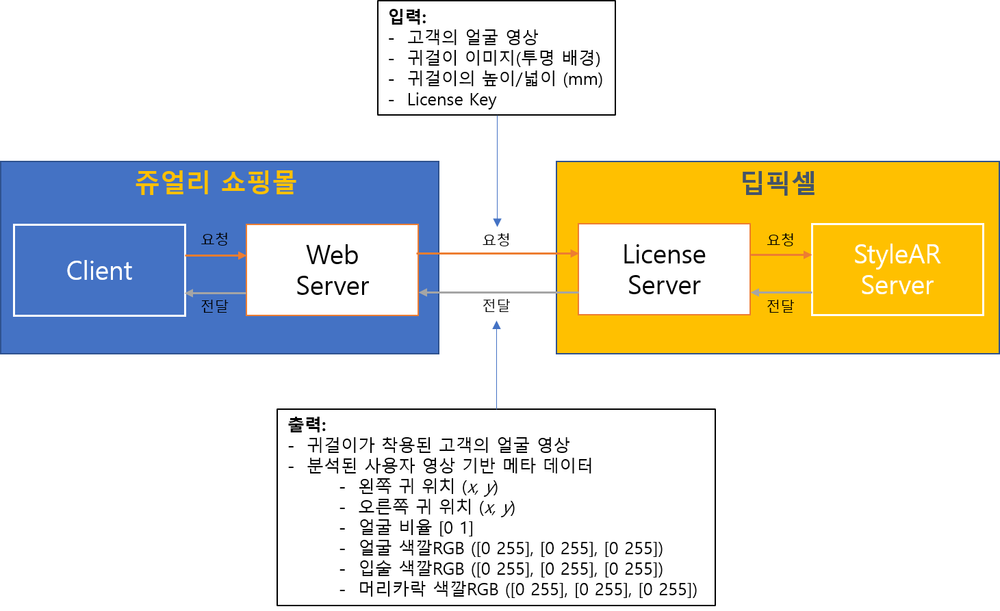

{: width="200"}

# StyleAR Web API

> 클라이언트 웹페이지에서 얼굴 영상데이터와 귀걸이 영상데이터를 입력받아 StyleAR 서버로 전송하면, 서버에서 영상처리 기반 알고리즘을 통해 귀걸이가 착용된 사진 및 사진의 메타정보를 클라이언트 웹페이지에 전달하는 웹 기반 영상처리 API입니다.

{: width="1000"}

## StyleAR Web API 입출력

- 입력(클라이언트)
  
  ||얼굴|귀걸이|
  |:-:|:-:|:-:|
  |입력|얼굴사진| 1.귀걸이사진 </br> 2.귀걸이 크기 </br> (실제 귀걸이 가로, 세로 크기를 실측함. 단위는 mm)|
  |주의사항|얼굴이 사진의 40%이상 차지|귀걸이를 제외한 바탕화면을 투명화 함(PNG 영상 입력)|
  |예제사진|{: width="200"}|{: width="600"}|

- 출력(서버)
  
  |결과물|내용|비고|
  |:-:|:-:|:-:|
  |귀걸이 착용 사진|{: width="200"}|기본적으로 사진에 instagram 필터가 적용|
  |메타정보|{: width="200"}| 귀 위치좌표 (영상의 x, y 좌표) </br> 얼굴 비율 (얼굴의 좌우비율) </br> 얼굴 부분 색 (Blue, Green, Red 순으로 정렬) |

## StyleAR Web API 사용방법

> StyleAR Web API사용은 쥬얼리 쇼핑몰에서 고객이 업로드 한 얼굴 및 귀걸이 영상과 미리 정의된 귀걸이 크기 및 발급받은 라이센스 키 데이터를 딥픽셀 서버 측에 전달합니다. 딥픽셀 서버는 라이센스 키가 유효한지 확인 후에 StyleAR 영상처리 알고리즘을 통해 귀걸이가 착용된 고객의 얼굴 영상 및 메타정보를 쥬얼리 쇼핑물에 전달합니다.
  
  {: width="1000"}

### StyleAR Web API 예제

> StyleAR Web API를 빠르고 간단하게 사용하는 방법을 아래 목차에 따라 설명합니다.

- 목차  
  1. 라이센스 키 발급
  2. 웹 페이지 구성
  3. 웹 서버로 데이터 전송
  4. StyleAR Web API 요청
  5. 웹 페이지에서 결과 출력

1. 라이센스 키 발급
   > StyleAR Web API를 사용하기 위해서는 반듯이 라이센스 키를 발급받아야 하며, 계약된 기간이 지나면 자동적으로 API사용 접근권한이 해제 됩니다.

    |목차|내용|
    |:-:|:-:|
    |발급|<honami82@deepixel.xyz>로 문의 바랍니다.|
    |코드|x-ncp-apigw-api-key|
    |주의사항|API 사용 기간, 메타정보 사용 유무를 고려하여 주시기 바랍니다.|

2. 웹 페이지 구성
   > StyleAR Web API를 위한 간단한 웹페이지 입니다. 얼굴 및 귀걸이 영상을 입력받도록 구성되어 있습니다.

   - HTML

   ```html
    <html lang="en">
    <head>
        <h1>StyleAR Web API</h1>
    </head>
    <body>
    <p id="meta-info"></p>
    <p id="earring-image"></p>
    <input accept="image/*" id="upload-face-Image" name="image" onchange="loadFaceFile(this)" type="file">
    <input accept="image/*" id="upload-ear-Image" name="image" onchange="loadEarFile(this)" type="file">
    <form enctype="multipart/form-data" id="myForm" method="post" novalidate>
        <input accept="image/*" id="upload-compressed-Face" name="url_face" type="hidden"/>
        <input accept="image/*" id="upload-compressed-ear" name="url_ear" type="hidden"/>
        <input accept="utf-8" id="upload-compressed-earHsize" name="url_earHsize" type="hidden"/>
        <input accept="utf-8" id="upload-compressed-earWsize" name="url_earWsize" type="hidden"/>
    </form>
    <button onclick="generateStyleAR()" type="button">제출</button>  
    </body>
    ```

    - JAVASCRIPT

    ```javaScript
    var faceFileReader = new FileReader();
    var earFileReader = new FileReader();

    // 얼굴파일 데이터 로드
    var loadFaceFile = function (input) {
        var uploadImage = document.getElementById("upload-face-Image");
        if (uploadImage.files.length === 0) {
            return;
        }
        var uploadFile = document.getElementById("upload-face-Image").files[0];
        faceFileReader.readAsDataURL(uploadFile);
    }
    // 얼굴영상 데이터 로드
    faceFileReader.onload = function (event) {
        var image = new Image();
        image.onload = function () {
            var canvas = document.createElement("canvas");
            var context = canvas.getContext("2d");
        // 영상비율을 640을 기준으로 맞춤
            var ratioWidth = image.width <= 640
                ? 1
                : 640 / image.width;
            var ratioHeight = image.height <= 640
                ? 1
                : 640 / image.height;
            var ratio = ratioWidth < ratioHeight
                ? ratioWidth
                : ratioHeight;
            canvas.width = image.width * ratio;
            canvas.height = image.height * ratio;
            context.drawImage(image, 0, 0, image.width, image.height, 0, 0,canvas.width, canvas.height);
            //영상데이터를 URL문자열 형식으로 변경
            document.getElementById("upload-compressed-Face").value
            canvas.toDataURL();
        }
        image.src = event.target.result;
    };

    //귀걸이 파일 로드
    var loadEarFile = function (input) {
        var uploadImage = document.getElementById("upload-ear-Image");
        if (uploadImage.files.length === 0) {
           return;
        }
        var uploadFile = document.getElementById("upload-ear-Image").files[0];
        earFileReader.readAsDataURL(uploadFile);
    }

    //귀걸이영상 데이터 로드
    earFileReader.onload = function (event) {
        var image = new Image();
        image.onload = function () {
            var canvas = document.createElement("canvas");
            var context = canvas.getContext("2d");
            canvas.width = image.width;
            canvas.height = image.height;
            context.drawImage(image, 0, 0, image.width, image.height, 0, 0, canvas.width, canvas.height);
        //귀걸이 영상데이터 URL문자열로 변경
            document.getElementById("upload-compressed-ear").value = canvas.toDataURL();
        }
        image.src = event.target.result;
    };
    ```

3. 웹 서버로 데이터 전송
   > 웹 페이지에서 취득된 데이터(얼굴, 귀걸이, 귀걸이크기)를 FORM 형식으로 취합하여 웹 서버로 전송합니다.

   - JAVASCRIPT

    ```javaScript
    function generateStyleAR() {
        var obj,dbParam,xmlhttp,myObj,x,txt = "";
        var txtArray = new Array();
        xmlhttp = new XMLHttpRequest();
        //Method - POST, URL - 쥬얼리 홈페이지 웹서버
        xmlhttp.open("POST", "<webserver-url>", true);
        //저장되어 있는 귀걸이 크기 입력
        document.getElementById("upload-compressed-earHsize").value = 85;
        document.getElementById("upload-compressed-earWsize").value = 15;
        //폼 데이터 형식으로 취합
        var myForm = document.getElementById('myForm');
        var formData = new FormData(myForm);
        //쥬얼리 웹서버로 전송
        xmlhttp.send(formData);
    }
    ```

4. 웹 서버로 데이터 전송
   > 웹 페이지에서 전송받은 데이터(얼굴, 귀걸이, 귀걸이 크기)를 딥픽셀 서버로 전송할 때에는 반드시 해더에 라이센스 키를 포함하여야 하며, 데이터는 폼에 맞게 변환한 후 딥픽셀 서버로 전송합니다. 딥픽셀 서버에서 응답이 오면 응답메시지에 확인하고, JSON형식으로 변환 후 웹 페이지에 전송합니다.

    - PYTHON

    ```python

    import requests
    import JsonResponse
    import HttpResponse

    # 전송된 데이터
    url_face = request.POST.get("url_face", None)
    url_ear = request.POST.get("url_ear", None)
    url_earHsize = request.POST.get("url_earHsize", None)
    url_earWsize = request.POST.get("url_earWsize", None)

    # 바운더리 설정
    boundary = '----DeepixelBoundary1234567890'

    # 얼굴 데이터 구축
    data_face = '--' + boundary + '\r\n'
    data_face += 'Content-Disposition: form-data; name="' + "url_face" + '"\r\n\r\n';
    data_face += url_face + '\r\n'
    data_face += '--' + boundary + '--\r\n'

    # 귀걸이 데이터 구축
    data_earing = '--' + boundary + '\r\n'
    data_earing += 'Content-Disposition: form-data; name="' + "url_ear" + '"\r\n\r\n';
    data_earing += url_ear + '\r\n'
    data_earing += '--' + boundary + '--\r\n'

    # 귀걸이 크기 데이터 구축
    data_earingH = '--' + boundary + '\r\n'
    data_earingH += 'Content-Disposition: form-data; name="' + "url_ear" + '"\r\n\r\n';
    data_earingH += url_earHsize + '\r\n'
    data_earingH += '--' + boundary + '--\r\n'

    data_earingW = '--' + boundary + '\r\n'
    data_earingW += 'Content-Disposition: form-data; name="' + "url_ear" + '"\r\n\r\n';
    data_earingW += url_earWsize + '\r\n'
    data_earingW += '--' + boundary + '--\r\n'

    # request 데이터 구성
    data = {'url_face':data_face, 'url_ear':data_ear, 'url_earHsize':data_earingH, 'url_earWsize':data_earingW}

    # request 해더 구성(발급받은 licence key를 {subscription key}에 입력)
    headers = {'x-ncp-apigw-api-key': '{subscription key}', }

    #전송 및 응답
    response = requests.post("https://4moep0liiy.apigw.ntruss.com/earring/v0_1/draw", headers=headers ,data=data)

    #JSON 형태로 리턴
    return JsonResponse(response.json())
    ```

    - 딥픽셀 전송 URL
      - https://4moep0liiy.apigw.ntruss.com/earring/v0_1/draw
    - 응답 메시지

    |RESPONSE CODE|Error Code|Description|
    |:-:|:-:|:-:|
    |200||성공|
    |400|'No Ear URL provided'|잘못된 귀걸이 데이터 전송|
    |400|'No Face URL provided'|잘못된 얼굴 데이터 전송|

5. 웹 페이지에서 결과 출력
   > 웹 서버에서 전달 받은 데이터(귀걸이 착용 얼굴영상, 메타데이터)를 웹 페이지에 출력 합니다.

   - JAVASCRIPT

    ```javaScript
    function generateStyleAR() {
        var obj,dbParam,xmlhttp,myObj,x,txt = "";
        var txtArray = new Array();
        xmlhttp = new XMLHttpRequest();
        // 웹 서버 응답 처리함수
        xmlhttp.onreadystatechange = function () {
            if (this.readyState == 4 && this.status == 200) {
                myObj = JSON.parse(xmlhttp.responseText);
                // 예제는 테이블 형식으로 출력
                txt += "<table border='1' style='font-size:1.5em;'>"
                Object.keys(myObj).forEach(function (k) {
                var objTxt = k;
                if(objTxt.indexOf("DEBUG") == -1){
                    if(objTxt == "오른쪽 귀 위치")
                        txtArray[0] = "<tr><td>" + k + "</td><td>" + myObj[k] + "</td></tr>";
                    if(objTxt == "왼쪽 귀 위치")
                        txtArray[1] = "<tr><td>" + k + "</td><td>" + myObj[k] + "</td></tr>";
                    if(objTxt == "얼굴 비율")
                        txtArray[2] = "<tr><td>" + k + "</td><td>" + myObj[k] + "</td></tr>";
                    if(objTxt == "머리카락 색")
                        txtArray[3] = "<tr><td>" + k + "</td><td>" + myObj[k] + "</td></tr>";
                    if(objTxt == "얼굴피부 색")
                        txtArray[4] = "<tr><td>" + k + "</td><td>" + myObj[k] + "</td></tr>";
                    if(objTxt == "입술 색")
                        txtArray[5] = "<tr><td>" + k + "</td><td>" + myObj[k] + "</td></tr>";
                    if(objTxt == "결과 영상")
                        txtArray[6] = myObj[k]
                }
            });

            for( var i = 0; i < txtArray.length - 1; i++)
                txt += txtArray[i];
            txt += "</table>";
            var debugTxt = String(myObj["DEBUG_success"]); //결과 성공확인
            if(debugTxt.indexOf("1") == -1)
                document.getElementById("meta_info").innerHTML = "에러";
            else
                document.getElementById("meta_info").innerHTML = txt; //메타정보 출력
            document.getElementById("earring-image").src = txtArray[6]; //결과영상 출력
            }
        };
        ///////////////////웹 서버로 전송//////////////////////////
        xmlhttp.open("POST", "<webserver-url>", true);
        var myForm = document.getElementById('myForm');
        var formData = new FormData(myForm);
        xmlhttp.send(formData);
        //////////////////////////////////////////////////////////
    }
    ```

## 연락처

>API 적용시 문제점을 발견하거나 궁금한 점이 있다면, 다음의 이메일 <hoohyun.kim@deepixel.xyz>로 문의해 주세요.
