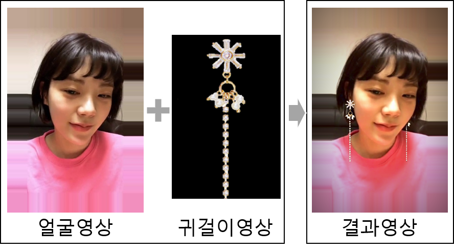

{: width="200"}

# StyleAR Web API란?

> StyleAR Web API는 얼굴 영상과 귀걸이 영상 입력을 클라이언트로부터 전달받아, 서버에서 귀걸이 위치 추정 및 영상분석 알고리즘을 실행 시킨 후 결과를 전달하는 Web기반 컴퓨터 비전API 입니다.

- 결과물
  - 귀걸이 착용 결과영상
  {: width="200"}
  - 메타정보
    |종류|설명|
    |:-:|:-:|
    |오른쪽 귀 위치|오른쪽 귀의 위치좌표(x, y)를 출력한다.|
    |왼쪽 귀 위치|왼쪽 귀의 위치좌표(x, y)를 출력한다.|
    |얼굴 비율|얼굴의 좌, 우 비율을 출력한다.|
    |머리카락 색|머리카락 색(B, G, R)를 출력한다.|
    |얼굴피부 색|얼굴피부 색(B, G, R)를 출력한다.|
    |입술 색|입술 색(B, G, R)를 출력한다.|

## 사용 필수 조건

- license key 발급
  - StyleAR Wep API 사용은 반드시 [license key를 발급][email]받아야 합니다.

## API Request

- HTTP Method
  - POST
  
- URL
  - https://4moep0liiy.apigw.ntruss.com/earring/v0_1/draw

- headers
  - x-ncp-apigw-api-key: 라이센스 키

- body(data)

    |Fields|Type|Description|
    |:-:|:-:|:-:|
    |url_face|form-data|얼굴 영상 데이터|
    |url_ear|form-data|귀걸이 영상 데이터|

## API Response

- Response 200

    |Fields|Type|Description|
    |:-:|:-:|:-:|
    |오른쪽 귀 위치|String|오른쪽 귀의 위치좌표(x, y)를 출력한다.|
    |왼쪽 귀 위치|String|왼쪽 귀의 위치좌표(x, y)를 출력한다.|
    |얼굴 비율|String|얼굴의 좌, 우 비율을 출력한다.|
    |머리카락 색|String|머리카락 색(R, G, B)를 출력한다.|
    |얼굴피부 색|String|얼굴피부 색(R, G, B)를 출력한다.|
    |입술 색|String|입술 색(R, G, B)를 출력한다.|
    |결과 영상|image|귀걸이가 착용된 결과 영상을 출력한다.|

- Response 400
  
    |Error Code|Description|
    |:-:|:-:|
    |'No Face URL provided'|얼굴 URL|
    |'No Ear URL provided'|귀 URL|

## API 빠른실행

> 클라이언트에서 입력받은 얼굴 및 귀걸이 영상을 서버로 요청하고, 결과를 받는 코드를 구현합니다.

- HTML(클라이언트)

```html
<html lang="en">
<head>
    <h1>StyleAR Web API</h1>
</head>
<body>
<p id="meta-info"></p>
<p id="earring-image"></p>
<input accept="image/*" id="upload-face-Image" name="image" onchange="loadFaceFile(this)" type="file">
<input accept="image/*" id="upload-ear-Image" name="image" onchange="loadEarFile(this)" type="file">
<form enctype="multipart/form-data" id="myForm" method="post" novalidate>
    <input accept="image/*" id="upload-compressed-Face" name="url_face" type="hidden"/>
    <input accept="image/*" id="upload-compressed-ear" name="url_ear" type="hidden"/>
</form>
<button onclick="generateStyleAR()" type="button">제출</button>  
</body>
```

- js

```javaScript
var faceFileReader = new FileReader();
vae earFileReader = new FileReader();

// 얼굴파일 데이터 로드
var loadFaceFile = function (input) { 
    var uploadImage = document.getElementById("upload-face-Image");
    if (uploadImage.files.length === 0) {
        return;
    }
    var uploadFile = document.getElementById("upload-face-Image").files[0];
    faceFileReader.readAsDataURL(uploadFile);
}
// 얼굴영상 데이터 로드
faceFileReader.onload = function (event) {
    var image = new Image();
    image.onload = function () {
        var canvas = document.createElement("canvas");
        var context = canvas.getContext("2d");
        // 영상비율을 640을 기준으로 맞춤
        var ratioWidth = image.width <= 640
            ? 1
            : 640 / image.width;
        var ratioHeight = image.height <= 640
            ? 1
            : 640 / image.height;
        var ratio = ratioWidth < ratioHeight
            ? ratioWidth
            : ratioHeight;
        canvas.width = image.width * ratio;
        canvas.height = image.height * ratio;
        context.drawImage(image, 0, 0, image.width, image.height, 0, 0,canvas.width, canvas.height);
        //영상데이터를 URL문자열 형식으로 변경
        document.getElementById("upload-compressed-Face").value
        canvas.toDataURL();
    }
    image.src = event.target.result;
};

//귀걸이 파일 로드
var loadEarFile = function (input) {
    var uploadImage = document.getElementById("upload-ear-Image");
    if (uploadImage.files.length === 0) {
        return;
    }
    var uploadFile = document.getElementById("upload-ear-Image").files[0];
    earFileReader.readAsDataURL(uploadFile);
}

//귀걸이영상 데이터 로드
earFileReader.onload = function (event) {
    var image = new Image();
    image.onload = function () {
        var canvas = document.createElement("canvas");
        var context = canvas.getContext("2d");
        canvas.width = image.width;
        canvas.height = image.height;
        context.drawImage(image, 0, 0, image.width, image.height, 0, 0, canvas.width, canvas.height);
        //귀걸이 영상데이터 URL문자열로 변경
        document.getElementById("upload-compressed-ear")
        .value = canvas.toDataURL();
    }
    image.src = event.target.result;
};

// 웹 서버에 얼굴 및 귀걸이 영상 전달 및 결과출력
function generateStyleAR() {
    var obj,dbParam,xmlhttp,myObj,x,txt = "";
    var txtArray = new Array();
    xmlhttp = new XMLHttpRequest();
    xmlhttp.onreadystatechange = function () {
        if (this.readyState == 4 && this.status == 200) {
            myObj = JSON.parse(xmlhttp.responseText);
            // 테이블 형식으로 출력
            txt += "<table border='1' style='font-size:1.5em;'>"
            Object.keys(myObj).forEach(function (k) {
            var objTxt = k;
            if(objTxt.indexOf("DEBUG") == -1){
                if(objTxt == "오른쪽 귀 위치")
                    txtArray[0] = "<tr><td>" + k + "</td><td>" + myObj[k] + "</td></tr>";
                if(objTxt == "왼쪽 귀 위치")
                    txtArray[1] = "<tr><td>" + k + "</td><td>" + myObj[k] + "</td></tr>";
                if(objTxt == "얼굴 비율")
                    txtArray[2] = "<tr><td>" + k + "</td><td>" + myObj[k] + "</td></tr>";
                if(objTxt == "머리카락 색")
                    txtArray[3] = "<tr><td>" + k + "</td><td>" + myObj[k] + "</td></tr>";
                if(objTxt == "얼굴피부 색")
                    txtArray[4] = "<tr><td>" + k + "</td><td>" + myObj[k] + "</td></tr>";
                if(objTxt == "입술 색")
                    txtArray[5] = "<tr><td>" + k + "</td><td>" + myObj[k] + "</td></tr>";
                if(objTxt == "결과 영상")
                    txtArray[6] = myObj[k]
            }
        });

        for( var i = 0; i < txtArray.length - 1; i++)
            txt += txtArray[i];                    

        txt += "</table>";
        var debugTxt = String(myObj["DEBUG_success"]); //결과 성공확인
        if(debugTxt.indexOf("1") == -1)
            document.getElementById("meta_info").innerHTML = "에러";
        else
            document.getElementById("meta_info").innerHTML = txt; //메타정보 출력
        document.getElementById("earring-image").src = txtArray[6]; //결과영상 출력
        }
    };
    //웹 서버로 전송
    xmlhttp.open("POST", "<webserver-url>", true);
    var myForm = document.getElementById('myForm');
    var formData = new FormData(myForm);
    xmlhttp.send(formData);
}

```

- Python(웹 서버)

```python

import requests
import JsonResponse
import HttpResponse

# 전송된 데이터
url_face = request.POST.get("url_face", None)
url_ear = request.POST.get("url_ear", None)

# 파운더리 설정
boundary = '----DeepixelBoundary1234567890'

# 얼굴 데이터 구축
data_face = '--' + boundary + '\r\n'
data_face += 'Content-Disposition: form-data; name="' + "url_face" + '"\r\n\r\n';
data_face += url_face + '\r\n'
data_face += '--' + boundary + '--\r\n'

# 귀걸이 데이터 구축
data_ear = '--' + boundary + '\r\n'
data_ear += 'Content-Disposition: form-data; name="' + "url_ear" + '"\r\n\r\n';
data_ear += url_ear + '\r\n'
data_ear += '--' + boundary + '--\r\n'

# request 데이터
data = {'url_face':data_face, 'url_ear':data_ear}

# request 해더(licence key 입력)
headers = {'x-ncp-apigw-api-key': '{subscription key}', }

#전송 및 응답
response = requests.post("https://4moep0liiy.apigw.ntruss.com/earring/v0_1/draw", headers=headers ,data=data)

#JSON 형태로 리턴
return JsonResponse(response.json())
```

[email]: <hoohyun.kim@deepixel.xyz>