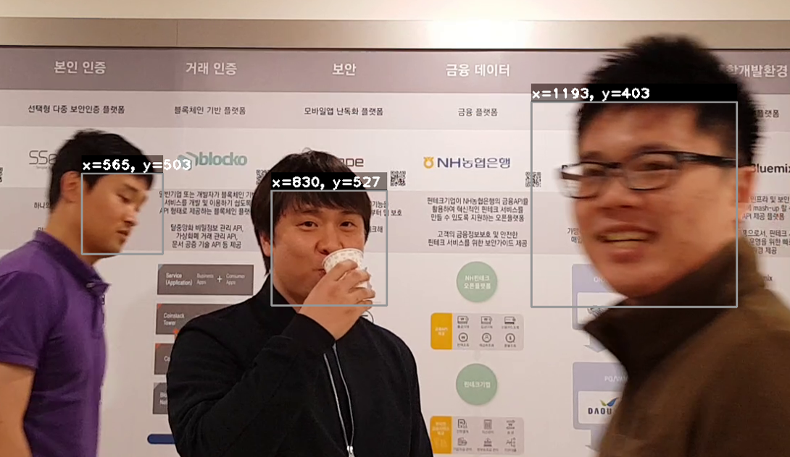
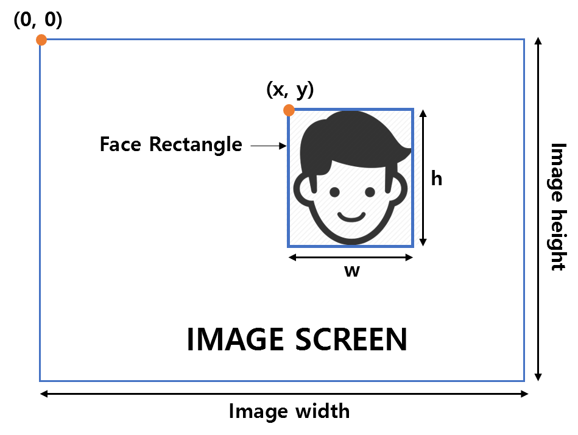
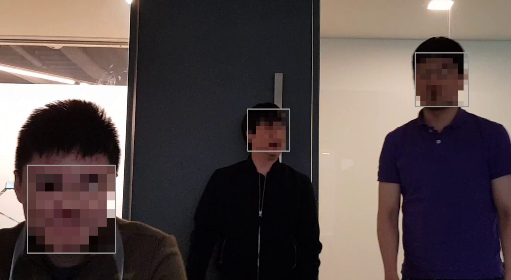
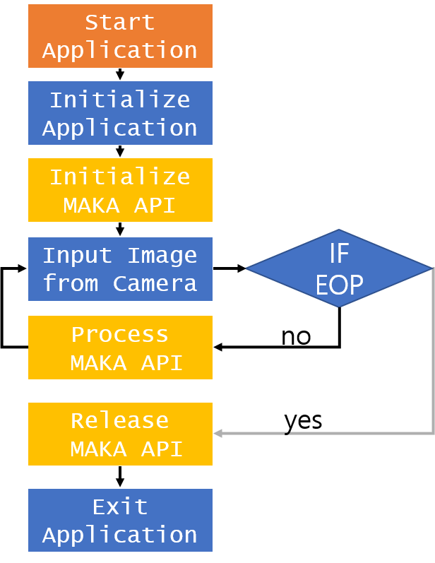

{: width="200"}  

MAKA API TUTORIAL (For Android)
=========================

>The MAKA API is an API module for face tracking, mosaic, and face recognition.  

***

## Features

### 1. MAKA Face Tracking

>MAKA Face Tracking is a system that finds faces at high speed and keeps track of face positions.  
{: width="600"}  

* SPEC:
	* Up to 3 people
	* Unconstraind face tracker  
	* 40~70 FPS (Device: Galaxy Note 8)
		* [TEST VIDEO][test]
		* [TEST VIDEO RESULT][test result]
	* Smoothing the positions of the faces being tracked
 
* OUTPUT:  
	* Face Rectangle(x, y, w, h)  	
	
	```
	x: x-coordinate of the upper-left corner of Face Rectangle
	y: y-coordinate of the upper-left corner of Face Rectangle
	w: width of Face Rectangle
	h: height of Face Rectangle
    ```
         
{: width="400"}	

### 2. MAKA Face Mosaic
>MAKA Face Mosaic is a module that create a mosaic at specified face area.

* OUTPUT:
	* Image with mosaic  
{: width="400"}

### 3. MAKA Face Tagging
>MAKA Face Tagging can continuously track the labeled face within detected faces by MAKA Face Tracking Module

* SPEC:
	* The Number of Labeled faces is up to 3
	* Labeled faces can be tracked continuously.

* Output:
	* Labeled Faces Rectangle(l)
	
	```
	l: Label information
	```
{: width="400"}

*****
## MAKA API Files
 * Maka API(C++)  
   
   ```
   MAKA/include/opencv_3.3.1/                : OpenCV library folder
   MAKA/include/IMaka.h                      : Maka API Interface Header file
   MAKA/include/DPException.h                : Maka Exception Header file
   MAKA/include/DPFactoryForAndroid.h        : Maka Singleton Header file
   MAKA/libs/armeabi-v7a/libopencv_world.so  : OpenCV library file
   MAKA/libs/armeabi-v7a/libtbb.so           : tbb library file
   MAKA/libs/armeabi-v7a/libmakanative.so    : Maka library file
   ```     

*****

## HOW TO USE [MAKA API][api] (For Android)
{: width="200"}   

##### 1. Insert "Library files" into the library directory that matches the project's target hardware

##### 2. Insert "Include files" into your project's include directory.

##### 3. Create the IMaka Object at the location you want to use.

  ```
std::shared_ptr<dp::makanative::IMaka> g_ptrMaka;
g_ptrMaka = dp::android::DPFactoryForAndroid::CreateInstance<dp::makanative::IMaka>(env,
                                                                                    activity,
                                                                                    licenseFilename);
  ```
##### 4. Before the MAKA API is executed, you must call the initialize function of the IMaka.

  ```
g_ptrMaka->initialize(img.cols, img.rows);  
  ```
  
  ```
(img.cols, input) 			  => size of input image width
(img.rows, input) 			  => size of input image height
  ```
##### 5. To run the MAKA API, call the process function of IMaka.

  ```
g_ptrMaka->process(img, MAKA_MODE, _MAKA_DATA_);

  ```
  ```
== Mosaic ==
(img, input) 				  => Source image
(img, output)				  => Image with mosaic applied
(MAKA_MODE, input)			  => FACE_MOSAIC
(_MAKA_DATA_, input)			  => faceRect: Area where mosaic will be applied
					  => nLabel: Unused
					  => faceCenterPos: Unused
  ```
  ```
== Tagging ==
(img, input)				  => Source image
(MAKA_MODE, input)			  => FACE_SELECTING_LABEL
(_MAKA_DATA_, input)  			  => faceRect: Unused
					  => nLabel: label 
					  => faceCenterPos: position of label
  ```

  ```
== Face Tracking ==
(img, input)				  => Source image
(MAKA_MODE, input)			  => FACE_TRACKING
(_MAKA_DATA_, input)			  => Unused
(_MAKA_DATA_, output)			  => faceRect: face rectangle
					  => nLabel: label on this face rectangle(if label has been assigned by Tagging)
					  => faceCenterPos: center position of face rectangle
  ```

*****

## Reference
- [MAKA API][maka_api]
- [OpenCV][opencv]
- [TBB][tbb]

[opencv]: http://opencv.org/
[maka_api]: https://deepixel-dev1.github.io/makanative/api/
[tbb]: https://www.threadingbuildingblocks.org/
[test]: https://youtu.be/_sUGfiMbUE4
[test result]: https://youtu.be/ewjAe0aKql4
